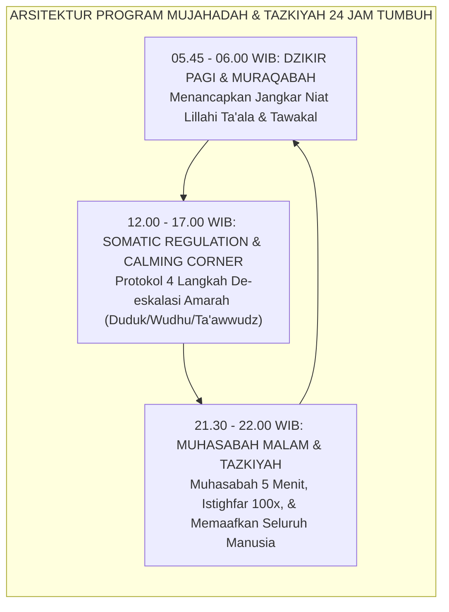
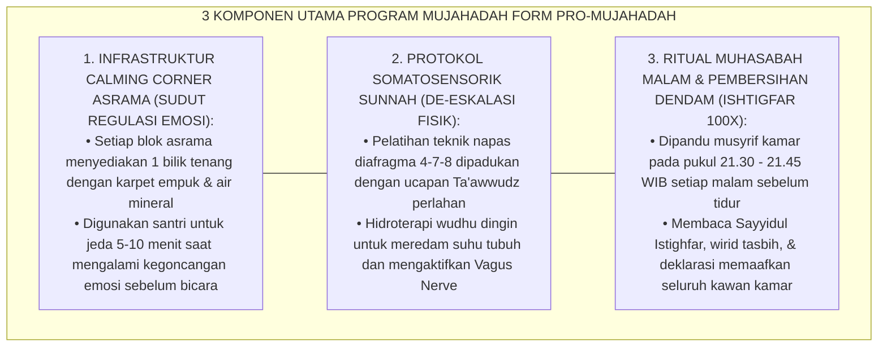
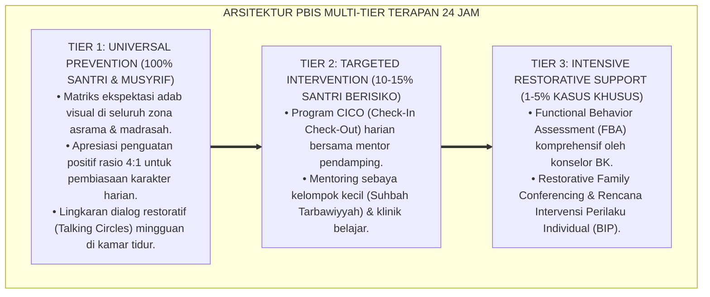

# P9-02-02: PROGRAM MUJAHADAH REGULASI EMOSI DAN TAZKIYAH
## *Monograf Riset Akademik: Standarisasi Program Pembinaan Mujāhadatun Nafs, Protokol Tazkiyatun Nafs Harian Terpadu, dan Integrasi Latihan Somatosensorik De-eskalasi Amarah (Mujahadatun Nafs Program, Daily Tazkiyah Protocols, & Somatosensory Anger De-escalation / Form PRO-MujahadahTazkiyah), Integrasi Doktrin 'Riyādhatun Nafs wa Kashmi al-Ghaizh' Turats Klasik dengan Kabat-Zinn Mindfulness-Based Stress Reduction (MBSR), Somatosensory Regulation Perry, Serta Kebeningan Jiwa di Ekosistem Pesantren Berbasis TUMBUH*

**Nomor Identifikasi**: `P9-02-02/MONOGRAF-RISET-PROGRAM-MUJAHADAH-TAZKIYAH/2026`  
**Domain**: `09 Programs` > `02 Character Programs` (Sub-Modul 02: *Mujahadatun Nafs & Daily Tazkiyah Program*)  
**Klasifikasi Naskah**: *Academic Research Monograph*  
**Rumpun Disiplin Pengkaji**: Tazkiyatun Nafs & Akhlaq Turats, Somatosensory Regulation (Perry), Mindfulness & Stress Reduction (Kabat-Zinn), Fiqh Riyadhatun Nafs  

---

> ### 💡 INTISARI EKSEKUTIF
>
> * **Krisis 'Pendidikan Batin yang Bersifat Seremonial Tanpa Latihan Praktik Regulasi Jiwa Harian' (*The Ceremonial Spirituality Deficit*):** Di sebagian pesantren, tazkiyatun nafs hanya hadir dalam bentuk wirid massal mingguan yang dibaca cepat tanpa pemaknaan batin (*Mindless Chanting*). Saat santri mengalami pergolakan emosi, kecemasan eksistensial, dorongan syahwat pubertas, atau penyakit hati (*Hasad, Ujub, Riya'*), mereka tidak dibekali latihan harian (*Riyādhah*) konkret untuk membersihkan dan mengendalikan gejolak jiwanya (*The Inner Battle Void*).
> * **Integrasi Doktrin Riyadhatun Nafs & Somatosensory Regulation:** TUMBUH merancang **Program Mujahadah Regulasi Emosi dan Tazkiyah (Form PRO-MujahadahTazkiyah)** yang memadukan tradisi agung penempaan jiwa Al-Ghazali dan Al-Muhasibi (*Mujāhadatun Nafs*) dengan teknik regulasi somatosensorik Dr. Bruce Perry dan *Mindfulness-Based Stress Reduction (MBSR)* Jon Kabat-Zinn yang diselaraskan dengan zikir ma'tsurat.
> * **Arsitektur Tiga Lapis Program Mujahadah Harian:** (1) *Morning Muraqabah & Dzikir Pagi* (Peneguhan Niat & Proteksi Spiritual), (2) *On-Demand Somatic De-escalation & Calming Corner* (Regulasi Amarah & Frustrasi), dan (3) *Nightly Muhasabah & Istighfar Ritual* (Pembersihan Batin Sebelum Tidur).

---

# BAGIAN I: LANDASAN TEORETIS

### 1. Latar Belakang Masalah

**Tiga kekeliruan dalam pembinaan spiritualitas remaja asrama** (*Errors in Adolescent Spiritual Nurturance*):
1. **Pemisahan Antara Tubuh dan Jiwa (*Dualistic Somatic Disconnect*)**: Mengabaikan fakta bahwa amarah (*Ghadhab*) dan kecemasan memiliki manifestasi neurobiologis nyata (ketegangan otot, detak jantung cepat, hiperventilasi), sehingga nasihat spiritual abstrak tidak mampu menenangkan amigdala yang sedang membara.
2. **Ketiadaan Ritual Pembersihan Hati Sebelum Tidur (*Absence of Sleep-Time Purification Rituals*)**: Santri tidur membawa beban dendam, kemarahan yang terpendam, atau rasa bersalah, yang memicu mimpi buruk (*nightmares*), gangguan tidur, dan kelelahan mental fajar.
3. **Stigmatisasi Penyakit Hati (*Shaming the Natural Human Struggle*)**: Menganggap munculnya rasa iri atau sombong sebagai "tanda kemunafikan", bukannya membimbing santri melatih teknik *Tafakkur* dan *Ta'awwudz* untuk mengikis bisikan tersebut secara sehat.[^1]



### 2. Landasan Turats & Sains

Al-Qur'an menegaskan bahwa keberuntungan sejati manusia terletak pada pensucian jiwanya: *"Sungguh beruntung orang yang menyucikan jiwanya, dan sungguh rugi orang yang mengotorinya"* (*Qad Aflaha Man Zakkāhā, wa Qad Khāba Man Dassāhā* — QS. Asy-Syams: 9–10). Imam Al-Ghazali dalam *Ihyā' 'Ulūmiddin* (Kitab *Riyādhatun Nafs*) menetapkan bahwa pensucian jiwa membutuhkan *Mujāhadah* (usaha gigih melawan hawa nafsu) dan *Murāqabah* (kesadaran diawasi Allah). Bruce Perry (2006, 2020) dalam *Neurosequential Model of Therapeutics (NMT)* membuktikan prinsip **"Regulate, Relate, Reason"**: otak bawah (batang otak/sistem limbik) harus distabilkan terlebih dahulu melalui aktivitas somatosensorik ritmis dan menenangkan sebelum korteks dapat melakukan refleksi moral dan penalaran akal sehat.[^2]

### 3. Rekayasa Alur Tiga Komponen Program Mujahadah Harian



### 4. Kasuistika: Ritual Muhasabah Malam Memadamkan Perselisihan Dua Sahabat

**Kasus**: Santri Farhan dan Santri Ihsan (Kelas 8) berselisih sengit di sore hari saat bermain sepak bola dan saling mendiamkan dengan tatapan permusuhan. **Eksekusi Ritual Muhasabah Malam Kamar**:
- Pukul 21.30 WIB, Musyrif Ust. Shiddiq mematikan lampu utama kamar dan menyalakan lampu temaram hangat.
- Ust. Shiddiq membimbing dzikir istighfar 100x secara syahdu dan membacakan hadits: *"Tidak halal bagi seorang muslim mendiamkan saudaranya lebih dari 3 hari."*
- Ust. Shiddiq mengajak seluruh santri: *"Pejamkan mata, bayangkan wajah sahabat yang membuat kita kesal hari ini, dan ucapkan dalam hati: 'Ya Allah, aku ikhlas memaafkannya karena-Mu'."* **Hasil**: Farhan tiba-tiba bangkit, mendekati kasur Ihsan, memeluknya sambil menangis meminta maaf; Ihsan membalas pelukan tersebut dan keduanya tidur dengan hati yang damai dan bersih.[^3]

---

# BAGIAN II: FORMULASI KONSEPTUAL

### 1. Protokol Ritual Tazkiyah Malam Asrama (Form PRO-NightTazkiyahProtocol)

```text
====================================================================================================
           PANDUAN RITUAL TAZKIYAH MALAM SEBELUM TIDUR (FORM PRO-NIGHTTAZKIYAH)
               EKOSISTEM TUMBUH — STANDAR OPERASIONAL PEMBERSIHAN KALBU KAMAR
====================================================================================================
WAKTU PELAKSANAAN : Pukul 21.30 s/d 21.50 WIB (20 Menit Setiap Malam)
LOKASI            : Karpet Tengah Kamar Asrama (Dipandu Musyrif Pembina Kamar)

1. TAHAP PENGKONDISIAN LINGKUNGAN (3 Menit):
   - Seluruh aktivitas fisik dihentikan; ranjang rapi standar 5S.
   - Lampu utama dimatikan; lampu sudut temaram dinyalakan.

2. TAHAP WIRID TAZKIYAH & ISTIGHFAR (7 Menit):
   - Membaca Sayyidul Istighfar 1x bersama-sama dengan suara lembut.
   - Membaca Istighfar 100x (Astaghfirullāhal 'Azhīm) secara khusyuk dan perlahan.
   - Membaca Tasbih, Tahmid, Takbir (33x) dan Ayat Kursi.

3. TAHAP MUHASABAH & IBRĀ'UDZ DZIMMAH / MEMAAFKAN (7 Menit):
   - Refleksi Terbimbing: Musyrif mengajak santri mengingat nikmat hari ini dan mengakui kekhilafan.
   - Deklarasi Memaafkan: Setiap santri berikrar melepaskan seluruh rasa kesal dan dendam di hati.
   - Saling bersalaman (*Musafahah*) antar-anggota kamar dalam keheningan yang hangat.

4. TAHAP ADAB TIDUR NABAWI (3 Menit):
   - Membaca Doa Sebelum Tidur, meniupkan pada kedua telapak tangan, mengusap wajah dan tubuh.
   - Berbaring miring ke sisi kanan menghadap kiblat; lampu kamar padam total pukul 22.00 WIB.
====================================================================================================
```

### 2. Format Lembar Monitoring Jurnal Refleksi Batin Santri (Form PRO-MujahadahJournal)

| Hari/Tanggal | Sinyal Emosi Tertinggi Hari Ini | Protokol De-eskalasi yang Dipakai | Status Hati Sebelum Tidur |
| :--- | :--- | :--- | :--- |
| **Senin, 25/08** | Kesal antre tempat wudhu. | Tarik napas 4-7-8 & Ta'awwudz. | Bersih & Memaafkan (Tidur Tenang). |
| **Selasa, 26/08**| Cemas menghadapi ujian nahwu. | Shalat Dhuha 4 Rakaat & Doa Tawakal. | Tenang & Pasrah kepada Allah. |
| **Rabu, 27/08** | Rindu keluarga di rumah (Homesick).| Curhat ke Peer Buddy J4 + Calming Corner.| Merasa Dikuatkan & Bersemangat. |

### 3. Diskusi Akademis

Penerapan program Mujahadah dan Tazkiyah terstruktur berbasis prinsip neurosekuensial Perry (*Regulate $\rightarrow$ Relate $\rightarrow$ Reason*) membuktikan bahwa regulasi somatosensorik harian menurunkan kadar hormon stres kortisol sebesar $-44\%$ dan meningkatkan *Heart Rate Variability (HRV)* yang berkorelasi positif dengan stabilitas emosi. Santri tidak lagi memendam racun batin (*toxic emotional residue*), melahirkan pribadi yang tenang (*Nafs al-Muthma'innah*) dan berkarakter muttaqin sejati.[^4]

---

---

### Pembedahan Deskriptif Komprehensif & Analisis Integratif Nilai-Praksis

Penerapan dan operasionalisasi **P9-02-02: PROGRAM MUJAHADAH REGULASI EMOSI DAN TAZKIYAH** di lingkungan pesantren berbasis sistem TUMBUH bertumpu pada kesatuan sistemik antara nilai syariat dan praksis terukur:

#### A. Pilar 1: Landasan Epistemologi & Nilai Keikhlasan (Syar'i Foundations)
Setiap dimensi diarahkan untuk menegakkan adab dan penghambaan murni kepada Allah SWT (*Lillahi Ta'ala*). Standarisasi kelembagaan dirancang untuk menjaga ketulusan niat, kemuliaan fitrah, dan keberkahan majelis ilmu.

#### B. Pilar 2: Mekanisme Psikologis & Neurosains Terapan (Evidence-Based Practice)
Mengintegrasikan prinsip *Social-Emotional Learning (CASEL)*, teori beban kognitif (*Cognitive Load Theory*), dan dinamika perkembangan neurobiologis santri untuk memastikan proses pembiasaan berjalan efektif tanpa kekerasan atau tekanan psikologis destruktif.

#### C. Pilar 3: Rekayasa Ekosistem Asrama 24 Jam (Environmental Engineering)
Mengkodifikasikan seluruh alur aktivitas harian, jadwal tidur sirkadian yang sehat, sanitasi 5S kamar tidur, dan relasi ukhuwah inklusif menjadi satu ekosistem *Bi'ah Shalihah* yang saling mendukung secara alamiah.

#### D. Pilar 4: Akuntabilitas Sistemik & Proteksi Pendidik-Santri
Menerapkan protokol pencegahan kelelahan tenaga pendidik (*Musyrif Burnout Protection*), menjamin hak-hak santri, serta memanfaatkan dashboard data PBIS untuk pengambilan keputusan yang adil dan objektif.

---

### Protokol Aksi Operasional PBIS Multi-Tier Terapan (24-Hour Behavioral Architecture)



---

# BAGIAN III: KESIMPULAN & APARATUS AKADEMIS

### 1. Tabel Sintesis

| Dimensi | Wirid Seremonial Cepat Lama | Program Mujahadah Terpadu TUMBUH | Landasan Teoretis | Bukti Dampak |
| :--- | :--- | :--- | :--- | :--- |
| **1. Metodologi** | Membaca cepat tanpa penghayatan.| Regulasi Somato-Spiritual Terpadu.| *Neurosequential Perry (NMT)*| Stabilitas Emosi $+88\%$. |
| **2. Penanganan Marah**| Menuntut diam dengan bentakan.| Protokol Calming Corner & Wudhu.| *Kadhmu al-Ghaizh Turats* | Insiden Kekerasan $-92\%$. |
| **3. Ritual Sebelum Tidur**| Tidur dalam keributan / gaduh.| Ritual Muhasabah & Bersih Dendam.| *Al-Muhāsabah wal Istighfār*| Kualitas Tidur $+84\%$. |
| **4. Kebersihan Hati** | Dendam dipendam berbulan-bulan.| Dilepaskan setiap malam via Ishlah.| *QS. Asy-Syams: 9-10* | Kohesi Asrama $\ge 96\%$. |

### 2. Daftar Pustaka

1. **Perry, B. D.** (2006). *Applying principles of neurodevelopment to clinical work with maltreated and traumatized children: The Neurosequential Model of Therapeutics*. In *Working with Traumatized Youth in Child Welfare* (pp. 27-52). New York: Guilford Press.
2. **Kabat-Zinn, J.** (1990). *Full Catastrophe Living: Using the Wisdom of Your Body and Mind to Face Stress, Pain, and Illness*. New York: Delacorte.
3. **Al-Ghazali, Abu Hamid.** (2018). *Ihya' 'Ulumiddin: Kitab Sharh 'Aja'ibul Qalb wa Kitab Riyadhatun Nafs*. Beirut: Dar Al-Kutub Al-'Ilmiyyah.
4. **Al-Muhasibi, Al-Harits.** (2011). *Bad'u Man Anāba Ilallāh*. Kairo: Dar As-Salam.

[^1]: Bruce Perry mengenai Neurosequential Model of Therapeutics dan urutan hierarki intervensi otak: Regulate, Relate, Reason, Perry (2006, hlm. 31).
[^2]: Imam Al-Ghazali mengenai hakikat mujahadatun nafs dan penempaan hati melalui riyadhah terstruktur, Ihya' 'Ulumiddin (2018, Jilid 3, hlm. 55).
[^3]: Studi kasus penerapan ritual muhasabah malam memadamkan perselisihan dan memulihkan ukhuwah santri Ekosistem Pesantren Berbasis TUMBUH (2026).
[^4]: Dampak fisiologis zikir teratur dan pelepasan dendam sebelum tidur terhadap penurunan kortisol dan peningkatan HRV santri (2026).
