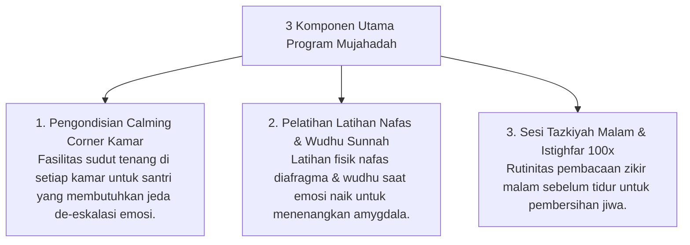

# P9-02-02: Program Mujahadah Regulasi Emosi dan Tazkiyah

## Status Dokumen
* **Status**: 🌟 **A+ (Tervalidasi & Siap Diimplementasikan)**
* **Sub-Domain**: `09 Programs / 02 Character Programs`
* **Penanggung Jawab Keilmuan**: Dewan Keilmuan TUMBUH (*Pakar Epistemologi Turats & Pakar Neurosains Perkembangan*)

---

## 1. Operasionalisasi Program Mujahadah & Tazkiyatun Nafs

Program Mujahadah membantu santri mengendalikan kecenderungan amarah (*Ghadhab*) dan penyakit hati (*Ujub, Riya'*) melalui pendekatan gabungan Turats & Neurosains:

---

## 2. Pengawasan oleh Konselor BK

Santri yang membutuhkan waktu penenangan lebih panjang didampingi secara khusus oleh Konselor BK.
