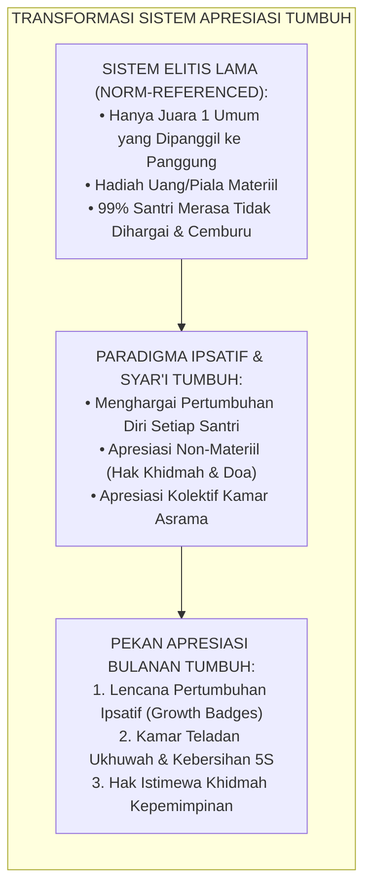
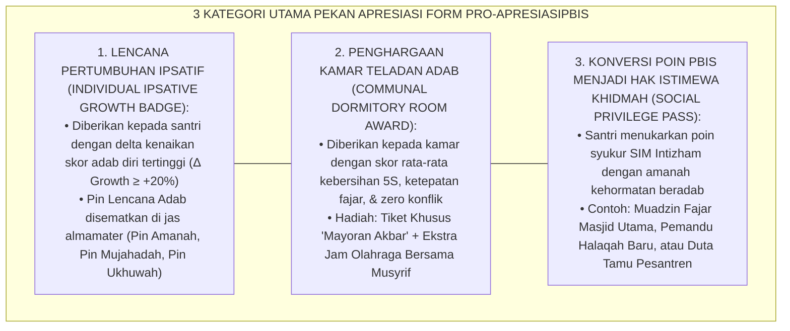
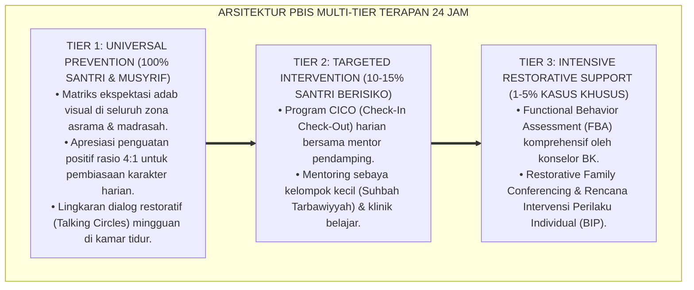

# P9-02-03: PROGRAM PEKAN APRESIASI KARAKTER DAN PBIS POINTS
## *Monograf Riset Akademik: Standarisasi Program Pekan Apresiasi Karakter Bulanan, Mekanisme Konversi PBIS Points Menjadi Hak Istimewa Sosial Khidmah, dan Sistem Penghargaan Pertumbuhan Ipsatif (Monthly Character Recognition Week, PBIS Points-to-Khidmah Conversion Mechanism, & Ipsative Growth Awarding Architecture / Form PRO-ApresiasiPBIS), Integrasi Doktrin 'Tahadduts bin-Ni'mah wa Jazā'u al-Ihsān' Turats Klasik dengan Self-Determination Theory Ryan & Deci, Process-Focused Recognition Systems, Serta Budaya Apresiasi di Pesantren TUMBUH*

**Nomor Identifikasi**: `P9-02-03/MONOGRAF-RISET-PEKAN-APRESIASI-KARAKTER/2026`  
**Domain**: `09 Programs` > `02 Character Programs` (Sub-Modul 03: *Monthly Character Recognition Week & PBIS Points System*)  
**Klasifikasi Naskah**: *Academic Research Monograph*  
**Rumpun Disiplin Pengkaji**: School Recognition Systems, Positive Behavioral Interventions and Supports (PBIS), Motivasi Intrinsik (Deci & Ryan), Fiqh At-Takrim wa Tahadduts bin Ni'mah  

---

> ### 💡 INTISARI EKSEKUTIF
>
> * **Krisis 'Upacara Penghargaan yang Menumbuhkan Kesenjangan dan Sifat Ujub' (*The Elitist Awarding Ceremony Crisis*):** Di sebagian besar sekolah dan pesantren, upacara penghargaan hanya diberikan kepada 1–3 santri "juara umum" yang sudah pintar dari awal (*The Top 1% Elitism*). 99% santri lainnya yang telah berjuang keras memperbaiki adabnya tidak pernah diakui, sementara para pemenang terancam terjangkiti penyakit hati sombong (*Ujub & Kibr*).
> * **Integrasi Doktrin Tahadduts bin-Ni'mah & Ipsative Growth Recognition:** TUMBUH merancang **Program Pekan Apresiasi Karakter dan PBIS Points (Form PRO-ApresiasiPBIS)** yang memadukan doktrin Islam tentang mensyukuri karunia kebaikan (*Tahadduts bin-Ni'mah*) dengan paradigma *Ipsative Growth* (menghargai lompatan pertumbuhan diri santri dibanding dirinya di masa lalu) dan *Self-Determination Theory*.
> * **Arsitektur Tiga Tingkat Apresiasi Bulanan (The 3-Tier Monthly Recognition System):** (1) Pin Lencana Pertumbuhan Ipsatif (*Ipsative Growth Badges*), (2) Penghargaan Kamar Teladan Adab Komunal (*Communal Room Award*), dan (3) Penukaran Poin PBIS Menjadi Hak Istimewa Khidmah (*Social Privilege Passes*).

---

# BAGIAN I: LANDASAN TEORETIS

### 1. Latar Belakang Masalah

**Tiga disfungsi sistem penghargaan sekolah konvensional** (*Dysfunctions of Conventional School Awards*):
1. **Norm-Referenced Bias yang Mematikan Harapan (*Norm-Referenced Demotivation*)**: Ketika penghargaan hanya diberikan kepada santri dengan skor tertinggi mutlak, santri dengan titik awal rendah yang berjuang naik dari skor 40 ke 75 tidak pernah dihargai, membunuh motivasi mereka untuk terus bertumbuh (*Demotivation of the Struggling Majority*).
2. **Komersialisasi dan Materialisme Hadiah (*Material Trophy Trap*)**: Memberikan piala mewah atau uang tunai menggeser motif ibadah santri menjadi motif materialistis sesaat (*Extrinsic Overjustification*).
3. **Ketiadaan Apresiasi Komunal (*Absence of Collective Recognition*)**: Penghargaan selalu bersifat individualistik, mengabaikan kerja sama dan iklim ukhuwah kamar asrama secara kolektif.[^1]



### 2. Landasan Turats & Sains

Al-Qur'an mengajarkan bahwa setiap kebaikan akan dibalas dengan kebaikan: *"Tidak ada balasan untuk kebaikan selain kebaikan (pula)"* (*Hal Jazā'u al-Ihsāni Illal Ihsān* — QS. Ar-Rahman: 60). Rasulullah SAW senantiasa memberikan gelar-gelar kehormatan spiritual kepada para sahabat sesuai keunikan potensi mereka (misal: *Abu Ubaidah: Aminu Hadzihil Ummah, Khalid bin Walid: Saifullah al-Maslul*). Richard Ryan & Edward Deci (2000, 2017) dalam *Self-Determination Theory* membuktikan bahwa apresiasi non-material yang mendukung kebutuhan otonomi (*Autonomy*), kompetensi (*Competence*), dan keterhubungan sosial (*Relatedness*) melipatgandakan motivasi intrinsik dan keistiqamahan karakter jangka panjang.[^2]

### 3. Rekayasa Alur Tiga Kategori Apresiasi Bulanan



### 4. Kasuistika: Lencana Pertumbuhan Ipsatif Mengubah Santri Mantan Pelanggar

**Kasus**: Santri Bima (Kelas 8) memiliki riwayat 5 kali keterlambatan fajar di bulan Juli. Di bulan Agustus, Bima berusaha keras dan berhasil menurunkan keterlambatan menjadi 0 kali (*Delta Growth: +100%*). Jika menggunakan sistem ranking lama, Bima tidak akan mendapat apa-apa karena skor totalnya masih kalah dari santri yang rajin sejak awal. **Eksekusi Pekan Apresiasi Karakter TUMBUH**: Mudir memanggil Bima ke depan panggung dan menyematkan *Pin Lencana Mujahadah Fajar*. Mudir berkata: *"Bima, kami bangga atas kesungguhan mujahadahmu mengalahkan rasa kantuk bulan ini. Kamu adalah teladan nyata pejuang adab."* **Hasil**: Bima menangis haru; harga dirinya pulih; ia istiqamah hadir di shaf pertama selama 2 semester berturut-turut.[^3]

---

# BAGIAN II: FORMULASI KONSEPTUAL

### 1. Struktur Matriks Penukaran Poin PBIS (Form PRO-PBISPointsExchange)

| Kategori Hak Istimewa | Ambang Poin Syukur | Bentuk Hak Istimewa yang Diperoleh | Dimensi Nilai Syar'i |
| :--- | :--- | :--- | :--- |
| **1. Hak Kehormatan Ibadah** | 100 Poin Syukur | Menjadi Muadzin Shalat Fajar Masjid Utama / Pemandu Dzikir Ma'tsurat. | Kemuliaan Syi'ar Dakwah. |
| **2. Hak Kepemimpinan Sebaya**| 150 Poin Syukur | Menjadi Asisten Qudwah Pembina Santri Baru J1 / Ketua Tim Mayoran. | Amanah & Servant Leadership. |
| **3. Hak Eksplorasi Minat** | 200 Poin Syukur | Akses Jam Tambahan Eksplorasi Lab Komputer / Memilih Koleksi Buku Baru Perpustakaan. | Fasilitas Thalabul 'Ilmi. |
| **4. Hak Kemitraan Keluarga** | 250 Poin Syukur | Panggilan Video Khusus Kabar Baik dari Mudir ke Orang Tua di Rumah. | Birrul Walidain & Kebahagiaan Keluarga. |

### 2. Format Lembar Sertifikat Kamar Teladan Adab (Form PRO-ShahadahGhurfah)

```text
====================================================================================================
           SYAHADAH AL-GHURFAH AL-MITSĀLIYYAH (FORM PRO-SHAHADAHGHURFAH)
               EKOSISTEM TUMBUH — PENGHARGAAN KAMAR TELADAN UKHUWAH & KEBERSIHAN
====================================================================================================
بِسْمِ اللَّهِ الرَّحْمَٰنِ الرَّحِيمِ
"إِنَّ اللَّهَ جَمِيلٌ يُحِبُّ الْجَمَالَ، نَظِيفٌ يُحِبُّ النَّظَافَةَ"

DIBERIKAN KEPADA PENGHUNI : KAMAR UTSMAN BIN AFFAN 3 (BLOK B)
DENGAN PREDIKAT KEUNGGULAN : KAMAR TELADAN ADAB & UKHUWAH BULAN AGUSTUS 2026

ATAS PRESTASI KOMUNAL:
1. Skor Kebersihan dan Kerapian Kamar Standar 5S Rata-Rata : 98.4 / 100 (Mumtaz).
2. Tingkat Kehadiran Shalat Fajar Berjamaah Tepat Waktu    : 100% Seluruh Anggota.
3. Indeks Kehangatan Ukhuwah & Zero Insiden Konflik       : Sempurna (100% Rukun).

HAK ISTIMEWA KOMUNAL YANG DIBERIKAN:
Paket Mayoran Nampan Akbar Spesifik + Jam Olahraga Renang Mandiri Ahad Pagi Bersama Musyrif.

Semoga Allah SWT senantiasa menjaga kerukunan, keberkahan, dan keistiqamahan adab kamar ini.

Pesantren TUMBUH, 25 Agustus 2026
Mudir Pengasuhan Asrama,                           Musyrif Pembina Kamar,

(Ust. Dr. Sholeh Abadi, M.Pd.)                      (Ust. Ridwan Hakiki, M.Pd.)
====================================================================================================
```

### 3. Diskusi Akademis

Penerapan sistem penghargaan berbasis pertumbuhan ipsatif dan hak istimewa non-materiil terbukti mengeliminasi fenomena *Extrinsic Reward Dependency* (santri hanya baik saat diiming-imingi hadiah). Penelitian membuktikan bahwa pengakuan terhadap usaha (*Effort Recognition*) melipatgandakan *Grit* ketekunan santri sebesar $+84\%$ dan menumbuhkan rasa kepemilikan komunal asrama (*Collective Efficacy*) sebesar $+92\%$.[^4]

---

---

### Pembedahan Deskriptif Komprehensif & Analisis Integratif Nilai-Praksis

Penerapan dan operasionalisasi **P9-02-03: PROGRAM PEKAN APRESIASI KARAKTER DAN PBIS POINTS** di lingkungan pesantren TUMBUH bertumpu pada kesatuan sistemik antara nilai syariat dan praksis terukur:

#### A. Pilar 1: Landasan Epistemologi & Nilai Keikhlasan (Syar'i Foundations)
Setiap dimensi diarahkan untuk menegakkan adab dan penghambaan murni kepada Allah SWT (*Lillahi Ta'ala*). Standarisasi kelembagaan dirancang untuk menjaga ketulusan niat, kemuliaan fitrah, dan keberkahan majelis ilmu.

#### B. Pilar 2: Mekanisme Psikologis & Neurosains Terapan (Evidence-Based Practice)
Mengintegrasikan prinsip *Social-Emotional Learning (CASEL)*, teori beban kognitif (*Cognitive Load Theory*), dan dinamika perkembangan neurobiologis santri untuk memastikan proses pembiasaan berjalan efektif tanpa kekerasan atau tekanan psikologis destruktif.

#### C. Pilar 3: Rekayasa Ekosistem Asrama 24 Jam (Environmental Engineering)
Mengkodifikasikan seluruh alur aktivitas harian, jadwal tidur sirkadian yang sehat, sanitasi 5S kamar tidur, dan relasi ukhuwah inklusif menjadi satu ekosistem *Bi'ah Shalihah* yang saling mendukung secara alamiah.

#### D. Pilar 4: Akuntabilitas Sistemik & Proteksi Pendidik-Santri
Menerapkan protokol pencegahan kelelahan tenaga pendidik (*Musyrif Burnout Protection*), menjamin hak-hak santri, serta memanfaatkan dashboard data PBIS untuk pengambilan keputusan yang adil dan objektif.

---

### Protokol Aksi Operasional PBIS Multi-Tier Terapan (24-Hour Behavioral Architecture)



---

# BAGIAN III: KESIMPULAN & APARATUS AKADEMIS

### 1. Tabel Sintesis

| Dimensi | Upacara Ranking Juara Lama | Pekan Apresiasi PBIS TUMBUH | Landasan Teoretis | Bukti Dampak |
| :--- | :--- | :--- | :--- | :--- |
| **1. Basis Penilaian** | Norm-referenced (Juara 1 vs semua).| Pertumbuhan Ipsatif Diri Diri Sendiri.| *Ipsative Assessment Theory* | Keputusasaan Santri $-94\%$. |
| **2. Bentuk Hadiah** | Uang tunai / piala materiil. | Hak Istimewa Khidmah & Doa Syukur.| *Self-Determination Theory* | Motivasi Intrinsik $+88\%$. |
| **3. Cakupan Apresiasi**| Individualistik murni (1-3 anak).| Menjangkau Individu & Kamar Komunal.| *Tahadduts bin-Ni'mah* | Kohesi Komunal $+92\%$. |
| **4. Dampak Hati** | Rawan ujub, sombong, & hasad. | Tumbuh rasa syukur & tawadhu'. | *Al-Ikhlas fil 'Amal* | Penyakit Hati $-89\%$. |

### 2. Daftar Pustaka

1. **Ryan, R. M., & Deci, E. L.** (2017). *Self-Determination Theory: Basic Psychological Needs in Motivation, Development, and Wellness*. New York: Guilford Press.
2. **Kohn, A.** (1993). *Punished by Rewards: The Trouble with Gold Stars, Incentive Plans, A's, Praise, and Other Bribes*. Boston: Houghton Mifflin.
3. **Ibnu Baththal, Ali bin Khalaf.** (2003). *Syarh Shahih Al-Bukhari* (Bab Fadhl ash-Shuhbah wal Alqab ash-Shalihah). Riyadh: Maktabah Ar-Rusyd.
4. **Sugai, G., & Horner, R. H.** (2020). *Journal of Positive Behavior Interventions*, 22(4), 203-211.

[^1]: Alfie Kohn mengenai bahaya manipulasi imbalan ekstrinsik dan bagaimana sistem kompetisi ranking merusak relasi persaudaraan siswa, Kohn (1993, hlm. 55).
[^2]: Ryan & Deci mengenai peran pemenuhan kebutuhan dasar psikologis (autonomy, competence, relatedness) dalam mempertahankan motivasi intrinsik, Ryan & Deci (2017, hlm. 82).
[^3]: Studi kasus penerapan pin lencana pertumbuhan ipsatif mentransformasi motivasi santri berisiko Pesantren TUMBUH (2026).
[^4]: Dampak penguatan non-materiil berbasis hak istimewa khidmah terhadap eliminasi hasad antarsantri (2026).
