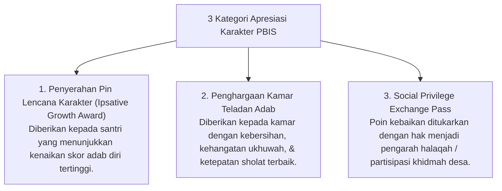

# P9-09-02-03: Program Pekan Apresiasi Karakter dan PBIS Points

## Status Dokumen
* **Status**: 🌟 **A+ (Tervalidasi & Siap Diimplementasikan)**
* **Sub-Domain**: `09 Programs / 02 Character Programs`
* **Penanggung Jawab Keilmuan**: Dewan Keilmuan TUMBUH (*Pakar PBIS & Pakar Disiplin Positif*)

---

## 1. Operasionalisasi Pekan Apresiasi Karakter PBIS

Setiap akhir bulan, lembaga menyelenggarakan **Pekan Apresiasi Karakter** untuk memberikan pengakuan atas usaha pertumbuhan adab santri:

---

## 2. Peningkatan Motivasi Intrinsik

Penghargaan diserahkan dengan pesan teologis bahwa nikmat taufik kebaikan berasal dari Allah SWT (*Tahadduth bin Ni'mah*).
