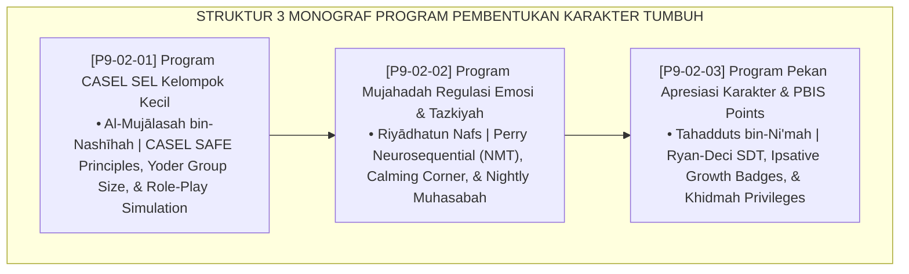

# P9-02: DOKUMEN INDUK PROGRAM PEMBENTUKAN KARAKTER PESANTREN
## *Arsitektur dan Standarisasi Program Pembelajaran Sosio-Emosional CASEL Kelompok Kecil, Program Mujahadah Regulasi Emosi dan Tazkiyatun Nafs Harian, Serta Program Pekan Apresiasi Karakter dan PBIS Points sebagai Tiga Pilar Pembentukan Karakter Insan (Small-Group SEL Form PRO-SELKelompok, Daily Mujahadah Form PRO-MujahadahTazkiyah, Serta Character Recognition Week Form PRO-ApresiasiPBIS) di Ekosistem TUMBUH Pesantren*

**Nomor Identifikasi**: `P9-02/DOKUMEN-INDUK-PROGRAM-PEMBENTUKAN-KARAKTER/2026`  
**Domain**: `09 Programs` > `02 Character Programs` (Gugus Sub-Domain 02: *Character & Socio-Emotional Programs*)  
**Klasifikasi Naskah**: *Master Architecture & Navigation Monograph*  
**Rumpun Disiplin Pengkaji**: Social-Emotional Learning (CASEL), Tazkiyatun Nafs & Akhlaq Turats, Positive Behavioral Interventions and Supports, Self-Determination Theory  

---

> ### 💡 INTISARI EKSEKUTIF
>
> * **Kedudukan Strategis Gugus Program Pembentukan Karakter:** Gugus ini adalah kawah candradimuka penempaan jiwa (*the character crucible*) di ekosistem TUMBUH. Mentransformasi pengajaran moral abstrak menjadi latihan keterampilan sosio-emosional nyata, penempaan batin harian (*Mujāhadatun Nafs*) yang menenangkan emosi, dan perayaan pertumbuhan adab yang adil dan inklusif (*Ipsative Growth Recognition*), gugus ini menjamin lahirnya generasi santri yang bersih kalbunya, cerdas emosinya, dan kokoh integritas amalnya (*Sound Heart, Agile Mind, Noble Character*).
> * **Triad Program Pembentukan Karakter TUMBUH:** (1) **CASEL SEL Kelompok Kecil** interaktif mingguan dengan simulasi peran (Role-Play), (2) **Program Mujahadah & Tazkiyah Harian** dengan Calming Corner dan ritual muhasabah malam, dan (3) **Pekan Apresiasi Karakter Bulanan** yang menukarkan poin syukur PBIS menjadi hak istimewa khidmah sosial.
> * **3 Monograf Riset Komprehensif:** Form PRO-SELKelompok, Form PRO-MujahadahTazkiyah, dan Form PRO-ApresiasiPBIS.

---

## 📑 PETA NAVIGASI TIGA MONOGRAF

---

## 📚 DESKRIPSI RINGKAS 3 BERKAS MONOGRAF

1. **[P9-02-01: Program CASEL SEL Kelompok Kecil](file:///c:/xampp/htdocs/tumbuh/09%20Programs/02%20Character%20Programs/P9-02-01-Program-CASEL-SEL-Kelompok-Kecil.md)**  
   *Sesi mingguan 45 menit untuk 8-10 santri, 4 tahap (emotion check-in, mini-lesson hadits, role-play asertif, refleksi komitmen), kurikulum 16 pekan, dan Form PRO-SELKelompok.*
2. **[P9-02-02: Program Mujahadah Regulasi Emosi dan Tazkiyah](file:///c:/xampp/htdocs/tumbuh/09%20Programs/02%20Character%20Programs/P9-02-02-Program-Mujahadah-Regulasi-Emosi-dan-Tazkiyah.md)**  
   *Infrastruktur Calming Corner asrama, protokol somatosensorik wudhu dan pernapasan 4-7-8, ritual muhasabah malam sebelum tidur (istighfar 100x & bersih dendam), dan Form PRO-MujahadahTazkiyah.*
3. **[P9-02-03: Program Pekan Apresiasi Karakter dan PBIS Points](file:///c:/xampp/htdocs/tumbuh/09%20Programs/02%20Character%20Programs/P9-02-03-Program-Pekan-Apresiasi-Karakter-dan-PBIS-Points.md)**  
   *Pekan apresiasi akhir bulan, pin lencana pertumbuhan ipsatif, penghargaan kamar teladan komunal 5S, konversi poin PBIS menjadi hak istimewa khidmah dakwah, dan Form PRO-ApresiasiPBIS.*

---

## 🎯 STANDAR PENJAMINAN MUTU PEMBENTUKAN KARAKTER

Penerapan gugus **Program Pembentukan Karakter** menjamin bahwa:
1. **Setiap Santri Menguasai Keterampilan Hidup Sosio-Emosional Nyata (*Social-Emotional Mastery Guarantee*)**: Santri mampu menyelesaikan konflik dan menolak tekanan negatif teman sebaya secara mandiri.
2. **Lingkungan Asrama Menjadi Ruang Pembersihan Batin yang Damai (*Soul Cleansing Sanctuary Guarantee*)**: Ritual tazkiyah malam memastikan tidak ada santri yang tidur dalam dendam atau ketakutan.
3. **Setiap Usaha Perbaikan Diri Dihargai Secara Adil Tanpa Diskriminasi (*Universal Growth Dignity Guarantee*)**: Paradigma ipsatif mengobarkan semangat bertumbuh bagi 100% santri.
