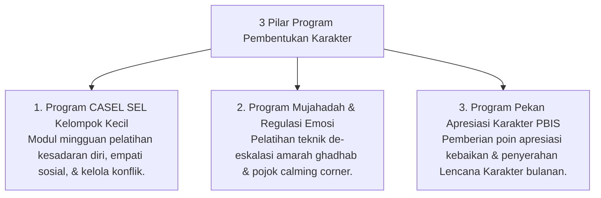

# P9-02: Program Pembentukan Karakter

## Status Dokumen
* **Status**: 🌟 **A+ (Tervalidasi & Siap Diimplementasikan)**
* **Sub-Domain**: `09 Programs / 02 Character Programs`
* **Penanggung Jawab Keilmuan**: Dewan Keilmuan TUMBUH (*Pakar Social Emotional Learning & Pakar PBIS*)

---

## 1. Konseptualisasi Program Pembentukan Karakter

Program Karakter (*Character Programs*) berfokus pada penataan jiwa (*Tazkiyatun Nafs*) dan pengembangan 5 Kompetensi CASEL SEL melalui program terstruktur:

---

## 2. Dampak Pada Iklim Asrama Positif

Program karakter menciptakan suasana persaudaraan yang hangat (*Bi'ah Shalihah*) dan menekan angka insiden perkelahian se-kamar.
