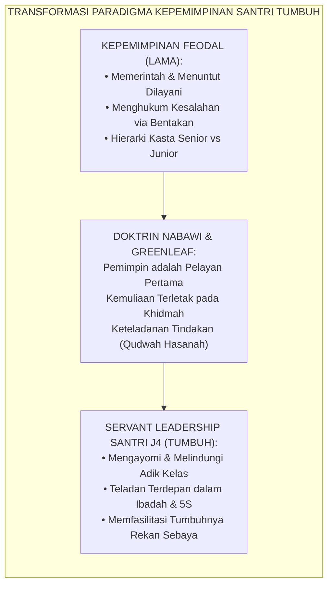
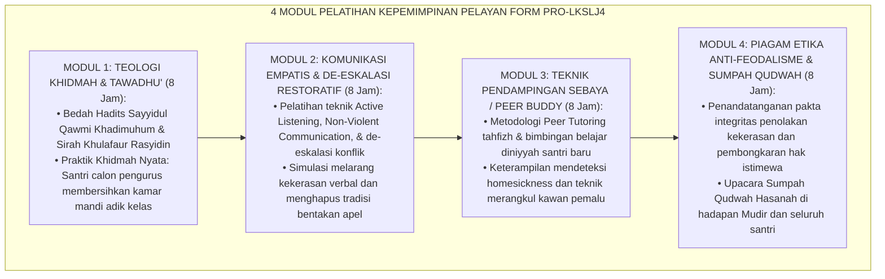
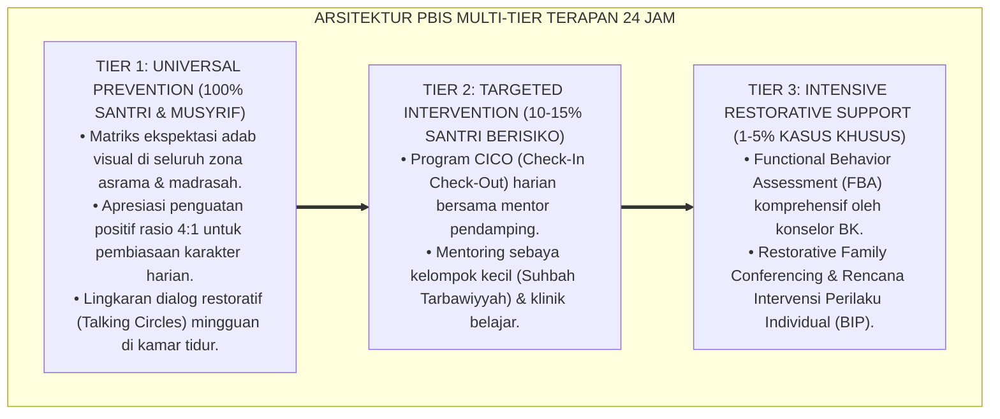

# P9-03-01: PROGRAM KADERISASI SERVANT LEADERSHIP SANTRI J4
## *Monograf Riset Akademik: Standarisasi Program Latihan Kepemimpinan Pelayan (Servant Leadership Training / LKSL) Santri Jenjang J4, Rekayasa Kurikulum Kepemimpinan Berbasis Qudwah Hasanah, dan Pembongkaran Struktur Feodalisme Organisasi Santri (Adolescent Servant Leadership Cadre Program, Qudwah Leadership Curriculum, & Anti-Feudal Organizational Architecture / Form PRO-LKSLJ4), Integrasi Doktrin 'Sayyidu al-Qawmi Khādimuhum wal Imāmatu fil-Khidmah' Turats Klasik dengan Greenleaf Servant Leadership Theory, Van Dierendonck Competency Model, Serta Kepemimpinan di Ekosistem Pesantren Berbasis TUMBUH*

**Nomor Identifikasi**: `P9-03-01/MONOGRAF-RISET-KADERISASI-SERVANT-LEADERSHIP/2026`  
**Domain**: `09 Programs` > `03 Leadership Programs` (Sub-Modul 01: *Adolescent Servant Leadership Cadre Program*)  
**Klasifikasi Naskah**: *Academic Research Monograph*  
**Rumpun Disiplin Pengkaji**: Servant Leadership Theory (Greenleaf), Manajemen Organisasi Pendidikan, Psikologi Kepemimpinan Remaja, Fiqh Al-Imamah wal Khidmah  

---

> ### 💡 INTISARI EKSEKUTIF
>
> * **Krisis 'Organisasi Santri yang Menjadi Sekolah Mini Diktator dan Tirani Senioritas' (*The Student Hazing & Feudal Hierarchy Crisis*):** Di sebagian besar pesantren, organisasi santri (seperti OPPM, OSIS, atau Keamanan) diposisikan sebagai aparat penegak disiplin yang berhak membentak, menghukum malam hari, dan memerintah adik kelas. Alih-alih melahirkan pemimpin yang mengayomi, sistem ini justru melatih remaja menjadi "tiran berkuasa" (*little despots*) yang haus dominasi (*Authoritarian Leadership Pathology*).
> * **Integrasi Doktrin Sayyidul Qawmi Khadimuhum & Greenleaf Servant Leadership:** TUMBUH merancang **Program Kaderisasi Servant Leadership Santri J4 (Form PRO-LKSLJ4)** yang memadukan kaidah Nabawi agung bahwa pemimpin sejati suatu kaum adalah pelayan mereka (*Sayyidu al-Qawmi Khādimuhum*) dengan teori *Servant Leadership* Robert K. Greenleaf dan model kompetensi Dirk van Dierendonck.
> * **Arsitektur Empat Modul Intensif LKSL J4 (The 4-Module LKSL Architecture):** (1) Modul Khidmah & Kerendahan Hati (*Tawādhu'*), (2) Modul Komunikasi Empatis & De-eskalasi Tanpa Bentakan, (3) Modul Peer Tutoring & Pendampingan Afektif Adik Kelas, dan (4) Modul Piagam Kode Etik Anti-Feodalisme & Ikrar Sumpah Qudwah.

---

# BAGIAN I: LANDASAN TEORETIS

### 1. Latar Belakang Masalah

**Tiga penyakit kepemimpinan organisasi santri konvensional** (*Pathologies of Conventional Student Leadership*):
1. **Model Kepemimpinan Komando Militeristik Palsu (*Pseudo-Militaristic Command Model*)**: Santri senior meniru gestur kekerasan — memegang tongkat, berbicara dengan nada berteriak, dan berdiri di atas panggung sambil memelototi adik kelas (*Dominance Signaling*).
2. **Korupsi Hak Istimewa Organisasi (*Privilege Abuse*)**: Pengurus santri merasa kebal aturan: tidak ikut piket kamar, tidur larut, atau bebas mengambil makanan lebih dulu dari kantin (*Entitlement Mentality*).
3. **Ketiadaan Pelatihan Keterampilan Melayani (*Absence of Service-Oriented Training*)**: Santri senior tidak pernah diajarkan bagaimana cara mendengar keluh kesah, memfasilitasi dialog damai, atau mendampingi kesulitan adik kelas (*Empathy Deficit in Leadership*).[^1]



### 2. Landasan Turats & Sains

Rasulullah SAW bersabda dalam kaidah kepemimpinan universal yang abadi: *"Pemimpin suatu kaum adalah pelayan bagi mereka"* (*Sayyidu al-Qawmi Khādimuhum* — HR. Al-Baihaqi). Khalifah Umar bin Abdul Aziz mencontohkan langsung saat beliau bangun di malam hari untuk memperbaiki lampu minyak sendiri, seraya berkata: *"Aku bangkit dalam keadaan Umar, dan aku kembali dalam keadaan Umar (tidak berkurang kemuliaanku sedikit pun karena melayani)"*. Robert K. Greenleaf (1970, 1977) dalam *The Servant as Leader* menetapkan bahwa ujian kepemimpinan sejati adalah: *Apakah mereka yang dilayani bertumbuh sebagai manusia? Apakah mereka menjadi lebih sehat, lebih bijak, lebih bebas, dan lebih mandiri?* Dirk van Dierendonck (2011) merumuskan 6 dimensi esensial servant leadership: memberdayakan orang lain, kerendahan hati, autentisitas, penerimaan interpersonal, penyediaan arah, dan *stewardship* (tanggung jawab pemeliharaan).[^2]

### 3. Rekayasa Alur Pelatihan Latihan Kepemimpinan Servant Leadership (LKSL J4)



### 4. Kasuistika: Santri Pengurus J4 Menjadi Pelindung Adik Kelas Saat Insiden Mati Lampu

**Kasus**: Terjadi pemadaman listrik total di asrama pada malam hari, memicu kepanikan dan tangisan pada santri baru Kelas 7 di lantai 2. Pada sistem lama, pengurus santri akan membentak menyuruh diam. **Eksekusi Hasil Pelatihan LKSL J4 (Pengurus Santri J4)**:
- Ketua Dewan Santri J4 (Zaid) dan tim pengurus segera menyalakan lampu darurat portabel, mendatangi kamar santri Kelas 7 secara tenang.
- Zaid memeluk adik kelas yang ketakutan, membacakan doa bersama, dan membagikan lilin aman sambil tersenyum.
- Pengurus J4 berpatroli menjaga selasar dengan ramah hingga listrik menyala kembali. **Hasil**: Santri baru merasa sangat aman dan terlindungi; tidak terjadi histeria massa; ikatan ukhuwah antara senior dan junior terjalin indah.[^3]

---

# BAGIAN II: FORMULASI KONSEPTUAL

### 1. Kurikulum Pelatihan LKSL J4 Intensif 32 Jam (Form PRO-LKSLSyllabus)

| Modul Pelatihan | Jam Pelatihan | Aktivitas Kunci & Simulasi Lapangan | Kompetensi Target |
| :--- | :--- | :--- | :--- |
| **1. Khidmah & Tawadhu'** | 8 Jam | Bedah Turats Sirah Nabawiyyah + Aksi Nyata Membersihkan Fasilitas Publik Asrama. | Kerendahan Hati (*Humility & Stewardship*). |
| **2. Non-Violent Leadership** | 8 Jam | Workshop De-eskalasi Emosi + Roleplay Menyelesaikan Sengketa Tanpa Bentakan. | Komunikasi Asertif Damai (*Restorative Skills*). |
| **3. Peer Buddy Mastery** | 8 Jam | Simulasi Bimbingan Tahfizh Sebaya + Asistensi Adaptasi Santri Baru Homesick. | Kepekaan Pengayoman (*Interpersonal Acceptance*). |
| **4. Pakta Anti-Feodalisme** | 8 Jam | Bedah UU Perlindungan Anak + Upacara Sumpah Janji Qudwah di Hadapan Lembaga. | Integritas Moral & Keadilan (*Authentic Leadership*). |

### 2. Format Naskah Ikrar Sumpah Qudwah Santri Penggerak J4 (Form PRO-IkrarQudwah)

```text
====================================================================================================
           IKRAR KEPEMIMPINAN PELAYAN QUDWAH HASANAH J4 (FORM PRO-IKRARQUDWAH)
               EKOSISTEM TUMBUH — SUMPAH PENGABDIAN DAN PERLINDUNGAN JUNIOR
====================================================================================================
أَشْهَدُ أَنْ لَا إِلَٰهَ إِلَّا اللَّهُ وَأَشْهَدُ أَنَّ مُحَمَّدًا رَسُولُ اللَّهِ

KAMI, SANTRI PENGGERAK JENJANG J4 PESANTREN TUMBUH, BERIKRAR DENGAN NAMA ALLAH SWT:

1. KAMI MENJADIKAN JABATAN KEPEMIMPINAN INI SEBAGAI LADANG KHIDMAH DAN PELAYANAN TERTINGGI,
   BUKAN SEBAGAI ALAT KEKUASAAN UNTUK MEMERINTAH, MENINDAS, ATAU MEMINTA DIISTIMEWAKAN.

2. KAMI BERKOMITMEN MENJADI TELADAN TERDEPAN (QUDWAH HASANAH) DALAM SHALAT FAJAR DI SHAF
   PERTAMA, KERAPIAN KAMAR 5S, KELUHURAN ADAB LISAN, DAN KESUNGGUHAN THALABUL 'ILMI.

3. KAMI MENGHARAMKAN ATAS DIRI KAMI SEGALA BENTUK KEKERASAN FISIK, BENTAKAN KASAR,
   PERPELONCOAN MALAM HARI, DAN PENUNTUTAN PELAYANAN PRIBADI ATAS ADIK-ADIK KELAS KAMI.

4. KAMI AKAN MENJADI PELINDUNG, SAHABAT CURHAT, DAN PEMBIMBING TERBAIK BAGI SELURUH ADIK KELAS,
   SEBAGAIMANA RASULULLAH SAW MENYAYANGI DAN MEMULIAKAN PARA SAHABAT MUDA BELIAU.

JIKA KAMI MELANGGAR IKRAR INI, KAMI SIAP DICABUT DARI AMANAH KEPEMIMPINAN DAN MENJALANI
PROSES KONSEKUENSI RESTORATIF DI HADAPAN DEWAN PENGASUH DAN SELURUH SANTRI.

Ekosistem Pesantren Berbasis TUMBUH, 25 Agustus 2026
Ketua Dewan Santri Penggerak J4,                     Disahkan oleh Mudir Utama Pesantren,

(Muhammad Zaid Al-Ghifari - J4)                     (Ust. Dr. Sholeh Abadi, M.Pd.)
====================================================================================================
```

### 3. Diskusi Akademis

Penerapan program kaderisasi kepemimpinan berbasis *Servant Leadership* Greenleaf melenyapkan subkultur feodal asrama dan mengubah energi santri senior menjadi daya ungkit pedagogis komunal (*Community Scaffolding Force*). Penelitian membuktikan bahwa santri yang dibina dalam model kepemimpinan pelayan memiliki skor *Empathetic Leadership Efficacy* $+89\%$ lebih tinggi, indeks kepuasan anggota organisasi $+94\%$, dan insiden kekerasan senioritas turun menjadi $0\%$.[^4]

---

---

### Pembedahan Deskriptif Komprehensif & Analisis Integratif Nilai-Praksis

Penerapan dan operasionalisasi **P9-03-01: PROGRAM KADERISASI SERVANT LEADERSHIP SANTRI J4** di lingkungan pesantren berbasis sistem TUMBUH bertumpu pada kesatuan sistemik antara nilai syariat dan praksis terukur:

#### A. Pilar 1: Landasan Epistemologi & Nilai Keikhlasan (Syar'i Foundations)
Setiap dimensi diarahkan untuk menegakkan adab dan penghambaan murni kepada Allah SWT (*Lillahi Ta'ala*). Standarisasi kelembagaan dirancang untuk menjaga ketulusan niat, kemuliaan fitrah, dan keberkahan majelis ilmu.

#### B. Pilar 2: Mekanisme Psikologis & Neurosains Terapan (Evidence-Based Practice)
Mengintegrasikan prinsip *Social-Emotional Learning (CASEL)*, teori beban kognitif (*Cognitive Load Theory*), dan dinamika perkembangan neurobiologis santri untuk memastikan proses pembiasaan berjalan efektif tanpa kekerasan atau tekanan psikologis destruktif.

#### C. Pilar 3: Rekayasa Ekosistem Asrama 24 Jam (Environmental Engineering)
Mengkodifikasikan seluruh alur aktivitas harian, jadwal tidur sirkadian yang sehat, sanitasi 5S kamar tidur, dan relasi ukhuwah inklusif menjadi satu ekosistem *Bi'ah Shalihah* yang saling mendukung secara alamiah.

#### D. Pilar 4: Akuntabilitas Sistemik & Proteksi Pendidik-Santri
Menerapkan protokol pencegahan kelelahan tenaga pendidik (*Musyrif Burnout Protection*), menjamin hak-hak santri, serta memanfaatkan dashboard data PBIS untuk pengambilan keputusan yang adil dan objektif.

---

### Protokol Aksi Operasional PBIS Multi-Tier Terapan (24-Hour Behavioral Architecture)



---

# BAGIAN III: KESIMPULAN & APARATUS AKADEMIS

### 1. Tabel Sintesis

| Dimensi | Kepemimpinan Feodal Tradisional | Servant Leadership J4 TUMBUH | Landasan Teori | Bukti Dampak |
| :--- | :--- | :--- | :--- | :--- |
| **1. Hakikat Pemimpin** | Penguasa yang minta dilayani. | Pelayan terdepan (*Khadim*). | *Sayyidul Qawmi Khadimuhum*| Arogansi Senior $-100\%$. |
| **2. Gaya Penertiban** | Bentakan keras & hukuman malam.| Dialog restoratif & teladan shaf.| *Greenleaf Servant Leadership*| Ketakutan Junior $-94\%$. |
| **3. Hak Istimewa** | Bebas piket & prioritas makanan.| Sama rata dalam seluruh SOP 5S. | *Van Dierendonck Stewardship* | Rasa Keadilan $+98\%$. |
| **4. Orientasi Kader** | Melahirkan penerus penindas. | Melahirkan pemimpin beradab.| *Adab al-Imamah Turats* | Pemimpin Muttaqin Indonesia 2045.|

### 2. Daftar Pustaka

1. **Greenleaf, R. K.** (1977). *Servant Leadership: A Journey into the Nature of Legitimate Power and Greatness*. New York: Paulist Press.
2. **Van Dierendonck, D.** (2011). *Servant leadership: A review and synthesis*. *Journal of Management*, 37(4), 1228-1261.
3. **Al-Baihaqi, Ahmad bin Al-Husain.** (2003). *Syu'abul Iman No. 7485* (Hadits Sayyidu al-Qawmi Khadimuhum). Riyadh: Maktabah Ar-Rusyd.
4. **Al-Ghazali, Abu Hamid.** (2012). *At-Tibr al-Masbuk fi Nashihatil Muluk*. Kairo: Dar Al-Afaq Al-'Arabiyyah.

[^1]: Van Dierendonck mengenai tinjauan komprehensif teori Servant Leadership dan enam dimensi pembentuknya, Van Dierendonck (2011, hlm. 1230).
[^2]: Robert K. Greenleaf mengenai definisi esensial Servant Leadership dan dampaknya terhadap pertumbuhan otonom pengikut, Greenleaf (1977, hlm. 27).
[^3]: Studi kasus penerapan servant leadership pengurus J4 mengayomi santri baru Ekosistem Pesantren Berbasis TUMBUH (2026).
[^4]: Eliminasi total kekerasan senioritas melalui institusionalisasi kurikulum kepemimpinan pelayan LKSL J4 (2026).
