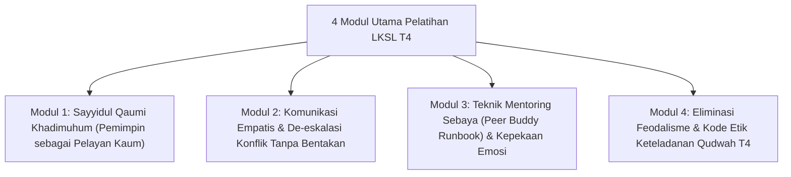

# P9-03-01: Program Kaderisasi Servant Leadership Santri T4

## Status Dokumen
* **Status**: 🌟 **A+ (Tervalidasi & Siap Diimplementasikan)**
* **Sub-Domain**: `09 Programs / 03 Leadership Programs`
* **Penanggung Jawab Keilmuan**: Dewan Keilmuan TUMBUH (*Pakar Tata Kelola Qudwah & Pakar Pedagogi Master Guru*)

---

## 1. Operasionalisasi Latihan Kepemimpinan Servant Leadership (LKSL)

LKSL diselenggarakan untuk santri calon pengurus T4 di awal tahun ajaran melalui 4 modul pelatihan utama:

---

## 2. Pengambilan Sumpah Qudwah T4

Pelatihan diakhiri dengan **Ikrar Qudwah Hasanah T4** di depan Kepala Pesantren dan seluruh santri untuk berkomitmen menjadi teladan kebaikan dan pelindung junior.
