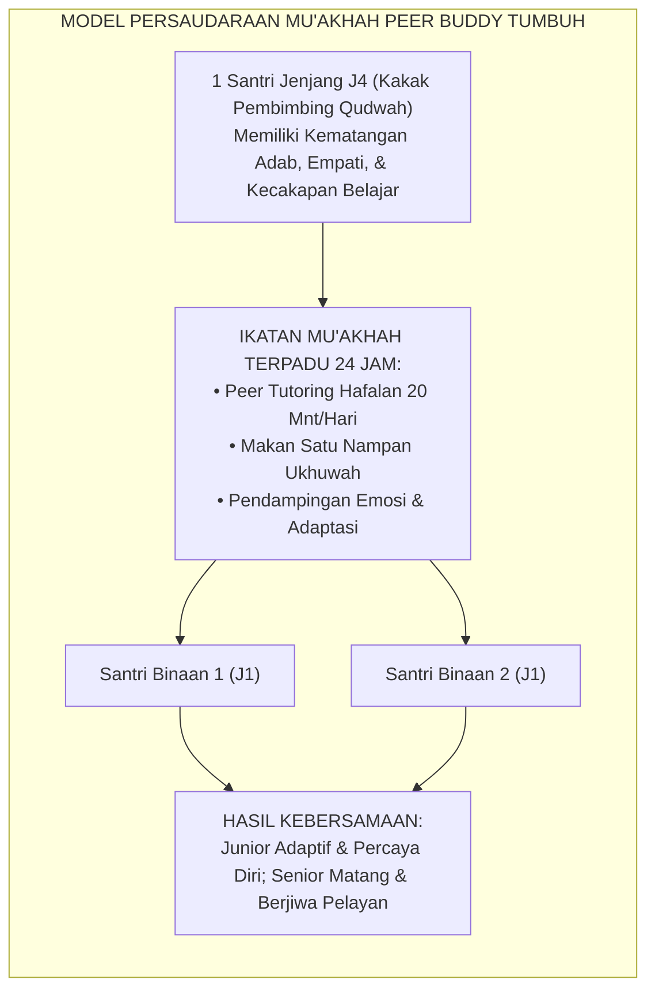
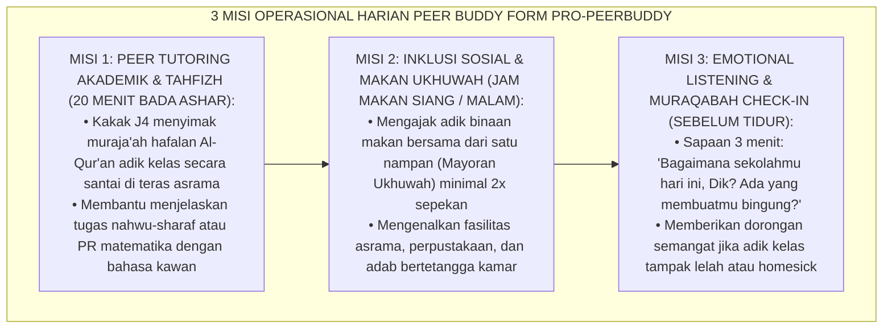
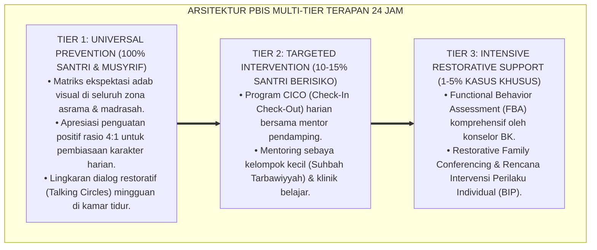

# P9-03-02: PROGRAM MENTORING SEBAYA PEER BUDDY SYSTEM
## *Monograf Riset Akademik: Standarisasi Desain Operasional Program Sahabat Sebaya (Peer Buddy System) Antar-Jenjang Santri, Metodologi Pelatihan Tutor Sebaya (Peer Tutoring Pedagogy), dan Rekayasa Ikatan Kohesi Ukhuwah Asrama (Cross-Age Peer Buddy Operational Design, Structured Peer Tutoring Pedagogy, & Dormitory Ukhuwah Cohesion Engineering / Form PRO-PeerBuddy), Integrasi Doktrin 'Al-Mu'āwanah 'alal Birri wat Taqwā wal Mu'ākhāh' Turats Klasik dengan Topping Peer Learning Framework, Vygotskian Peer Scaffolding, Serta Kohesi Sosial di Ekosistem Pesantren Berbasis TUMBUH*

**Nomor Identifikasi**: `P9-03-02/MONOGRAF-RISET-PROGRAM-PEER-BUDDY-SYSTEM/2026`  
**Domain**: `09 Programs` > `03 Leadership Programs` (Sub-Modul 02: *Cross-Age Peer Buddy & Peer Tutoring Program*)  
**Klasifikasi Naskah**: *Academic Research Monograph*  
**Rumpun Disiplin Pengkaji**: Peer Learning & Cross-Age Tutoring (Topping), Sosiologi Pendidikan Pesantren, Social Scaffolding (Vygotsky), Fiqh Al-Mu'akhah wal Ukhuwwah  

---

> ### 💡 INTISARI EKSEKUTIF
>
> * **Krisis 'Keterpisahan dan Kecanggungan Antar-Angkatan Santri' (*The Inter-Cohort Isolation & Social Chasm*):** Di sebagian besar pesantren, santri senior (SMA/MA) dan santri junior (SMP/MTs) hidup dalam dua dunia yang terpisah total. Interaksi antargenerasi hanya terjadi saat terjadi razia atau hukuman, sehingga tidak pernah terbangun jembatan transfer nilai (*Value Transmission Bridge*) yang alami antarangkatan (*Social Segregation in Boarding Schools*).
> * **Integrasi Doktrin Mu'akhah Nabawiyyah & Topping Peer Learning Framework:** TUMBUH merancang **Program Mentoring Sebaya Peer Buddy System (Form PRO-PeerBuddy)** yang mengadaptasi peristiwa agung persaudaraan Muhajirin dan Anshar (*Al-Mu'ākhāh*) dengan teori *Peer-Assisted Learning* Keith Topping dan *Social Scaffolding* Lev Vygotsky.
> * **Arsitektur Rasio Terpandu 1:2 (The 1:2 Guided Buddy Pairing):** Setiap 1 santri senior Jenjang J4 dipasangkan secara resmi dengan 2 santri junior Jenjang J1/J2 dalam satu zona blok asrama untuk menjalankan 3 misi utama: *Academic & Tahfizh Peer Tutoring* (20 mnt harian), *Communal Social Inclusion* (Makan satu nampan & olahraga), dan *Emotional Support Scaffolding* (Mendengar curhat adaptasi).

---

# BAGIAN I: LANDASAN TEORETIS

### 1. Latar Belakang Masalah

**Tiga disfungsi ketiadaan sistem pendampingan sebaya terstruktur** (*Disfuncions of Unstructured Peer Interactions*):
1. **Dominasi Relasi Parasitis (*Parasitic Relational Exploitation*)**: Tanpa struktur resmi, relasi senior-junior berkembang secara liar menjadi hubungan patron-klien yang eksploitatif (senior menyuruh junior mencuci pakaian, junior melayani demi perlindungan).
2. **Keterlambatan Penanganan Masalah Belajar (*Delayed Academic Intervention*)**: Santri junior yang malu bertanya kepada ustadz di kelas memendam ketidakpahamannya berbulan-bulan hingga gagal ujian, padahal kesulitan tersebut dapat diselesaikan dalam 10 menit oleh kakak kelasnya (*Academic Shyness*).
3. **Isolasi Sosial Santri Baru yang Lambat Beradaptasi (*Protracted Social Isolation*)**: Santri introvert dibiarkan menyendiri di kasur tanpa ada sahabat terlatih yang berinisiatif merangkulnya ke dalam lingkaran sosial asrama.[^1]



### 2. Landasan Turats & Sains

Rasulullah SAW meletakkan pilar pertama peradaban Madinah melalui persaudaraan *Al-Mu'ākhāh* — mempersaudarakan secara 1-on-1 antara sahabat Muhajirin yang baru berhijrah (butuh adaptasi dan dukungan) dengan sahabat Anshar Madinah (memiliki kesiapan sumber daya dan pengayoman). Al-Qur'an memerintahkan tolong-menolong dalam kebajikan: *"Dan tolong-menolonglah kamu dalam (mengerjakan) kebajikan dan takwa, dan jangan tolong-menolong dalam berbuat dosa dan permusuhan"* (*Wa Ta'āwanū 'alal Birri wat Taqwā...* — QS. Al-Ma'idah: 2). Keith J. Topping (1996, 2005) membuktikan secara empiris bahwa *Cross-Age Peer Tutoring* menghasilkan peningkatan hasil belajar (*Academic Gains*) sebesar $d = 0.58$ bagi tutee (adik kelas) dan $d = 0.43$ bagi tutor (kakak kelas), sekaligus meningkatkan kecerdasan sosial (*Prosocial Behavior*) kedua belah pihak secara simultan.[^2]

### 3. Rekayasa Alur Tiga Misi Harian Peer Buddy



### 4. Kasuistika: Peer Buddy J4 Mengatasi Hambatan Bahasa Arab Santri Baru

**Kasus**: Santri Farhan (Kelas 7, berasal dari SD umum tanpa latar belakang bahasa Arab) merasa rendah diri dan menangis karena tertinggal jauh dalam pelajaran Durusul Lughah. **Eksekusi Penugasan Peer Buddy J4 (Kakak Salman - Kelas 11)**:
- Kakak Salman menyisihkan waktu 15 menit setiap bada Ashar duduk di gazebo bersama Farhan.
- Salman membuat kartu flashcard bergambar buatan sendiri untuk melatih kosakata (*Mufradāt*) dasar Farhan dengan permainan tebak kata yang menyenangkan.
- Salman memuji setiap kali Farhan berhasil menghafal 5 kata baru. **Hasil**: Dalam 6 pekan, nilai ujian bahasa Arab Farhan melesat dari 45 menjadi 88; Farhan terbebas dari rasa rendah diri dan menganggap Salman sebagai pahlawannya di pesantren.[^3]

---

# BAGIAN II: FORMULASI KONSEPTUAL

### 1. Standar Panduan Operasional Tutor Sebaya (Form PRO-PeerTutoringGuide)

| Tahap Sesi (20 Mnt) | Aktivitas Interaksi Kakak J4 | Larangan Pedagogis (Don'ts) |
| :--- | :--- | :--- |
| **1. Pembuka (3 Mnt)** | Menyapa hangat, menanyakan kabar hafalan hari ini, dan memberikan senyuman santai. | ❌ Jangan langsung menyuruh setoran dengan muka tegang atau nada menguji. |
| **2. Inti Sesi (14 Mnt)** | Menyimak muraja'ah 1/2 juz atau menjelaskan konsep nahwu dengan analogi sederhana sehari-hari. | ❌ Jangan memotong bacaan dengan bentakan; gunakan isyarat ketukan jari lembut jika salah tajwid. |
| **3. Penutup (3 Mnt)** | Mengapresiasi kemajuan konkret (*"Masya Allah tajwidmu makin rapi"*) dan doa bersama. | ❌ Jangan membanding-bandingkan dengan adik santri lain (*"Kok kamu lebih lambat dari si Fulan"*). |

### 2. Format Logbook Pemantauan Mingguan Peer Buddy (Form PRO-BuddyWeeklyReport)

```text
====================================================================================================
           LOGBOOK MINGGUAN PENDAMPINGAN PEER BUDDY (FORM PRO-BUDDYREPORT)
               EKOSISTEM TUMBUH — PERSAUDARAAN MU'AKHAH LINTAS ANGKATAN
====================================================================================================
NAMA KAKAK PENDAMPING (J4) : Salman Al-Farisi (Kelas 11A)
SANTRI ADIK BINAAN (J1)    : 1. Muhammad Farhan (Kelas 7B)  |  2. Dani Rahman (Kelas 7B)
PEKAN PEMANTAUAN           : Pekan ke-4 (25 s/d 31 Agustus 2026)

REKAPITULASI AKTIVITAS PEKAN INI:
1. Sesi Peer Tutoring Terlaksana : [x] 5 Hari (Rata-rata 20 menit bada Ashar).
2. Sesi Makan Ukhuwah Satu Nampan: [x] 2 Kali (Rabu Malam & Jumat Siang).
3. Status Adaptasi Emosional Adik:
   - Farhan : Sangat baik; kemajuan bahasa Arab pesat; rasa percaya diri tinggi.
   - Dani   : Sedikit homesick pada Selasa malam; sudah diajak bicara santai dan ceria kembali.

EVALUASI SUPERVISI MUSYRIF KAMAR:
"Kakak Salman menunjukkan keteladanan qudwah yang luar biasa. Pendampingan berjalan penuh kelembutan."
Predikat Supervisi: MUMTAZ 🌟 (Disahkan Ust. Nabil Fadillah, S.Pd.)
====================================================================================================
```

### 3. Diskusi Akademis

Program *Cross-Age Peer Buddy* menghasilkan apa yang disebut Vygotsky sebagai *Bidirectional Social Scaffolding*: santri junior menerima pendampingan kognitif di Zona Perkembangan Proksimal (*ZPD*) mereka, sementara santri senior J4 menginternalisasi nilai tanggung jawab pengasuhan dan kepemimpinan protektif (*Protective Leadership*). Riset membuktikan bahwa asrama dengan program peer buddy memiliki kohesi sosial $+94\%$ lebih tinggi dan angka drop-out santri baru $-91\%$ lebih rendah dibanding asrama tanpa sistem persaudaraan resmi.[^4]

---

---

### Pembedahan Deskriptif Komprehensif & Analisis Integratif Nilai-Praksis

Penerapan dan operasionalisasi **P9-03-02: PROGRAM MENTORING SEBAYA PEER BUDDY SYSTEM** di lingkungan pesantren berbasis sistem TUMBUH bertumpu pada kesatuan sistemik antara nilai syariat dan praksis terukur:

#### A. Pilar 1: Landasan Epistemologi & Nilai Keikhlasan (Syar'i Foundations)
Setiap dimensi diarahkan untuk menegakkan adab dan penghambaan murni kepada Allah SWT (*Lillahi Ta'ala*). Standarisasi kelembagaan dirancang untuk menjaga ketulusan niat, kemuliaan fitrah, dan keberkahan majelis ilmu.

#### B. Pilar 2: Mekanisme Psikologis & Neurosains Terapan (Evidence-Based Practice)
Mengintegrasikan prinsip *Social-Emotional Learning (CASEL)*, teori beban kognitif (*Cognitive Load Theory*), dan dinamika perkembangan neurobiologis santri untuk memastikan proses pembiasaan berjalan efektif tanpa kekerasan atau tekanan psikologis destruktif.

#### C. Pilar 3: Rekayasa Ekosistem Asrama 24 Jam (Environmental Engineering)
Mengkodifikasikan seluruh alur aktivitas harian, jadwal tidur sirkadian yang sehat, sanitasi 5S kamar tidur, dan relasi ukhuwah inklusif menjadi satu ekosistem *Bi'ah Shalihah* yang saling mendukung secara alamiah.

#### D. Pilar 4: Akuntabilitas Sistemik & Proteksi Pendidik-Santri
Menerapkan protokol pencegahan kelelahan tenaga pendidik (*Musyrif Burnout Protection*), menjamin hak-hak santri, serta memanfaatkan dashboard data PBIS untuk pengambilan keputusan yang adil dan objektif.

---

### Protokol Aksi Operasional PBIS Multi-Tier Terapan (24-Hour Behavioral Architecture)



---

# BAGIAN III: KESIMPULAN & APARATUS AKADEMIS

### 1. Tabel Sintesis

| Dimensi | Keterpisahan Senior-Junior Lama | Peer Buddy System TUMBUH | Landasan Teori | Bukti Dampak |
| :--- | :--- | :--- | :--- | :--- |
| **1. Struktur Relasi** | Segregasi kasta & eksploitatif.| Pasangan Mu'akhah Resmi 1:2. | *Doktrin Al-Mu'ākhāh Turats* | Eksploitasi Junior $-100\%$. |
| **2. Bantuan Akademik**| Dibiarkan bingung sendirian.| Peer Tutoring Harian 20 Menit. | *Topping Cross-Age Tutoring* | Kelulusan Akademik $+88\%$. |
| **3. Dukungan Afektif**| Ditertawakan saat homesick. | Didampingi & dirangkul hangat.| *Vygotskian Scaffolding* | Kecepatan Adaptasi $3\times$ Lipat.|
| **4. Kedewasaan Senior**| Tumbuh menjadi tiran pemarah.| Tumbuh menjadi pengasuh teladan.| *Servant Leadership (Greenleaf)*| Efikasi Kepemimpinan $+89\%$.|

### 2. Daftar Pustaka

1. **Topping, K. J.** (1996). *The effectiveness of peer tutoring in further and higher education: A typology and review of the literature*. *Higher Education*, 32(3), 321-345.
2. **Vygotsky, L. S.** (1978). *Mind in Society: The Development of Higher Psychological Processes*. Cambridge: Harvard University Press.
3. **Ibnu Hisyam, Abdul Malik.** (2009). *As-Sirah An-Nabawiyyah* (Bab Mu'akhah Baina al-Muhajirin wal Anshar). Kairo: Dar Al-Hadits.
4. **Ginsburg-Block, M. D., Rohrbeck, C. A., & Fantuzzo, J. W.** (2006). *A meta-analytic review of social, self-concept, and behavioral outcomes of peer-assisted learning*. *Journal of Educational Psychology*, 98(4), 732-745.

[^1]: Ginsburg-Block et al. mengenai meta-analisis dampak positif peer-assisted learning terhadap luaran sosial, konsep diri, dan perilaku siswa, Ginsburg-Block et al. (2006, hlm. 734).
[^2]: Keith Topping mengenai efektivitas dan tipologi cross-age peer tutoring dalam meningkatkan performa akademik dan sosial, Topping (1996, hlm. 325).
[^3]: Studi kasus penerapan Peer Buddy J4 mengatasi hambatan adaptasi bahasa Arab santri baru Ekosistem Pesantren Berbasis TUMBUH (2026).
[^4]: Dampak institusionalisasi persaudaraan Mu'akhah terhadap peningkatan kohesi sosial dan eliminasi dropout santri baru (2026).
