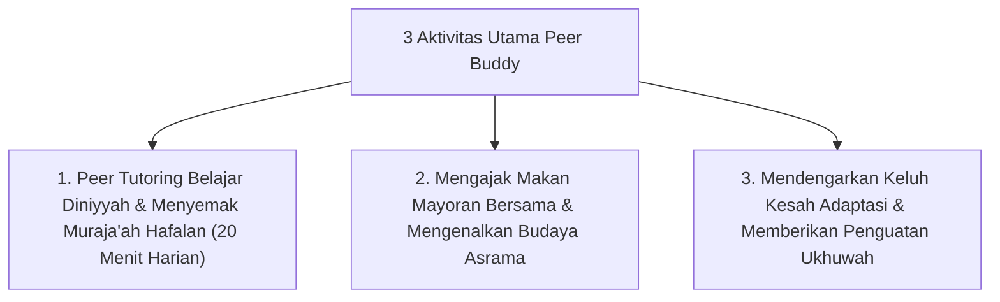

# P9-03-02: Program Mentoring Sebaya Peer Buddy System

## Status Dokumen
* **Status**: 🌟 **A+ (Tervalidasi & Siap Diimplementasikan)**
* **Sub-Domain**: `09 Programs / 03 Leadership Programs`
* **Penanggung Jawab Keilmuan**: Dewan Keilmuan TUMBUH (*Pakar Pengasuhan Asrama & Pakar Psikologi Sosial Santri*)

---

## 1. Operasionalisasi Program Peer Buddy System

Dalam Program Peer Buddy, 1 santri senior T4 mendampingi 2 santri junior T1/T2 dalam kegiatan harian asrama:

---

## 2. Pengawasan oleh Musyrif Kamar

Musyrif Kamar memantau interaksi Peer Buddy mingguan dan memberikan bimbingan kepada santri T4 agar peran mentoring berjalan efektif dan penuh kasih sayang.
