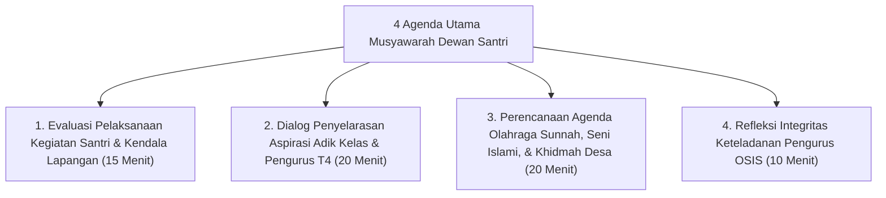

# P9-03-03: Program Musyawarah Restoratif OSIS dan Dewan Santri

## Status Dokumen
* **Status**: 🌟 **A+ (Tervalidasi & Siap Diimplementasikan)**
* **Sub-Domain**: `09 Programs / 03 Leadership Programs`
* **Penanggung Jawab Keilmuan**: Dewan Keilmuan TUMBUH (*Pakar Tata Kelola Qudwah & Pakar Kuratif Restoratif*)

---

## 1. Operasionalisasi Forum Musyawarah Dewan Santri

Pengurus OSIS / Dewan Santri mengelola dinamika keorganisasian melalui **Forum Musyawarah Restoratif Dwi-Pekanan**:

---

## 2. Pendampingan Staf OSIS

Sesi musyawarah didampingi oleh Staf OSIS (Pembina OSIS) untuk memastikan prinsip kepemimpinan tetap berorientasi *Servant Leadership*.
