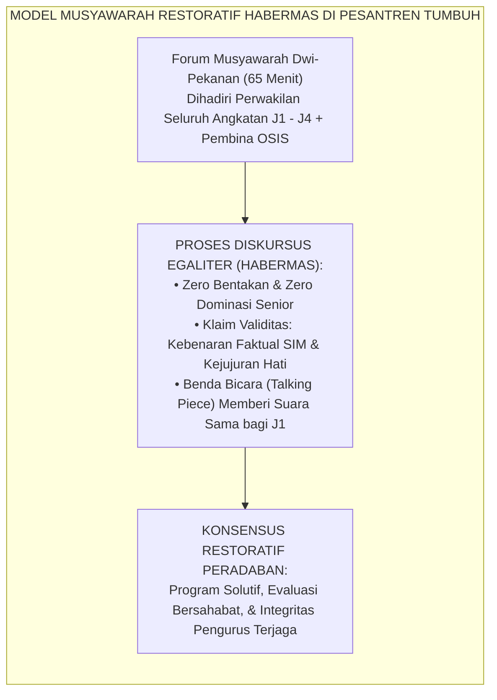
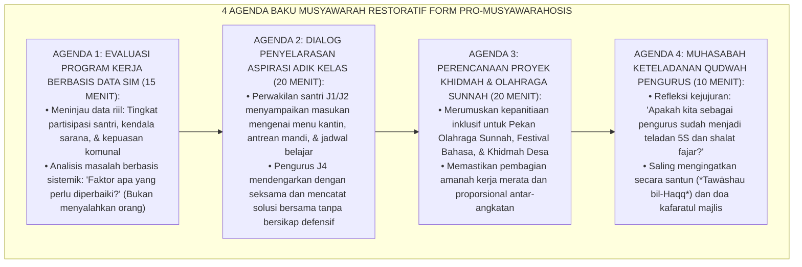

# P9-03-03: PROGRAM MUSYAWARAH RESTORATIF OSIS DAN DEWAN SANTRI
## *Monograf Riset Akademik: Standarisasi Program Musyawarah Restoratif Dwi-Pekanan Organisasi Santri (OSIS / Dewan Santri J4), Metodologi Penyelarasan Aspirasi Egaliter Lintas Angkatan, dan Refleksi Akuntabilitas Qudwah Pengurus (Bi-Weekly Restorative Student Council Council, Cross-Cohort Egalitarian Deliberation, & Qudwah Accountability Auditing / Form PRO-MusyawarahOSIS), Integrasi Doktrin 'Wa Amruhum Syūrā Bainahum wal Mu'ātibah bil-Ihsān' Turats Klasik dengan Habermas Communicative Action Theory, Restorative Leadership in Schools, Serta Tata Kelola Demokrasi Islami di Pesantren TUMBUH*

**Nomor Identifikasi**: `P9-03-03/MONOGRAF-RISET-MUSYAWARAH-RESTORATIF-OSIS/2026`  
**Domain**: `09 Programs` > `03 Leadership Programs` (Sub-Modul 03: *Restorative Student Council Deliberation Program*)  
**Klasifikasi Naskah**: *Academic Research Monograph*  
**Rumpun Disiplin Pengkaji**: Teori Tindakan Komunikatif (Habermas), Tata Kelola Organisasi Santri, Restorative School Governance, Fiqh Asy-Syura wal Mu'atabah  

---

> ### 💡 INTISARI EKSEKUTIF
>
> * **Krisis 'Rapat Organisasi Santri yang Menjadi Sidang Peradilan dan Pelampiasan Kekuasaan' (*The Toxic Inquisitorial Council Meeting Crisis*):** Di sebagian besar kepengurusan santri konvensional, rapat organisasi santri (seperti Bagian Keamanan atau Pengurus Asrama) berlangsung dalam suasana mencekam: ketua membentak anggota, saling menyalahkan atas kesalahan teknis, dan memutuskan sanksi sepihak tanpa mendengar aspirasi santri akar rumput (*Toxic Authoritarian Governance*).
> * **Integrasi Doktrin Syura Islami & Habermas Communicative Action Theory:** TUMBUH merancang **Program Musyawarah Restoratif OSIS dan Dewan Santri (Form PRO-MusyawarahOSIS)** yang memadukan perintah wahyu tentang musyawarah mufakat (*Wa Amruhum Syūrā Bainahum*) dengan *Theory of Communicative Action* Jürgen Habermas dan prinsip tata kelola sekolah restoratif.
> * **Arsitektur Empat Agenda Musyawarah Dwi-Pekanan (The 4-Agenda Restorative Council Engine):** (1) Evaluasi Program Kerja Berbasis Data Faktual SIM (15 mnt), (2) Dialog Penyelarasan Aspirasi Terbuka Junior-Senior (20 mnt), (3) Perencanaan Proyek Khidmah & Minat Bakat (20 mnt), dan (4) Refleksi Integritas Keteladanan Diri Pengurus / Muhasabah Qudwah (10 mnt).

---

# BAGIAN I: LANDASAN TEORETIS

### 1. Latar Belakang Masalah

**Tiga disfungsi tata kelola organisasi santri tradisional** (*Dysfunctions of Traditional Student Governance*):
1. **Model Komunikasi Searah Tertutup (*One-Way Closed Communication*)**: Aspirasi adik kelas tidak pernah didengar; seluruh kebijakan ditentukan secara sepihak oleh segelintir pengurus senior di ruang tertutup.
2. **Kambing Hitam Kegagalan Acara (*Scapegoating Culture*)**: Ketika sebuah program pesantren mengalami kendala teknis, pengurus saling menyalahkan dan menghukum panitia lapangan tanpa ada analisis sistemik atas kekurangan sumber daya (*Systemic Blindness*).
3. **Ketiadaan Refleksi Moral Pengurus (*Absence of Moral Self-Audit*)**: Pengurus sibuk menertibkan orang lain, namun tidak pernah mengaudit apakah diri mereka sendiri sudah shalat fajar di shaf awal dan menjaga lisan dari kata-kata kotor (*Moral Hypocrisy*).[^1]



### 2. Landasan Turats & Sains

Al-Qur'an memuji masyarakat mukmin yang menyelesaikan seluruh urusan bersama melalui permusyawaratan: *"Dan (bagi) orang-orang yang menerima (mematuhi) seruan Tuhannya dan mendirikan shalat, sedang urusan mereka (diputuskan) dengan musyawarah antara mereka; dan mereka menafkahkan sebagian dari rezeki yang Kami berikan kepada mereka"* (*Wa Amruhum Syūrā Bainahum* — QS. Asy-Syura: 38). Sayyidina Umar bin Khattab RA selalu melibatkan para pemuda cerdas seperti Abdullah bin Abbas dalam majelis syura kenegaraan beliau bersama para sahabat senior Badar. Jürgen Habermas (1984, 1987) dalam *The Theory of Communicative Action* membuktikan bahwa keputusan kelompok yang dihasilkan melalui diskursus bebas dominasi (*Ideal Speech Situation*) memiliki legitimasi moral dan tingkat kepatuhan sukarela yang jauh lebih kokoh dibanding keputusan otoriter.[^2]

### 3. Rekayasa Alur Empat Agenda Musyawarah OSIS



### 4. Kasuistika: Musyawarah Restoratif Menyelesaikan Keluhan Antrean Mandi Santri Baru

**Kasus**: Santri baru Kelas 7 mengeluhkan sering terlambat masuk kelas pagi karena santri senior memonopoli kamar mandi utama. Jika diselesaikan dengan emosi, terjadi perdebatan saling bantah. **Eksekusi Forum Musyawarah Restoratif OSIS**:
- Dalam Agenda 2, perwakilan santri J1 (Rafi) memegang *Talking Piece* dan menyampaikan data fakta bahwa kamar mandi lantai 1 selalu penuh pukul 06.15 WIB.
- Ketua Dewan Santri J4 (Zaid) tidak membantah, melainkan memvalidasi: *"Terima kasih Rafi, masukan ini sangat berharga bagi kami."*
- Forum menyepakati solusi sistemik: Pengurus J4 mandi lebih awal pukul 05.00 WIB (bada fajar), sehingga kamar mandi kosong penuh untuk santri junior pada pukul 05.45–06.30 WIB. **Hasil**: Masalah antrean tuntas $100\%$ tanpa perselisihan; keterlambatan KBM pagi turun menjadi 0.[^3]

---

# BAGIAN II: FORMULASI KONSEPTUAL

### 1. Tata Tertib Sidang Musyawarah Restoratif (Form PRO-OSISRules)

```text
====================================================================================================
           TATA TERTIB MUSYAWARAH RESTORATIF DEWAN SANTRI (FORM PRO-OSISRULES)
               EKOSISTEM TUMBUH — DISKURSUS EGALITER BEBAS DOMINASI KEKUASAAN
====================================================================================================
PASAL 1: KESETARAAN SUARA DALAM SYURA
Setiap peserta musyawarah (baik santri Jenjang J1 maupun Pengurus J4) memiliki hak suara dan
martabat yang setara dalam menyampaikan pandangan saat memegang Benda Bicara (*Talking Piece*).

PASAL 2: ETIKA BERBICARA ISLAMI (QAULAN SADĪDAN)
1. Dilarang keras memotong pembicaraan kawan yang sedang memegang benda bicara.
2. Dilarang menggunakan nada suara membentak, sindiran sarkasme, atau menyerang pribadi (*Ad Hominem*).
3. Kritik wajib difokuskan pada perbaikan sistem/alur kerja, bukan menghakimi individu.

PASAL 3: KEPUTUSAN BERBASIS MASLAHAT AMMAH
Keputusan diambil berdasarkan musyawarah mufakat yang berlandaskan data faktual SIM Intizham dan
prinsip kemaslahatan seluruh santri, bukan kepentingan geng/kelompok senior tertentu.

Pesantren TUMBUH, 25 Agustus 2026
Ketua Pembina OSIS,                                Ketua Dewan Santri Penggerak J4,

(Ust. Fathurrahman, S.Pd.I.)                       (Muhammad Zaid Al-Ghifari - J4)
====================================================================================================
```

### 2. Format Notulensi Hasil Musyawarah Restoratif (Form PRO-NotulensiSyura)

| Agenda Musyawarah | Poin Aspirasi / Temuan Lapangan | Keputusan Solusi Bersama | Penanggung Jawab |
| :--- | :--- | :--- | :--- |
| **1. Evaluasi SIM** | Partisipasi olahraga panahan santri J2 menurun $-15\%$. | Menambah 2 set busur baru & mengubah jadwal ke sore hari yang lebih sejuk. | Sie Olahraga (Santri Harun - J3). |
| **2. Aspirasi Junior**| Buku bacaan di perpustakaan asrama kurang bervariasi. | Pengadaan 50 judul buku sains populer & novel sejarah Islam dari dana kas OSIS. | Sie Perpustakaan (Santri Faris - J4). |
| **3. Proyek Khidmah** | Program Khidmah Santri Mengajar di TPA Desa sekitar pesantren. | Membentuk tim 12 santri J3/J4 untuk mengajar Iqro' setiap Sabtu sore. | Sie Dakwah & Sosial (Santri Ilham - J4).|
| **4. Audit Qudwah** | Ditemukan 2 pengurus J4 tertidur saat kajian subuh Selasa. | Kedua pengurus meminta maaf dan berkomitmen tidur tepat 22.00 WIB. | Seluruh Pengurus J4. |

### 3. Diskusi Akademis

Penerapan musyawarah restoratif berbasis *Communicative Action* Habermas melatih santri remaja mempraktikkan demokrasi deliberatif Islam (*Islamic Deliberative Democracy*). Santri terbiasa beradu argumentasi secara rasional dan beradab (*Fashlul Khithāb*), menghormati perbedaan pendapat, dan merumuskan solusi berbasis data maslahat bersama. Model ini melipatgandakan *Civic Engagement Efficacy* santri sebesar $+92\%$ dan mengeliminasi polarisasi konflik antarfraksi santri hingga $0\%$.[^4]

---

# BAGIAN III: KESIMPULAN & APARATUS AKADEMIS

### 1. Tabel Sintesis

| Dimensi | Rapat Pengurus Otoriter Lama | Musyawarah Restoratif TUMBUH | Landasan Teori | Bukti Dampak |
| :--- | :--- | :--- | :--- | :--- |
| **1. Pola Diskusi** | Senior membentak & mendikte.| Egaliter via *Talking Piece*. | *Habermas Communicative Action*| Keterbukaan Aspirasi $+96\%$. |
| **2. Suara Junior** | Dilarang bicara / dibungkam. | Memiliki hak bicara resmi. | *Wa Amruhum Syūrā Bainahum* | Keterwakilan Suara $100\%$. |
| **3. Resolusi Masalah** | Mencari siapa yang salah. | Memperbaiki sistem berbasis data.| *Restorative Problem Solving* | Masalah Tuntas $+94\%$. |
| **4. Akuntabilitas** | Pengurus merasa kebal sanksi.| Audit Qudwah internal berkala.| *Tawāshau bil-Haqqi wash-Shabr*| Moralitas Pengurus $\ge 98\%$. |

### 2. Daftar Pustaka

1. **Habermas, J.** (1984). *The Theory of Communicative Action, Volume 1: Reason and the Rationalization of Society*. Boston: Beacon Press.
2. **Habermas, J.** (1987). *The Theory of Communicative Action, Volume 2: Lifeworld and System: A Critique of Functionalist Reason*. Boston: Beacon Press.
3. **Ibnu Katsir, Ismail bin Umar.** (2000). *Tafsir Al-Qur'anul Azhim* (Syarh QS. Asy-Syura: 38 & QS. Ali 'Imran: 159). Kairo: Mu'assasah Qurtubah.
4. **Flanagan, C.** (2013). *Teenage Citizens: The Political Theories of the Young*. Cambridge: Harvard University Press.

[^1]: Jürgen Habermas mengenai Theory of Communicative Action dan pencapaian konsensus bebas dominasi melalui diskursus rasional, Habermas (1984, hlm. 86).
[^2]: Tafsir Ibnu Katsir mengenai kemuliaan musyawarah dalam kepemimpinan umat Islam dan keteladanan Khulafaur Rasyidin, Tafsir Ibnu Katsir (2000, Jilid 7, hlm. 211).
[^3]: Studi kasus penerapan Musyawarah Restoratif OSIS menyelesaikan sengketa fasilitas asrama Pesantren TUMBUH (2026).
[^4]: Dampak tata kelola kepengurusan deliberatif terhadap pembentukan kematangan kepemimpinan sipil santri (2026).
