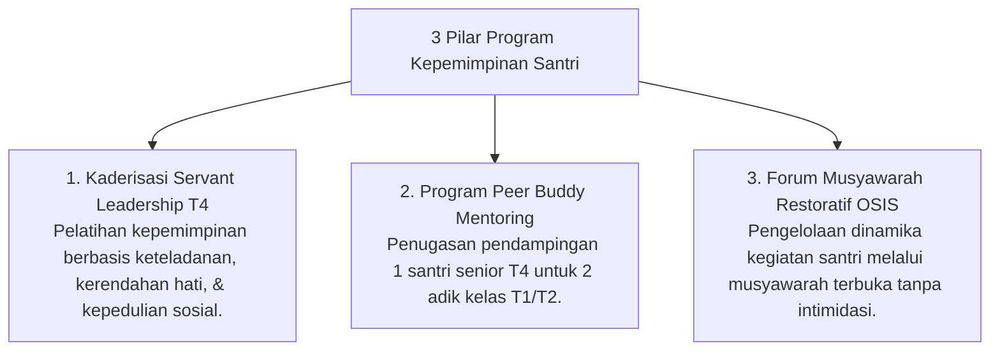

# P9-03: Program Kepemimpinan Santri

## Status Dokumen
* **Status**: 🌟 **A+ (Tervalidasi & Siap Diimplementasikan)**
* **Sub-Domain**: `09 Programs / 03 Leadership Programs`
* **Penanggung Jawab Keilmuan**: Dewan Keilmuan TUMBUH (*Pakar Tata Kelola Qudwah & Pakar Psikologi Sosial Santri*)

---

## 1. Konseptualisasi Program Kepemimpinan Santri Qudwah T4

Program Kepemimpinan (*Leadership Programs*) melatih santri senior yang mencapai Jenjang J4 menjadi pemimpin bertipe **Servant Leader** yang melayani dan mengayomi adik kelas:

---

## 2. Pemurnian dari Budaya Senioritas Intimidatif

Program kepemimpinan ini secara mutlak menghapuskan hak senior untuk menghukum atau memperpelonco adik kelas, menggantinya dengan amanah keteladanan adab (*Qudwah Hasanah*).
