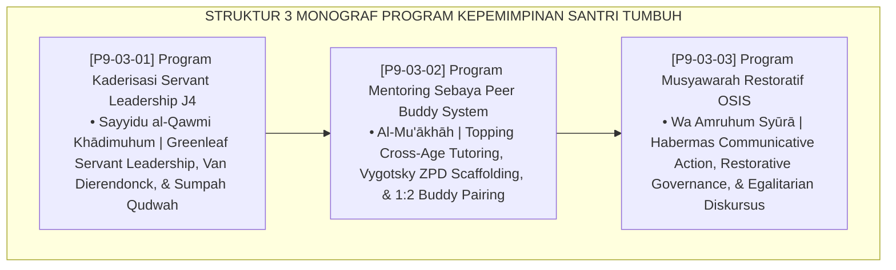

# P9-03: DOKUMEN INDUK PROGRAM KEPEMIMPINAN SANTRI PESANTREN
## *Arsitektur dan Standarisasi Program Kaderisasi Servant Leadership Santri Jenjang J4, Program Mentoring Sebaya (Peer Buddy System) Rasio 1:2 Bebas Feodalisme, Serta Program Musyawarah Restoratif Dwi-Pekanan Dewan Santri sebagai Tiga Pilar Kepemimpinan Pelayan Qudwah (Servant Leadership LKSL Form PRO-LKSLJ4, Peer Buddy System Form PRO-PeerBuddy, Serta Restorative Council Form PRO-MusyawarahOSIS) di Ekosistem TUMBUH Pesantren*

**Nomor Identifikasi**: `P9-03/DOKUMEN-INDUK-PROGRAM-KEPEMIMPINAN-SANTRI/2026`  
**Domain**: `09 Programs` > `03 Leadership Programs` (Gugus Sub-Domain 03: *Student Leadership & Peer Mentoring Programs*)  
**Klasifikasi Naskah**: *Master Architecture & Navigation Monograph*  
**Rumpun Disiplin Pengkaji**: Servant Leadership Theory (Greenleaf), Peer Learning & Tutoring (Topping), Communicative Action (Habermas), Fiqh Al-Imamah wal Khidmah  

---

> ### 💡 INTISARI EKSEKUTIF
>
> * **Kedudukan Strategis Gugus Program Kepemimpinan Santri:** Gugus ini adalah inkubator kepemimpinan peradaban (*civilizational leadership incubator*) di ekosistem TUMBUH. Membongkar tuntas tradisi feodalisme senioritas, perpeloncoan, dan arogansi kekuasaan yang merusak pesantren tradisional, pendekatan ini mencetak generasi santri penggerak Jenjang J4 yang memimpin dengan keteladanan nyata (*Qudwah Hasanah*), melayani adik kelas dengan kasih sayang (*Servant Leadership*), dan mengelola organisasi melalui musyawarah deliberatif yang egaliter (*Leading by Serving, Inspiring by Example*).
> * **Triad Program Kepemimpinan Santri TUMBUH:** (1) **Kaderisasi LKSL J4** (Latihan Kepemimpinan Servant Leadership 32 Jam) berbasis sumpah ikrar qudwah, (2) **Peer Buddy System 1:2** untuk pendampingan hafalan, belajar diniyyah, dan afeksi santri baru, dan (3) **Musyawarah Restoratif OSIS** dwi-pekanan berbasis diskursus bebas dominasi Habermas.
> * **3 Monograf Riset Komprehensif:** Form PRO-LKSLJ4, Form PRO-PeerBuddy, dan Form PRO-MusyawarahOSIS.

---

## 📑 PETA NAVIGASI TIGA MONOGRAF

---

## 📚 DESKRIPSI RINGKAS 3 BERKAS MONOGRAF

1. **[P9-03-01: Program Kaderisasi Servant Leadership Santri T4](file:///c:/xampp/htdocs/tumbuh/09%20Programs/03%20Leadership%20Programs/P9-03-01-Program-Kaderisasi-Servant-Leadership-Santri-T4.md)**  
   *Kurikulum LKSL J4 32 jam 4 modul (khidmah, non-violent communication, peer tutoring, pakta integritas), naskah ikrar sumpah qudwah, dan Form PRO-LKSLJ4.*
2. **[P9-03-02: Program Mentoring Sebaya Peer Buddy System](file:///c:/xampp/htdocs/tumbuh/09%20Programs/03%20Leadership%20Programs/P9-03-02-Program-Mentoring-Sebaya-Peer-Buddy-System.md)**  
   *Sistem pasangan persaudaraan Mu'akhah 1 senior J4 : 2 adik J1, tiga misi harian (peer tutoring tahfizh 20 mnt, makan nampan ukhuwah, emotional support), dan Form PRO-PeerBuddy.*
3. **[P9-03-03: Program Musyawarah Restoratif OSIS dan Dewan Santri](file:///c:/xampp/htdocs/tumbuh/09%20Programs/03%20Leadership%20Programs/P9-03-03-Program-Musyawarah-Restoratif-OSIS-dan-Dewan-Santri.md)**  
   *Musyawarah dwi-pekanan 4 agenda (evaluasi data SIM, aspirasi junior, proyek khidmah, muhasabah qudwah), tata tertib sidang bebas dominasi, notulensi syura, dan Form PRO-MusyawarahOSIS.*

---

## 🎯 STANDAR PENJAMINAN MUTU KEPEMIMPINAN SANTRI

Penerapan gugus **Program Kepemimpinan Santri** menjamin bahwa:
1. **Seluruh Struktur Organisasi Santri Bersih dari Feodalisme dan Perpeloncoan (*Zero Hazing Guarantee*)**: Menjamin kepemimpinan santri berfungsi murni sebagai pelindung dan pelayan.
2. **Transfer Adab dan Keilmuan Terjadi Secara Alami Antar-Generasi (*Seamless Value Scaffolding Guarantee*)**: Peer Buddy memastikan santri baru bertumbuh dalam dekapan persaudaraan hangat.
3. **Santri Terlatih Menjadi Negosiator Damai dan Pengambil Keputusan Bijak (*Deliberative Governance Guarantee*)**: Musyawarah restoratif melahirkan negarawan muda muslim yang matang.
