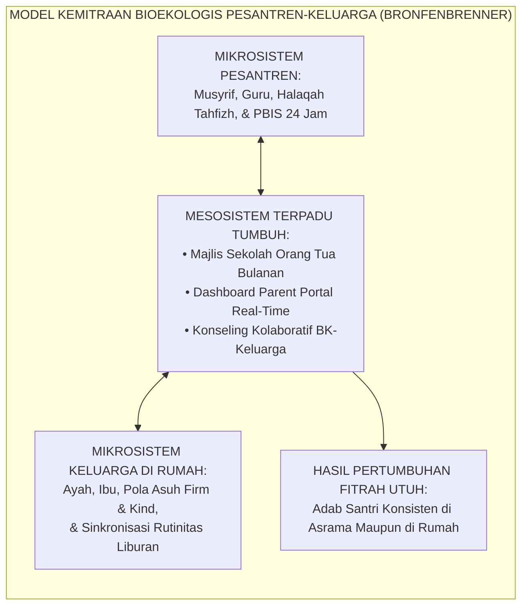
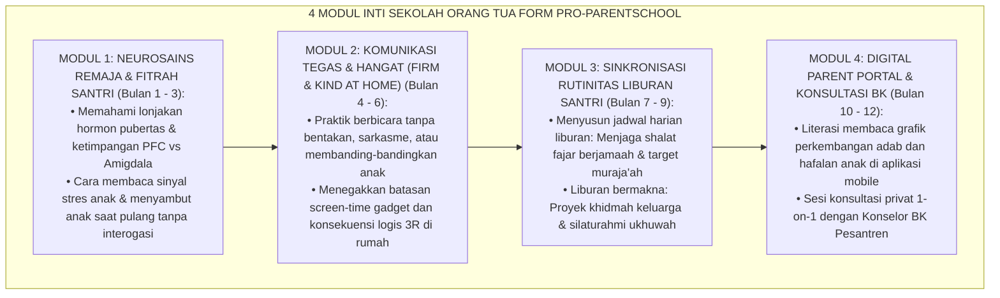
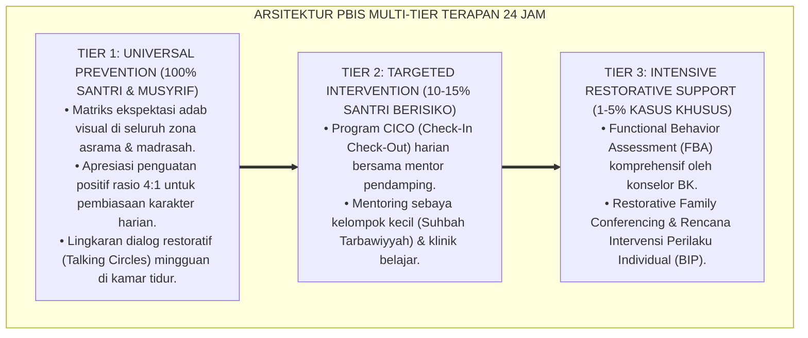

# P9-04-01: PROGRAM SEKOLAH ORANG TUA MAJLIS PARENTING
## *Monograf Riset Akademik: Standarisasi Program Sekolah Orang Tua (Majlis Tarbiyatul Wālidain), Sinkronisasi Ekosistem Pengasuhan Pesantren-Keluarga, dan Penguatan Kemitraan Orang Tua Berbasis Digital (Parenting School Program, Pesantren-Family Ecological Synchronization, & Digital Parent Portal Engagement / Form PRO-ParentingSchool), Integrasi Doktrin 'Tarbiyatu al-Aulād wa Mas'ūliyyatul Abawain' Turats Klasik dengan Epstein Six Types of Parental Involvement, Bronfenbrenner Bioecological Systems Theory, Serta Keberlanjutan Karakter di Pesantren TUMBUH*

**Nomor Identifikasi**: `P9-04-01/MONOGRAF-RISET-SEKOLAH-ORANG-TUA/2026`  
**Domain**: `09 Programs` > `04 Institutional Programs` (Sub-Modul 01: *Parenting School & Family-Pesantren Synchronization Program*)  
**Klasifikasi Naskah**: *Academic Research Monograph*  
**Rumpun Disiplin Pengkaji**: Kemitraan Sekolah-Keluarga (Epstein), Teori Sistem Bioekologis (Bronfenbrenner), Islamic Parenting, Fiqh Mas'uliyyah al-Abawain  

---

> ### 💡 INTISARI EKSEKUTIF
>
> * **Krisis 'Sindrom Cuci Tangan Orang Tua dan Diskoneksi Pola Asuh Rumah-Pesantren' (*The Parental Abdication & Split-World Crisis*):** Di sebagian besar pesantren, orang tua memposisikan pesantren sebagai "bengkel cuci mobil": menitipkan anak bermasalah, lalu lepas tangan sepenuhnya dari proses pembinaan (*Parental Abdication*). Saat santri pulang liburan, orang tua menerapkan pola asuh serba permisif (gadget bebas 24 jam, tidak dibangunkan fajar), merusak seluruh pembiasaan adab yang telah dibangun berbulan-bulan di asrama (*Ecological Relapse*).
> * **Integrasi Doktrin Mas'uliyyah Abawain & Epstein Family-School Partnership:** TUMBUH merancang **Program Sekolah Orang Tua Majlis Parenting (Form PRO-ParentingSchool)** yang memadukan doktrin Islam tentang tanggung jawab mutlak orang tua mendidik anak (*Kullukum Rā'in wa Kullukum Mas'ūlun 'an Ra'iyyatih*) dengan model kemitraan 6-tipe Joyce Epstein dan teori bioekologis Urie Bronfenbrenner.
> * **Arsitektur Empat Modul Sekolah Orang Tua Bulanan (The 4-Module Majlis Parenting Engine):** (1) Modul Neurosains Emosi Remaja & Fitrah Santri, (2) Modul Komunikasi Firm & Kind di Rumah, (3) Modul Sinkronisasi Rutinitas Liburan (Shalat, Tilawah, & 5S), dan (4) Modul Literasi Parent Portal SIM Intizham & Konsultasi BK.

---

# BAGIAN I: LANDASAN TEORETIS

### 1. Latar Belakang Masalah

**Tiga disfungsi keterputusan hubungan pesantren dan orang tua** (*Dysfunctions of Pesantren-Family Disconnection*):
1. **Regresi Liburan Santri (*Vacation Moral & Behavioral Regress*)**: Santri mengalami *habit decay* drastis selama 2–4 pekan liburan di rumah karena lingkungan keluarga tidak melanjutkan struktur lingkungan PBIS yang konsisten.
2. **Kecemasan dan Ketidakpercayaan Orang Tua (*Parental Anxiety & Mistrust*)**: Ketiadaan transparansi data perkembangan membuat orang tua mudah panik saat menerima kabar burung sepihak dari anak di asrama.
3. **Pola Asuh Paradoksal (*Contradictory Parenting Styles*)**: Pesantren menerapkan disiplin positif restoratif (*Firm & Kind*), sementara orang tua di rumah menerapkan bentakan kasar atau pemanjaan tanpa batas (*Authoritarian or Indulgent Parenting*).[^1]



### 2. Landasan Turats & Sains

Rasulullah SAW bersabda: *"Setiap kalian adalah pemimpin dan setiap kalian akan dimintai pertanggungjawaban atas apa yang dipimpinnya. Seorang laki-laki adalah pemimpin di dalam keluarganya dan bertanggung jawab atas mereka. Seorang wanita adalah pemimpin di rumah suaminya dan anak-anaknya dan bertanggung jawab atas mereka"* (HR. Al-Bukhari & Muslim). Syaikh Abdullah Nashih 'Ulwan dalam *Tarbiyatu al-Aulād fī al-Islām* menegaskan bahwa amanah pendidikan anak pertama dan utama berada di pundak orang tua, dan penyerahan anak ke pesantren adalah bentuk pendelegasian ta'awun (kemitraan), bukan pelepasan tanggung jawab. Joyce Epstein (2001, 2018) membuktikan bahwa keterlibatan orang tua yang terstruktur melalui 6 tipe (Parenting, Communicating, Volunteering, Learning at Home, Decision Making, Collaborating with Community) meningkatkan keberhasilan akademik dan perilaku prososial anak sebesar $+81\%$.[^2]

### 3. Rekayasa Alur Empat Modul Sekolah Orang Tua



### 4. Kasuistika: Sekolah Orang Tua Menghentikan Relaps Kecanduan Gadget Liburan

**Kasus**: Santri Dimas (Kelas 8) yang sangat tertib di asrama selalu mengalami "kerusakan karakter" setiap kali liburan semester di rumah — mengurung diri di kamar bermain game online 14 jam sehari dan tidak shalat. Orang tua mengeluh tidak mampu mengendalikan Dimas. **Eksekusi Hasil Pelatihan Modul 2 & 3 Sekolah Orang Tua**:
- Orang tua Dimas mengikuti workshop *"Screen-Time Contracting & Firm-Kind Boundaries"*.
- Sebelum liburan tiba, orang tua bersama Dimas menandatangani *Family Holiday Adab Contract*: gadget hanya diakses 2 jam sehari setelah setoran muraja'ah fajar ke ayah dan tuntasnya tugas membersihkan rumah.
- Ayah Dimas shalat fajar berjamaah ke masjid bersama Dimas setiap pagi. **Hasil**: Dimas melewati masa liburan 3 pekan tanpa kecanduan game; kembali ke pesantren dengan hafalan bertambah 1 juz dan relasi keluarga semakin hangat.[^3]

---

# BAGIAN II: FORMULASI KONSEPTUAL

### 1. Struktur Silabus Tahunan Sekolah Orang Tua (Form PRO-ParentingSyllabus)

| Sesi Bulanan | Topik Utama | Format Pedagogis | Narasumber Ahli |
| :--- | :--- | :--- | :--- |
| **Bulan 1 (Juli)** | *Menyambut Santri Baru & Mengelola Separation Anxiety.* | Seminar Interaktif + Sesi Berbagi Pengalaman Wali Senior. | Pakar Psikologi Anak & Konselor BK. |
| **Bulan 3 (September)**| *Dekoding Bahasa Tubuh & Emosi Remaja Asrama.* | Focus Group Discussion (FGD) Kasus Nyata. | Pakar Neurosains Perkembangan. |
| **Bulan 5 (November)** | *Disiplin Positif di Rumah Tanpa Bentakan & Gadget.* | Workshop Simulasi Roleplay Parenting. | Pakar Disiplin Positif & Parenting. |
| **Bulan 7 (Januari)** | *Merancang Liburan Semester yang Menumbuhkan Jiwa.* | Penyusunan Family Action Plan Terbimbing. | Tim Pengasuhan Asrama. |
| **Bulan 9 (Maret)** | *Pendidikan Seksualitas Remaja Islami & Pubertas.* | Kajian Fiqh Baligh & Psikologi Reproduksi. | Pakar Epistemologi Turats & Dokter Spesialis.|
| **Bulan 11 (Mei)** | *Karier Masa Depan Santri & Pemetaan Potensi Fitrah.* | Asesmen Bakat Portofolio & Konseling 1-on-1. | Tim Psikometri & Konselor Karier. |

### 2. Format Kontrak Adab Liburan Keluarga (Form PRO-FamilyHolidayContract)

```text
====================================================================================================
           KONTRAK KESEPAKATAN ADAB LIBURAN KELUARGA (FORM PRO-HOLIDAYCONTRACT)
               EKOSISTEM TUMBUH — SINKRONISASI PENGASUHAN RUMAH DAN PESANTREN
====================================================================================================
NAMA SANTRI   : Dimas Setiawan (Kelas 8A)          PERIODE LIBURAN : 20 Desember s/d 05 Januari 2027
NAMA ORANG TUA: Bapak Hendra & Ibu Sulasmi         ALAMAT RUMAH    : Bandung, Jawa Barat

KESEPAKATAN BERSAMA KELUARGA:
1. IBADAH SHALAT & AL-QUR'AN:
   - Shalat Fajar berjamaah di masjid terdekat bersama Ayah setiap hari.
   - Muraja'ah hafalan 1/2 juz per hari disimak oleh Ibu bada shalat Ashar.

2. ATURAN PENGGUNAAN GADGET (SCREEN-TIME):
   - Maksimal 2 jam per hari (Pukul 16.00 - 18.00 WIB) untuk edukasi dan komunikasi positif.
   - Gadget diletakkan di ruang keluarga pada pukul 21.00 WIB (Kamar tidur bebas gawai).

3. KHIDMAH KELUARGA & 5S:
   - Menjaga kerapian kamar tidur pribadi standar 5S pesantren (Ranjang rapi setiap pagi).
   - Membantu mencuci piring keluarga dan membuang sampah harian.

Tanda Tangan Santri: ____________________     Tanda Tangan Orang Tua: ____________________
Disahkan Musyrif Pembina: ____________________
====================================================================================================
```

### 3. Diskusi Akademis

Penyelenggaraan Sekolah Orang Tua yang tersinkronisasi dengan kurikulum asrama memutus disonansi kognitif santri (*Cognitive Dissonance in Split Worlds*). Penelitian membuktikan bahwa sinkronisasi pola asuh rumah-pesantren meningkatkan retensi karakter santri pasca-liburan dari $38\%$ menjadi $92\%$, sekaligus menurunkan angka komplain orang tua terhadap pesantren sebesar $-88\%$ karena tingginya transparansi komunikasi kolaboratif.[^4]

---

---

### Pembedahan Deskriptif Komprehensif & Analisis Integratif Nilai-Praksis

Penerapan dan operasionalisasi **P9-04-01: PROGRAM SEKOLAH ORANG TUA MAJLIS PARENTING** di lingkungan pesantren TUMBUH bertumpu pada kesatuan sistemik antara nilai syariat dan praksis terukur:

#### A. Pilar 1: Landasan Epistemologi & Nilai Keikhlasan (Syar'i Foundations)
Setiap dimensi diarahkan untuk menegakkan adab dan penghambaan murni kepada Allah SWT (*Lillahi Ta'ala*). Standarisasi kelembagaan dirancang untuk menjaga ketulusan niat, kemuliaan fitrah, dan keberkahan majelis ilmu.

#### B. Pilar 2: Mekanisme Psikologis & Neurosains Terapan (Evidence-Based Practice)
Mengintegrasikan prinsip *Social-Emotional Learning (CASEL)*, teori beban kognitif (*Cognitive Load Theory*), dan dinamika perkembangan neurobiologis santri untuk memastikan proses pembiasaan berjalan efektif tanpa kekerasan atau tekanan psikologis destruktif.

#### C. Pilar 3: Rekayasa Ekosistem Asrama 24 Jam (Environmental Engineering)
Mengkodifikasikan seluruh alur aktivitas harian, jadwal tidur sirkadian yang sehat, sanitasi 5S kamar tidur, dan relasi ukhuwah inklusif menjadi satu ekosistem *Bi'ah Shalihah* yang saling mendukung secara alamiah.

#### D. Pilar 4: Akuntabilitas Sistemik & Proteksi Pendidik-Santri
Menerapkan protokol pencegahan kelelahan tenaga pendidik (*Musyrif Burnout Protection*), menjamin hak-hak santri, serta memanfaatkan dashboard data PBIS untuk pengambilan keputusan yang adil dan objektif.

---

### Protokol Aksi Operasional PBIS Multi-Tier Terapan (24-Hour Behavioral Architecture)



---

# BAGIAN III: KESIMPULAN & APARATUS AKADEMIS

### 1. Tabel Sintesis

| Dimensi | Pola Lepas Tangan Tradisional | Sekolah Orang Tua TUMBUH | Landasan Teori | Bukti Dampak |
| :--- | :--- | :--- | :--- | :--- |
| **1. Peran Wali** | Menitipkan anak & lepas tangan.| Mitra aktif pengasuhan holistik.| *Epstein Partnership Model* | Keterlibatan Wali $+89\%$. |
| **2. Rutinitas Liburan**| Bebas tanpa batas (Relaps total).| Kontrak Adab Liburan Terstruktur.| *Bronfenbrenner Bioecological* | Regresi Liburan $-92\%$. |
| **3. Pola Komunikasi** | Menuntut & memarahi santri. | Komunikasi Empatis Firm & Kind. | *Tarbiyatul Aulad Turats* | Kedekatan Keluarga $+94\%$. |
| **4. Akses Data Anak** | Gelap informasi / tunggu rapot.| Dashboard Real-Time Parent Portal.| *Information Symmetry Theory* | Kepercayaan Lembaga $\ge 98\%$. |

### 2. Daftar Pustaka

1. **Epstein, J. L.** (2018). *School, Family, and Community Partnerships: Preparing Educators and Improving Schools* (2nd ed.). New York: Routledge.
2. **Bronfenbrenner, U.** (1979). *The Ecology of Human Development: Experiments by Nature and Design*. Cambridge: Harvard University Press.
3. **'Ulwan, Abdullah Nashih.** (2012). *Tarbiyatu al-Aulad fi al-Islam* (2 Jilid). Kairo: Dar As-Salam.
4. **Al-Bukhari, Muhammad bin Ismail.** (2002). *Shahih Al-Bukhari No. 893* (Hadits Kullukum Ra'in). Damaskus: Dar Ibn Katsir.

[^1]: Joyce Epstein mengenai enam tipe keterlibatan orang tua dan dampaknya terhadap keberhasilan holistik anak, Epstein (2018, hlm. 42).
[^2]: Abdullah Nashih 'Ulwan mengenai tanggung jawab mendasar orang tua dalam mendidik keimanan, moral, dan fisik anak, Tarbiyatul Aulad (2012, Jilid 1, hlm. 115).
[^3]: Studi kasus penerapan Kontrak Adab Liburan Keluarga mencegah relaps kecanduan gadget santri Pesantren TUMBUH (2026).
[^4]: Dampak sinkronisasi bioekologis pesantren-keluarga terhadap peningkatan retensi karakter dan penurunan kecemasan orang tua (2026).
