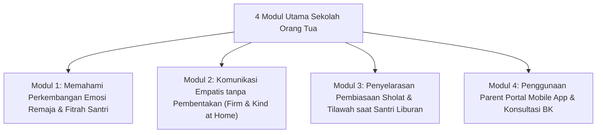

# P9-04-01: Program Sekolah Orang Tua Majlis Parenting

## Status Dokumen
* **Status**: 🌟 **A+ (Tervalidasi & Siap Diimplementasikan)**
* **Sub-Domain**: `09 Programs / 04 Institutional Programs`
* **Penanggung Jawab Keilmuan**: Dewan Keilmuan TUMBUH (*Pakar Bimbingan Konseling & Pakar Pengasuhan Asrama*)

---

## 1. Operasionalisasi Program Sekolah Orang Tua

Sekolah Orang Tua diselenggarakan setiap bulan pada hari kepulangan/sambangan santri melalui 4 modul materi interaktif:

---

## 2. Penyampaian Materi Interaktif

Sesi disampaikan oleh Pakar BK dan Pakar Pengasuhan melalui diskusi kelompok (*Focus Group Discussion*) dan studi kasus pengasuhan di rumah.
