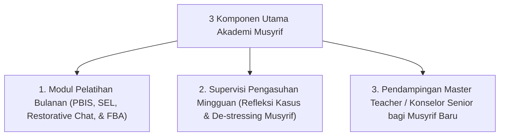

# P9-04-02: Program Pengembangan Profesi Musyrif dan Supervisi

## Status Dokumen
* **Status**: 🌟 **A+ (Tervalidasi & Siap Diimplementasikan)**
* **Sub-Domain**: `09 Programs / 04 Institutional Programs`
* **Penanggung Jawab Keilmuan**: Dewan Keilmuan TUMBUH (*Pakar Pengasuhan Asrama & Pakar Pedagogi Master Guru*)

---

## 1. Operasionalisasi Akademi Musyrif & Program Supervisi

Program Akademi Musyrif bertujuan meningkatkan kompetensi pedagogi, konseling, dan kesehatan emosional para musyrif asrama:

---

## 2. Perlindungan Kesejahteraan & Pencegahan Burnout

Supervisi mingguan memberikan ruang aman bagi musyrif untuk mengekspresikan keletihan emosional dan memperoleh dukungan psikologis (*Self-Care for Educators*).
