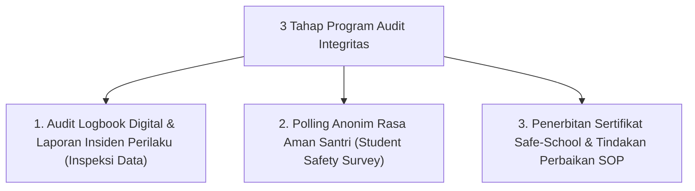

# P9-04-03: Program Audit Integritas Zero-Violence Lembaga

## Status Dokumen
* **Status**: 🌟 **A+ (Tervalidasi & Siap Diimplementasikan)**
* **Sub-Domain**: `09 Programs / 04 Institutional Programs`
* **Penanggung Jawab Keilmuan**: Dewan Keilmuan TUMBUH (*Pakar Tata Kelola Qudwah & Pakar Arsitektur PBIS Restoratif*)

---

## 1. Operasionalisasi Program Audit Integritas Zero-Violence

Program Audit Integritas diselenggarakan setiap semester untuk menjamin lingkungan pesantren 100% bebas dari tindak kekerasan dan feodalisme:

---

## 2. Jaminan Keamanan Santri

Lembaga memberikan jaminan bahwa setiap laporan tindak kekerasan akan ditindaklanjuti secara tegas tanpa intimidasi balasan kepada pelapor.
