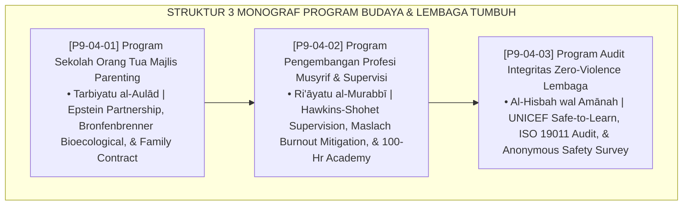

# P9-04: DOKUMEN INDUK PROGRAM BUDAYA DAN LEMBAGA PESANTREN
## *Arsitektur dan Standarisasi Program Sekolah Orang Tua Majlis Parenting, Program Akademi Pengembangan Profesi dan Supervisi Musyrif, Serta Program Audit Integritas Zero-Violence Lembaga sebagai Tiga Pilar Program Kelembagaan dan Budaya (Parenting School Form PRO-ParentingSchool, Musyrif Academy & Supervision Form PRO-AkademiMusyrif, Serta Zero-Violence Integrity Audit Form PRO-AuditIntegritas) di Ekosistem TUMBUH Pesantren*

**Nomor Identifikasi**: `P9-04/DOKUMEN-INDUK-PROGRAM-BUDAYA-LEMBAGA/2026`  
**Domain**: `09 Programs` > `04 Institutional Programs` (Gugus Sub-Domain 04: *Institutional, Cultural, & Professional Programs*)  
**Klasifikasi Naskah**: *Master Architecture & Navigation Monograph*  
**Rumpun Disiplin Pengkaji**: Kemitraan Keluarga-Sekolah (Epstein), Clinical Supervision (Hawkins-Shohet), Child Safeguarding (UNICEF Safe-to-Learn), Fiqh Al-Amanah wal Hisbah  

---

> ### 💡 INTISARI EKSEKUTIF
>
> * **Kedudukan Strategis Gugus Program Budaya dan Lembaga:** Gugus ini adalah benteng ketahanan institusional (*institutional resilience fortress*) di ekosistem TUMBUH. Memastikan bahwa pembinaan karakter tidak hanya bertumpu pada santri semata, melainkan didukung serempak oleh tiga pilar dewasa penopang ekosistem: orang tua yang teredukasi dan bersinergi (*Educated & Engaged Parents*), musyrif yang terlatih secara profesional dan terlindungi dari burnout (*Supported & Professional Caregivers*), serta lembaga yang berintegritas tinggi dengan audit kepatuhan ramah anak yang transparan tanpa kekerasan (*Zero-Violence Safe Institutional Climate*).
> * **Triad Program Kelembagaan & Budaya TUMBUH:** (1) **Sekolah Orang Tua Majlis Parenting** bulanan untuk sinkronisasi pola asuh rumah-pesantren, (2) **Akademi Musyrif & Supervisi Mingguan** 90 menit untuk pembekalan 100 jam dan pencegahan burnout pendidik, dan (3) **Audit Integritas Zero-Violence Semesteran** berbasis survei anonim terenkripsi (S-SCS) dan sertifikasi ramah anak.
> * **3 Monograf Riset Komprehensif:** Form PRO-ParentingSchool, Form PRO-AkademiMusyrif, dan Form PRO-AuditIntegritas.

---

## 📑 PETA NAVIGASI TIGA MONOGRAF

---

## 📚 DESKRIPSI RINGKAS 3 BERKAS MONOGRAF

1. **[P9-04-01: Program Sekolah Orang Tua Majlis Parenting](file:///c:/xampp/htdocs/tumbuh/09%20Programs/04%20Institutional%20Programs/P9-04-01-Program-Sekolah-Orang-Tua-Majlis-Parenting.md)**  
   *Silabus tahunan 12 modul parenting, workshop komunikasi Firm & Kind di rumah, kontrak adab liburan keluarga, pemanfaatan Parent Portal, dan Form PRO-ParentingSchool.*
2. **[P9-04-02: Program Pengembangan Profesi Musyrif dan Supervisi](file:///c:/xampp/htdocs/tumbuh/09%20Programs/04%20Institutional%20Programs/P9-04-02-Program-Pengembangan-Profesi-Musyrif-dan-Supervisi.md)**  
   *Kurikulum 100 jam sertifikasi Akademi Musyrif, SOP 4 tahap supervisi reflektif mingguan 90 menit (check-in emosi, bedah kasus, drill, self-care), dan Form PRO-AkademiMusyrif.*
3. **[P9-04-03: Program Audit Integritas Zero-Violence Lembaga](file:///c:/xampp/htdocs/tumbuh/09%20Programs/04%20Institutional%20Programs/P9-04-03-Program-Audit-Integritas-Zero-Violence-Lembaga.md)**  
   *Audit hisbah semesteran 3 tahap (inspeksi digital, survei anonim 100% santri S-SCS, sidang etik penindakan oknum), penerbitan sertifikat akreditasi Safe-School, dan Form PRO-AuditIntegritas.*

---

## 🎯 STANDAR PENJAMINAN MUTU KELEMBAGAAN

Penerapan gugus **Program Budaya dan Lembaga** menjamin bahwa:
1. **Pola Asuh Rumah dan Pesantren Berjalan Seirama Tanpa Kontradiksi (*Parental Synergy Guarantee*)**: Kontrak liburan memastikan karakter santri terjaga konsisten di rumah.
2. **Musyrif Asrama Bertugas dengan Kompetensi Tinggi dan Jiwa Bahagia (*Educator Flourishing Guarantee*)**: Supervisi klinis mengeliminasi burnout dan menekan turnover staf.
3. **Pesantren Menjadi Lingkungan 100% Aman dan Akuntabel Bebas Kekerasan (*Safe School Atmosphere Guarantee*)**: Audit hisbah menjamin tidak ada kasus kekerasan yang disembunyikan.
