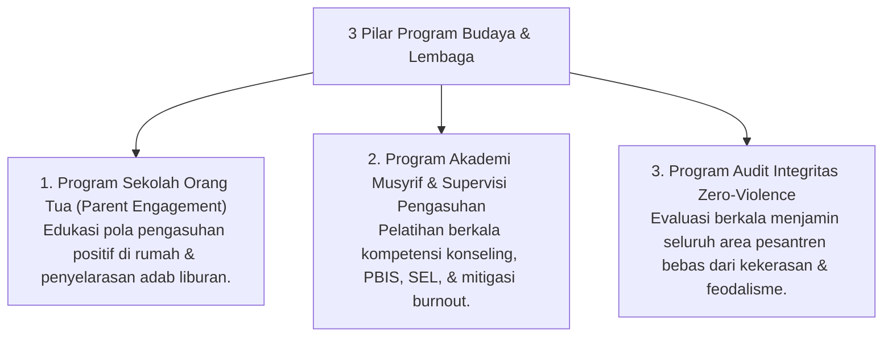

# P9-04: Program Budaya dan Lembaga

## Status Dokumen
* **Status**: 🌟 **A+ (Tervalidasi & Siap Diimplementasikan)**
* **Sub-Domain**: `09 Programs / 04 Institutional Programs`
* **Penanggung Jawab Keilmuan**: Dewan Keilmuan TUMBUH (*Pakar Tata Kelola Qudwah & Pakar Metodologi Riset*)

---

## 1. Konseptualisasi Institutional Programs Pesantren

Program Budaya & Lembaga (*Institutional Programs*) memastikan pesantren bertransformasi menjadi **Organisasi Pembelajar (*Learning Organization*)** yang sehat, aman, dan berkelanjutan:

---

## 2. Keberlanjutan Organisasi Pembelajar

Program lembaga mengokohkan ekosistem pengasuhan 24-jam melalui sinergi segitiga antara Pimpinan, Pengasuh/Guru, dan Orang Tua Santri.
