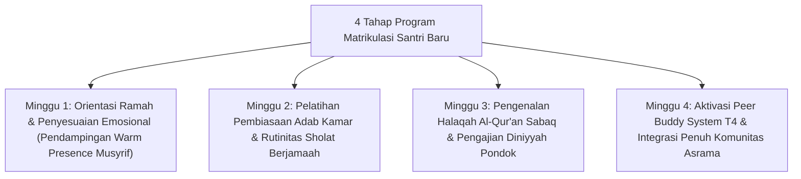

# P9-05-01: Program Matrikulasi Santri Baru dan Homesickness Care

## Status Dokumen
* **Status**: 🌟 **A+ (Tervalidasi & Siap Diimplementasikan)**
* **Sub-Domain**: `09 Programs / 05 Special Programs`
* **Penanggung Jawab Keilmuan**: Dewan Keilmuan TUMBUH (*Pakar Pengasuhan Asrama & Pakar Bimbingan Konseling*)

---

## 1. Operasionalisasi Program Matrikulasi 30-Hari

Program Matrikulasi diselenggarakan selama 30 hari pertama bagi santri baru untuk mempermudah adaptasi kehidupan asrama:

---

## 2. Unit Penanganan Homesickness Care

Musyrif dan Peer Buddy memberikan perhatian hangat ekstra dan ruang curhat pribadi bagi santri baru yang mengalami kejenuhan rindu keluarga.
