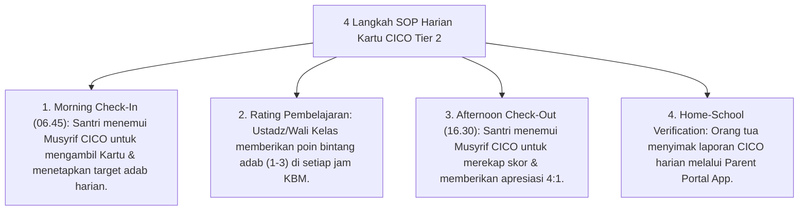

# P9-05-02: Program CICO Tier 2 dan BIP Tier 3 BK

## Status Dokumen
* **Status**: 🌟 **A+ (Tervalidasi & Siap Diimplementasikan)**
* **Sub-Domain**: `09 Programs / 05 Special Programs`
* **Penanggung Jawab Keilmuan**: Dewan Keilmuan TUMBUH (*Pakar PBIS & Pakar Bimbingan Konseling*)

---

## 1. Operasionalisasi Program Kartu CICO (Check-In / Check-Out) Tier 2

Program CICO diperuntukkan bagi 15% santri yang membutuhkan penguatan perilaku harian terstruktur:

---

## 2. Operasionalisasi Behavior Intervention Plan (BIP) Tier 3

Bagi 5% santri dengan krisis emosional / masalah perilaku persisten, Konselor BK menyusun dokumen BIP Individual berbasis asesmen FBA diagnostik.
