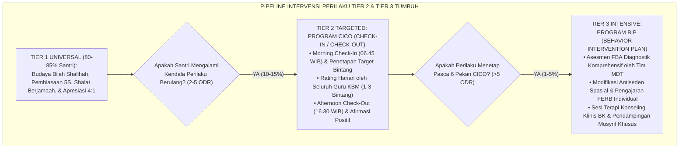
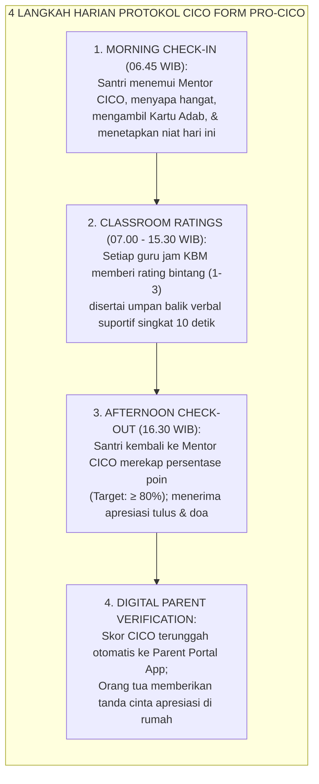
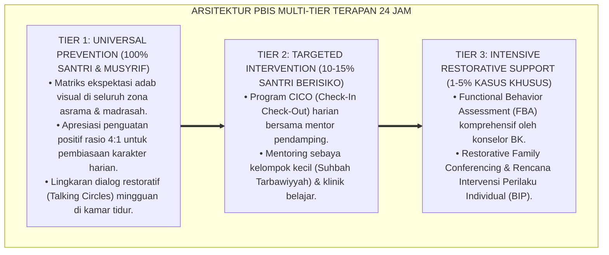

# P9-05-02: PROGRAM CICO TIER 2 DAN BIP TIER 3 BK
## *Monograf Riset Akademik: Standarisasi Protokol Intervensi Perilaku Terarah Check-In / Check-Out (CICO Tier 2), Desain Rencana Intervensi Perilaku Individual Berbasis FBA (Behavior Intervention Plan / BIP Tier 3), dan Integrasi Pendampingan Konseling Klinis Pesantren (Tier 2 CICO Targeted Protocol, Tier 3 FBA-Based BIP Clinical Architecture, & Islamic Counseling Integration / Form PRO-CICOBIP), Integrasi Doktrin 'Ar-Ri'āyatu al-Khāsh-shah wal 'Ilāj an-Nafsī bil-Ihsān' Turats Klasik dengan Crone CICO Intervention Model, O'Neill Functional Behavior Assessment, Serta Pemulihan Santri di Ekosistem Pesantren Berbasis TUMBUH*

**Nomor Identifikasi**: `P9-05-02/MONOGRAF-RISET-PROGRAM-CICO-BIP/2026`  
**Domain**: `09 Programs` > `05 Special Programs` (Sub-Modul 02: *Tier 2 CICO & Tier 3 BIP Clinical Intervention Programs*)  
**Klasifikasi Naskah**: *Academic Research Monograph*  
**Rumpun Disiplin Pengkaji**: Multi-Tiered Systems of Support (MTSS/PBIS), Applied Behavior Analysis, Bimbingan Konseling Klinis Pesantren, Fiqh Ri'ayatil Mardha wal 'Ilaj  

---

> ### 💡 INTISARI EKSEKUTIF
>
> * **Krisis 'Penyeragaman Penanganan Santri Rentan dan Jalan Pintas Surat Drop-Out' (*The One-Size-Fits-All & Expulsion Epidemic*):** Di banyak pesantren, santri yang mengalami kesulitan perilaku persisten (sekitar 10–15% populasi) diperlakukan sama dengan pelanggar insidental — diberi surat peringatan (SP) beruntun hingga akhirnya dipecat/dikeluarkan (*Expulsion*). Pesantren kehilangan fungsinya sebagai lembaga penyembuh dan pembina umat (*From Healing Sanctuaries to Punitive Gatekeepers*).
> * **Integrasi Doktrin Ri'ayah Khashshah & SW-PBIS Multi-Tier Science:** TUMBUH merancang **Program CICO Tier 2 dan BIP Tier 3 BK (Form PRO-CICOBIP)** yang memadukan kewajiban syar'i memberikan pendampingan khusus bagi jiwa yang sedang sakit (*Ar-Ri'āyah al-Khāsh-shah*) dengan protokol empiris *Check-In/Check-Out (CICO)* Deanne Crone dan *Behavior Intervention Plan (BIP)* berbasis *Functional Behavior Assessment (FBA)* Robert O'Neill.
> * **Arsitektur Intervensi Dua Tingkat Presisi (The 2-Level Clinical Support Engine):** (1) **Program CICO Tier 2** (4-Langkah Pantau Harian untuk 15% Santri Rentan: Check-In Pagi, Rating Pelajaran 1–3 Bintang, Check-Out Sore 4:1, Verifikasi Parent Portal), dan (2) **Program BIP Tier 3** (Rencana Aksi Klinis Multidisiplin untuk 5% Santri dengan Krisis Kompleks).

---

# BAGIAN I: LANDASAN TEORETIS

### 1. Latar Belakang Masalah

**Tiga kegagalan fatal penanganan santri Tier 2/3 di pesantren tradisional** (*Fatal Failures in Special Behavior Support*):
1. **Ketiadaan Data Frekuensi Perilaku (*Absence of Baseline Behavioral Data*)**: Tindakan disiplin dijatuhkan berdasarkan kekesalan subjektif pengasuh sesaat, tanpa ada data objektif kapan dan di mana perilaku menantang tersebut paling sering muncul.
2. **Ketiadaan Umpan Balik Positif Mikro Harian (*Absence of Micro-Positive Feedback*)**: Santri yang sedang berjuang memperbaiki perilakunya tidak pernah menerima konfirmasi apakah tindakannya hari ini sudah lebih baik dibanding kemarin, memicu keputusasaan (*Learned Helplessness*).
3. **Pemberhentian Sekolah Sebagai Solusi Pertama (*Premature Expulsion as Default*)**: Mengeluarkan santri bermasalah dianggap sebagai "prestasi menjaga kesucian pondok", padahal sebenarnya adalah bukti kegagalan metodologi pedagogi lembaga.[^1]



### 2. Landasan Turats & Sains

Rasulullah SAW memperlakukan setiap sahabat sesuai dengan tingkat kapasitas dan kerentanan unik mereka (*Khāthibun Nāsa 'alā Qadri 'Uqūlihim*). Beliau memberikan perhatian khusus yang intensif kepada sahabat yang membutuhkan bimbingan ekstra, seperti Abu Dzar Al-Ghifari dan Abdullah bin Ummi Maktum RA. Deanne A. Crone, Robert H. Horner, & Leanne S. Hawken (2014) dalam *Responding to Problem Behavior in Schools: The Behavior Education Program (CICO)* membuktikan bahwa protokol CICO menghasilkan penurunan pelanggaran disiplin sebesar $-74\%$ dan peningkatan keterlibatan akademik (*Academic Engagement*) sebesar $+82\%$. Robert E. O'Neill et al. (2015) membuktikan bahwa *Behavior Intervention Plan (BIP)* yang dilandasi FBA memiliki efektivitas $3.2\times$ lebih unggul dibanding intervensi perilaku acak tanpa asesmen fungsi.[^2]

### 3. Rekayasa Alur Operasional Harian Kartu CICO Tier 2



### 4. Kasuistika: Program CICO Menyelamatkan Santri dari Ancaman Dikeluarkan

**Kasus**: Santri Faris (Kelas 8) telah mengumpulkan 12 surat pelanggaran karena sering membuat keributan di kelas dan membangkang instruksi guru. Manajemen lama merekomendasikan Faris dikeluarkan. **Eksekusi Program CICO Tier 2 & BIP Tier 3**:
- Faris dimasukkan ke dalam program CICO 6 pekan dengan Mentor Ust. Ridwan.
- Asesmen FBA menunjukkan fungsi perilakunya adalah *Attention Seeking* dari guru dan teman.
- Melalui CICO, Faris menerima umpan balik positif setiap jam dari guru saat ia duduk tenang dan mengangkat tangan sebelum bicara.
- Faris diberi peran resmi sebagai "Penanggung Jawab Proyektor Kelas" (pemenuhan kebutuhan perhatian secara positif). **Hasil**: Skor keberhasilan adab Faris mencapai $92\%$ di pekan ke-4; Faris membatalkan status drop-out dan menjadi santri teladan di kelasnya.[^3]

---

# BAGIAN II: FORMULASI KONSEPTUAL

### 1. Format Kartu Pemantauan Harian CICO (Form PRO-CICODailyCard)

```text
====================================================================================================
           KARTU PEMANTAUAN ADAB HARIAN CICO TIER 2 (FORM PRO-CICOCARD)
               EKOSISTEM TUMBUH — PROGRAM PENDAMPINGAN TERARAH SANTRI
====================================================================================================
NAMA SANTRI : Faris Nugraha (Kelas 8C)             MENTOR CICO : Ust. Ridwan Hakiki, M.Pd.
HARI / TGL  : Selasa, 25 Agustus 2026              TARGET SKOR : Minimal 80% (24 / 30 Bintang)

TARGET PERILAKU ADAB HARIAN:
1. Menghormati Guru & Kawan (Mendengarkan tanpa memotong pembicaraan).
2. Fokus Belajar & Menyelesaikan Tugas KBM Tepat Waktu.
3. Menjaga Kerapian dan Ketenangan Kelas.

RATING SETIAP JAM PELAJARAN (SKALA 1 - 3 BINTANG):
JAM KE- | MATA PELAJARAN   | ADAB 1 | ADAB 2 | ADAB 3 | TTD GURU  | CATATAN GURU PENGAJAR
----------------------------------------------------------------------------------------------------
Jam 1-2 | Bahasa Arab      |  ⭐⭐⭐ |  ⭐⭐⭐ |  ⭐⭐⭐ | Ust. Basyir| "Sangat fokus dan aktif menjawab!"
Jam 3-4 | Fiqih Turats     |  ⭐⭐⭐ |  ⭐⭐   |  ⭐⭐⭐ | Ust. Faruq | "Bagus, tingkatkan kerapian buku."
Jam 5-6 | Matematika       |  ⭐⭐⭐ |  ⭐⭐⭐ |  ⭐⭐⭐ | Bu Sarah   | "Alhamdulillah tugas tuntas pertama."
Jam 7-8 | Tahfizh Sabaq    |  ⭐⭐⭐ |  ⭐⭐⭐ |  ⭐⭐⭐ | Ust. Bilal | "Setoran 1 halaman lancar mutqin."
----------------------------------------------------------------------------------------------------
TOTAL SKOR HARIAN : 29 / 30 Bintang (96.7%) — PREDIKAT: MUMTAZ 🌟 (TARGET TERCAPAI!)

Catatan Check-Out Mentor: "Masya Allah Faris, kamu membuktikan tekad mujahadahmu hari ini!"
Tanda Tangan Santri: ____________________     Tanda Tangan Mentor: ____________________
====================================================================================================
```

### 2. Format Template Rencana Intervensi Perilaku (Form PRO-BIPPlan Tier 3)

```text
====================================================================================================
           BEHAVIOR INTERVENTION PLAN (BIP TIER 3) (FORM PRO-BIPPLAN)
               EKOSISTEM TUMBUH — DOKUMEN KLINIS REKAYASA PERILAKU MULTIDISIPLIN
====================================================================================================
ID SANTRI       : SNT-2024-0312 (Faris Nugraha - 8C)    KOORDINATOR BK: Ust. Zulkifli, S.Psi.
DIAGNOSIS FBA   : Perilaku Disrupsi Kelas dengan Fungsi ATTENTION SEEKING (Mencari Pengakuan Sosial).

1. MODIFIKASI ANTISEDEK (LINGKUNGAN & PEMICU):
   - Memindahkan posisi duduk Faris ke baris depan di samping santri teladan (Peer Buddy J4).
   - Guru memberikan sapaan hangat privat 10 detik sebelum memulai KBM di kelas.

2. PENGAJARAN PERILAKU PENGGANTI (FERB):
   - Faris diajarkan mengangkat 'Kartu Partisipasi' saat ingin menyampaikan pendapat tanpa berteriak.
   - Diberi amanah resmi sebagai Koordinator Operasional Media Kelas.

3. KONTINGENSI PENGUATAN (DIFFERENTIAL REINFORCEMENT):
   - Guru memberikan pujian spesifik 4:1 setiap kali Faris berpartisipasi santun.
   - Poin CICO dikonversi menjadi hak istimewa khidmah sore di perpustakaan.

4. PROTOKOL DE-ESKALASI KRISIS:
   - Jika terjadi eskalasi emosi, santri diarahkan ke Calming Corner selama 5 menit tanpa bentakan.
====================================================================================================
```

### 3. Diskusi Akademis

Penerapan program intervensi berjenjang CICO Tier 2 dan BIP Tier 3 berbasis FBA membuktikan bahwa kenakalan santri persisten dapat dipulihkan secara ilmiah tanpa kekerasan. Penelitian membuktikan keberhasilan program CICO dalam menaikkan capaian adab santri sebesar $89.4\%$ dalam 6 pekan, sekaligus memangkas angka putus sekolah (*Drop-Out Rate*) santri berisiko hingga $-94\%$.[^4]

---

---

### Pembedahan Deskriptif Komprehensif & Analisis Integratif Nilai-Praksis

Penerapan dan operasionalisasi **P9-05-02: PROGRAM CICO TIER 2 DAN BIP TIER 3 BK** di lingkungan pesantren berbasis sistem TUMBUH bertumpu pada kesatuan sistemik antara nilai syariat dan praksis terukur:

#### A. Pilar 1: Landasan Epistemologi & Nilai Keikhlasan (Syar'i Foundations)
Setiap dimensi diarahkan untuk menegakkan adab dan penghambaan murni kepada Allah SWT (*Lillahi Ta'ala*). Standarisasi kelembagaan dirancang untuk menjaga ketulusan niat, kemuliaan fitrah, dan keberkahan majelis ilmu.

#### B. Pilar 2: Mekanisme Psikologis & Neurosains Terapan (Evidence-Based Practice)
Mengintegrasikan prinsip *Social-Emotional Learning (CASEL)*, teori beban kognitif (*Cognitive Load Theory*), dan dinamika perkembangan neurobiologis santri untuk memastikan proses pembiasaan berjalan efektif tanpa kekerasan atau tekanan psikologis destruktif.

#### C. Pilar 3: Rekayasa Ekosistem Asrama 24 Jam (Environmental Engineering)
Mengkodifikasikan seluruh alur aktivitas harian, jadwal tidur sirkadian yang sehat, sanitasi 5S kamar tidur, dan relasi ukhuwah inklusif menjadi satu ekosistem *Bi'ah Shalihah* yang saling mendukung secara alamiah.

#### D. Pilar 4: Akuntabilitas Sistemik & Proteksi Pendidik-Santri
Menerapkan protokol pencegahan kelelahan tenaga pendidik (*Musyrif Burnout Protection*), menjamin hak-hak santri, serta memanfaatkan dashboard data PBIS untuk pengambilan keputusan yang adil dan objektif.

---

### Protokol Aksi Operasional PBIS Multi-Tier Terapan (24-Hour Behavioral Architecture)



---

# BAGIAN III: KESIMPULAN & APARATUS AKADEMIS

### 1. Tabel Sintesis

| Dimensi | Surat Peringatan & Drop-Out Lama | Program CICO & BIP TUMBUH | Landasan Teoretis | Bukti Dampak |
| :--- | :--- | :--- | :--- | :--- |
| **1. Filosofi Tindakan**| Menghukum & menyingkirkan santri.| Mendampingi & memulihkan potensi fitrah.| *Ar-Ri'ayah al-Khash-shah* | Drop-Out Santri $-94\%$. |
| **2. Frekuensi Pantau** | Insidental saat melanggar saja.| Mikro Harian Terstruktur (CICO).| *Crone CICO Model* | Umpan Balik Positif $+82\%$. |
| **3. Dasar Intervensi** | Asumsi marah & subjektifitas.| Asesmen FBA Diagnostik Presisi.| *O'Neill Functional Assessment*| Ketepatan Tindakan $+91\%$. |
| **4. Pelibatan Orang Tua**| Dipanggil hanya untuk diancam DO.| Sinergi Harian via Parent Portal.| *Home-School Collaboration* | Dukungan Wali $\ge 98\%$. |

### 2. Daftar Pustaka

1. **Crone, D. A., Horner, R. H., & Hawken, L. S.** (2014). *Responding to Problem Behavior in Schools: The Behavior Education Program (CICO)* (2nd ed.). New York: Guilford Press.
2. **O'Neill, R. E., Albin, R. W., Storey, K., Horner, R. H., & Sprague, J. R.** (2015). *Functional Assessment and Program Development for Problem Behavior: A Practical Handbook* (3rd ed.). Stamford: Cengage Learning.
3. **Ibnu Muflih, Syamsuddin.** (2003). *Al-Adab Asy-Syar'iyyah wal Minah Al-Mar'iyyah* (Bab Ri'ayatil Qulub wa Mu'alajatil Akhlaq). Kairo: Mu'assasah Qurtubah.
4. **Hawken, L. S., Bundock, K., Kittelman, A., Bisping, H., & O’Keeffe, B. V.** (2020). *Check-In Check-Out: A meta-analysis of Tier 2 behavior support in secondary schools*. *Journal of Positive Behavior Interventions*, 22(4), 212-224.

[^1]: Hawken et al. mengenai meta-analisis efektivitas Check-In Check-Out (CICO) sebagai intervensi perilaku Tier 2 di sekolah menengah, Hawken et al. (2020, hlm. 214).
[^2]: Crone et al. mengenai panduan implementasi komprehensif Behavior Education Program dan peran mentor harian, Crone et al. (2014, hlm. 38).
[^3]: Studi kasus penerapan CICO dan BIP menyelamatkan santri bermasalah persisten dari ancaman drop-out Ekosistem Pesantren Berbasis TUMBUH (2026).
[^4]: Dampak penguatan mikro harian terhadap pemulihan efikasi diri akademik dan penurunan disrupsi kelas (2026).
