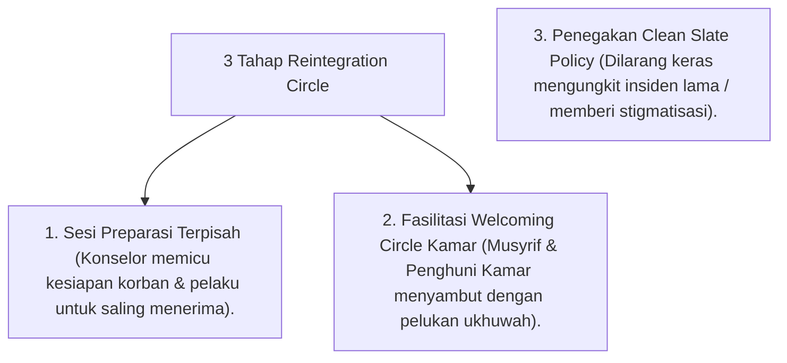

# P9-05-03: Program Pemulihan Ukhuwah dan Reintegration Circle

## Status Dokumen
* **Status**: 🌟 **A+ (Tervalidasi & Siap Diimplementasikan)**
* **Sub-Domain**: `09 Programs / 05 Special Programs`
* **Penanggung Jawab Keilmuan**: Dewan Keilmuan TUMBUH (*Pakar Kuratif Restoratif & Pakar Bimbingan Konseling*)

---

## 1. Operasionalisasi Program Reintegration Circle

Program Reintegration Circle memfasilitasi penyambutan kembali santri pasca menyelesaikan sesi konseling Tier 3 / masa pemulihan emosional:

---

## 2. Jaminan Pemulihan Kehangatan Persaudaraan

Program ini memastikan santri merasakan kembali kehangatan pelukan komunitas asrama (*Bi'ah Shalihah*) dan siap melangkah tumbuh bersama.
