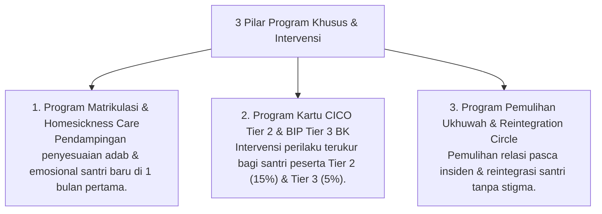

# P9-05: Program Khusus dan Intervensi

## Status Dokumen
* **Status**: 🌟 **A+ (Tervalidasi & Siap Diimplementasikan)**
* **Sub-Domain**: `09 Programs / 05 Special Programs`
* **Penanggung Jawab Keilmuan**: Dewan Keilmuan TUMBUH (*Pakar Bimbingan Konseling & Pakar Kuratif Restoratif*)

---

## 1. Konseptualisasi Special & Intervention Programs

Program Khusus (*Special Programs*) menyediakan pelayanan pendampingan terarah bagi santri yang membutuhkan penyesuaian khusus maupun penanganan krisis perilaku:

---

## 2. Kesetaraan & Perlindungan Hak Santri

Seluruh program khusus dilaksanakan dengan prinsip penghormatan martabat santri tanpa pelabelan buruk atau diskriminasi sosial.
