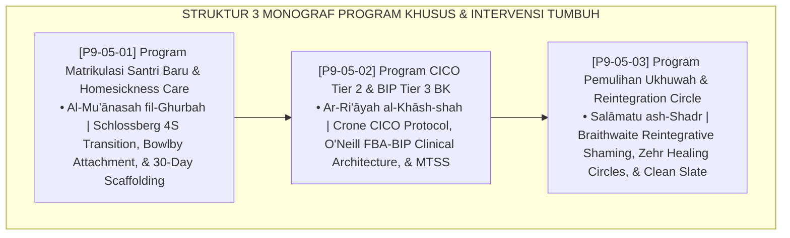

# P9-05: DOKUMEN INDUK PROGRAM KHUSUS DAN INTERVENSI PESANTREN
## *Arsitektur dan Standarisasi Program Matrikulasi Adaptasi 30-Hari dan Homesickness Care, Program Intervensi Perilaku Berjenjang CICO Tier 2 dan BIP Tier 3, Serta Program Pemulihan Ukhuwah dan Reintegration Circle sebagai Tiga Pilar Program Khusus Intervensi (Matriculation Care Form PRO-MatrikulasiCare, CICO & BIP Form PRO-CICOBIP, Serta Reintegration Circles Form PRO-ReintegrasiUkhuwah) di Ekosistem TUMBUH Pesantren*

**Nomor Identifikasi**: `P9-05/DOKUMEN-INDUK-PROGRAM-KHUSUS-INTERVENSI/2026`  
**Domain**: `09 Programs` > `05 Special Programs` (Gugus Sub-Domain 05: *Special Programs & Multi-Tier Clinical Interventions*)  
**Klasifikasi Naskah**: *Master Architecture & Navigation Monograph*  
**Rumpun Disiplin Pengkaji**: Multi-Tiered Behavior Support (MTSS/PBIS), Crisis & Transition Counseling (Schlossberg), Restorative Reintegration (Braithwaite), Fiqh Al-Mu'anasah wal 'Ilaj  

---

> ### 💡 INTISARI EKSEKUTIF
>
> * **Kedudukan Strategis Gugus Program Khusus dan Intervensi:** Gugus ini adalah jaring pengaman multi-lapis (*the multi-tiered safety net*) di ekosistem TUMBUH. Memastikan tidak ada satu pun santri yang tertinggal, terisolasi, atau diusir secara prematur karena kesulitan adaptasi maupun krisis perilaku, pendekatan ini menyediakan intervensi klinis yang penuh empati, berbasis data, dan terstruktur secara ilmiah — mulai dari pendampingan transisi santri baru, modifikasi perilaku individual FBA, hingga pemulihan persaudaraan kamar bebas stigma (*No Child Left Behind, Every Fitrah Restored*).
> * **Triad Program Khusus & Intervensi TUMBUH:** (1) **Program Matrikulasi 30-Hari & Homesickness Care** untuk transisi adaptasi santri baru tanpa kejutan, (2) **Program CICO Tier 2 & BIP Tier 3 BK** untuk pendampingan terarah santri berisiko tinggi tanpa vonis DO, dan (3) **Program Reintegration Circle** untuk penyambutan kembali yang hangat dan pengawalan Clean Slate Policy.
> * **3 Monograf Riset Komprehensif:** Form PRO-MatrikulasiCare, Form PRO-CICOBIP, dan Form PRO-ReintegrasiUkhuwah.

---

## 📑 PETA NAVIGASI TIGA MONOGRAF

---

## 📚 DESKRIPSI RINGKAS 3 BERKAS MONOGRAF

1. **[P9-05-01: Program Matrikulasi Santri Baru dan Homesickness Care](file:///c:/xampp/htdocs/tumbuh/09%20Programs/05%20Special%20Programs/P9-05-01-Program-Matrikulasi-Santri-Baru-dan-Homesickness-Care.md)**  
   *Kurikulum transisi 30 hari 4 fase, penanganan unit homesickness care 3 tingkat, lembar rapor kelulusan matrikulasi, penyematan songkok kehormatan, dan Form PRO-MatrikulasiCare.*
2. **[P9-05-02: Program CICO Tier 2 dan BIP Tier 3 BK](file:///c:/xampp/htdocs/tumbuh/09%20Programs/05%20Special%20Programs/P9-05-02-Program-CICO-Tier-2-dan-BIP-Tier-3-BK.md)**  
   *Protokol 4 langkah CICO (check-in pagi, rating guru KBM, check-out sore 4:1, verifikasi parent portal), dokumen klinis BIP berbasis asesmen FBA, dan Form PRO-CICOBIP.*
3. **[P9-05-03: Program Pemulihan Ukhuwah dan Reintegration Circle](file:///c:/xampp/htdocs/tumbuh/09%20Programs/05%20Special%20Programs/P9-05-03-Program-Pemulihan-Ukhuwah-dan-Reintegration-Circle.md)**  
   *Proses 3 tahap (preparasi terpisah, majelis welcoming circle 30 mnt di kamar, pemantauan clean slate), naskah ikrar ukhuwah komunal, ritual musafahah, dan Form PRO-ReintegrasiUkhuwah.*

---

## 🎯 STANDAR PENJAMINAN MUTU PROGRAM KHUSUS

Penerapan gugus **Program Khusus dan Intervensi** menjamin bahwa:
1. **Santri Baru Beradaptasi dengan Cepat dan Bahagia (*Gentle Transition Guarantee*)**: Menjamin angka putus sekolah bulan pertama ditekan hingga mendekati 0%.
2. **Santri dengan Tantangan Perilaku Berat Dipulihkan Secara Ilmiah (*Prescriptive Healing Guarantee*)**: CICO dan BIP memastikan intervensi tepat sasaran tanpa hukuman punitif.
3. **Reintegrasi Sosial Pasca-Krisis Berjalan Hangat dan Bermartabat (*Full Reconnection Guarantee*)**: Welcoming Circle memastikan tidak ada santri yang terstigma atau terasing di kamarnya sendiri.
