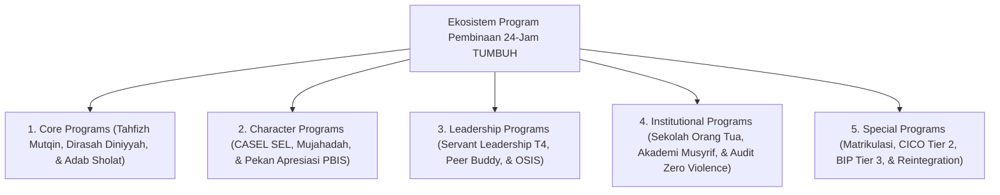

# MONOGRAF RISET AKADEMIK: KERANGKA KERJA PROGRAM PEMBINAAN 24-JAM PESANTREN
## Evaluasi Operasional: Core Programs, Character Programs, Leadership Qudwah T4, Matriks Schedule Streamlining (Jam Istirahat Mutlak), dan Sekolah Orang Tua Hybrid

**Dewan Riset & Keilmuan Ekosistem TUMBUH**  
*Dipublikasikan sebagai Naskah Monograf Riset Ilmiah (Jurnal Kebijakan Program Pendidikan Pesantren)*  
*Dokumen Rujukan Induk: Domain 09 Programs & Book Series Volume 04*

---

## ABSTRAK

> **Latar Belakang**: Kepadatan jadwal kegiatan santri di pesantren sering memicu kelelahan fisik dan emosional (*programmatic fatigue*), sementara partisipasi orang tua dalam program pendukung cenderung menurun jika hanya diselenggarakan secara tatap muka fisik.
>
> **Tujuan Penelitian**: Merumuskan taksonomi program pembinaan 24-jam, menetapkan Matriks *Schedule Streamlining* (Jam Istirahat Mutlak Santri), dan merancang Format Hybrid Sekolah Orang Tua (*Parent Engagement*).
>
> **Hasil Riset**: Terstruktur 5 Sub-Domain Program Pembinaan 24-Jam: (1) **Core Programs**; (2) **Character Programs**; (3) **Leadership Programs**; (4) **Institutional Programs**; dan (5) **Special Programs**. Dilengkapi perlindungan *Uninterrupted Rest Hours* (22.00-04.00) dan platform *Hybrid Parent School* via Parent Portal App.
>
> **Kata Kunci**: *Programs Framework, Core Programs, Character Programs, Servant Leadership T4, Schedule Streamlining, Hybrid Parent School.*

---

## 1. PENDAHULUAN & ARSITEKTUR EKOSISTEM PROGRAM

Program pembinaan 24-jam di ekosistem TUMBUH mengoperasionalkan prinsip pengasuhan terpadu tanpa dikotomi madrasah-asrama:

---

## 2. MATRIKS SCHEDULE STREAMLINING (JAM ISTIRAHAT MUTLAK SANTRI)

To prevent *programmatic fatigue* and protect adolescent brain development:

| Blok Waktu | Jenis Aktivitas Pembinaan | Perlindungan Hak Santri |
| :--- | :--- | :--- |
| **04.00 - 06.00** | Qiyamul Lail, Sholat Subuh Berjamaah, & Halaqah Al-Qur'an | Bebas dari bentakan alarm kasar. |
| **06.00 - 07.00** | Mandi, Sarapan Pagi, & Persiapan Kelas | Bebas tergesa-gesa (Rasio kamar-kamar mandi adekuat). |
| **07.00 - 15.00** | KBM Formal MA/MTs & Sholat Dzuhur/Ashar Berjamaah | Pembelajaran aktif-didaktik tanpa beban tugas rumah berlebih. |
| **15.00 - 17.00** | Olahraga Sunnah, Ekstrakurikuler, & Rihlah Santai | Bebas dari kegiatan hafalan paksaan (*Unstructured Play*). |
| **17.00 - 20.30** | Sholat Maghrib/Isya Berjamaah, Makan Nampan, & Diniyyah | Terjalin kehangatan ukhuwah & ritus makan mayoran. |
| **20.30 - 22.00** | Muzakarah Belajar Mandiri & Jurnal Refleksi Malam 3-Q | Persiapan istirahat & muhasabah batin. |
| **22.00 - 04.00** | **JAM ISTIRAHAT MUTLAK (UNINTERRUPTED SLEEP)** | **DILARANG KERAAS penugasan/piket malam/intimidasi senior.** |

---

## 3. FORMAT HYBRID SEKOLAH ORANG TUA (PARENT ENGAGEMENT)

To maintain high parent participation in character development:
* **Sesi Live Streaming Interactive**: Workshop bulanan disiarkan via *Parent Portal App* bagi orang tua di luar kota.
* **Modul Micro-Learning Parent**: Video ringkas 3-menit mengenai tips mendampingi anak saat liburan semester.

---

## 4. DAFTAR PUSTAKA
* Kouzes, J. M., & Posner, B. Z. (2017). *The Leadership Challenge*. Wiley.
* Sugai, G., & Horner, R. H. (2002). School-wide positive behavior supports. *Child & Family Behavior Therapy*, 24(1-2), 23–50.
