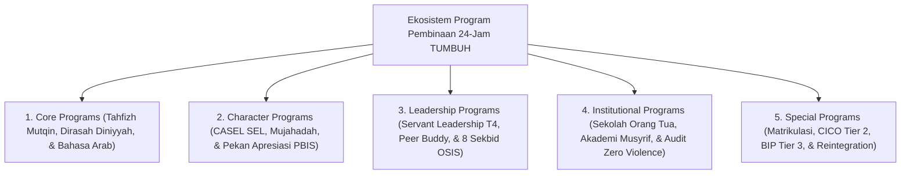
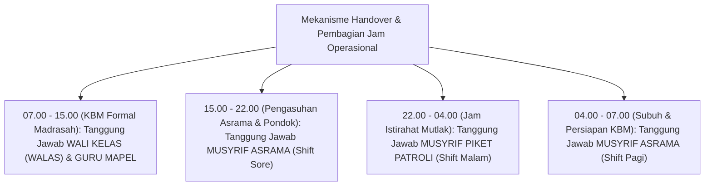

# MONOGRAF RISET AKADEMIK: KERANGKA KERJA PROGRAM PEMBINAAN 24-JAM PESANTREN
## Evaluasi Operasional: Core Programs, Handover Jam KBM Walas (07.00-15.00) vs Jam Asrama Musyrif (15.00-07.00), Kurikulum Diniyyah 24-Jam, Kurikulum Al-Qur'an & Bahasa Arab, Matriks Schedule Streamlining, dan 8 Sekbid OSIS

**Dewan Riset & Keilmuan Ekosistem TUMBUH**  
*Dipublikasikan sebagai Naskah Monograf Riset Ilmiah (Jurnal Kebijakan Program Pendidikan Pesantren)*  
*Dokumen Rujukan Induk: Domain 09 Programs & Book Series Volume 04*

---

## ABSTRAK

> **Latar Belakang**: Kepadatan jadwal kegiatan santri di pesantren sering memicu kelelahan fisik dan emosional (*programmatic fatigue*), sementara struktur pengasuhan sering disalahpahami bahwa Musyrif harus bertugas 24-jam nonstop. Padahal, jam KBM madrasah (07.00-15.00) merupakan domain penuh Wali Kelas (Walas) dan Guru Madrasah.
>
> **Tujuan Penelitian**: Merumuskan taksonomi program pembinaan 24-jam, menetapkan mekanisme *handover* jam KBM Walas (07.00-15.00) vs jam asrama Musyrif (15.00-07.00), merinci Kurikulum Pondok 24-Jam, dan memetakan Matriks *Schedule Streamlining*.
>
> **Hasil Riset**: Terstruktur 5 Sub-Domain Program Pembinaan 24-Jam dengan klarifikasi pembagian peran: (1) **07.00-15.00 (KBM Madrasah)** di bawah Wali Kelas & Guru; (2) **15.00-07.00 (Kehidupan Asrama)** di bawah Musyrif Asrama via sistem 3-Shift; serta perlindungan *Uninterrupted Rest Hours* (22.00-04.00).
>
> **Kata Kunci**: *Programs Framework, Core Programs, Handover Walas-Musyrif, Dirasah Islamiyah, Al-Qur'an, Bahasa Arab, Schedule Streamlining, Hybrid Parent School.*

---

## 1. PENDAHULUAN & ARSITEKTUR EKOSISTEM PROGRAM

Program pembinaan 24-jam di ekosistem TUMBUH mengoperasionalkan prinsip pengasuhan terpadu tanpa dikotomi madrasah-asrama dan tanpa membebankan tugas fisik 24-jam nonstop pada Musyrif:

---

## 2. MEKANISME HANDOVER JAM KBM WALAS (07.00-15.00) VS JAM ASRAMA MUSYRIF (15.00-07.00)

---

## 3. RINCIAN OPERASIONAL KURIKULUM PONDOK 24-JAM

Berdasarkan dokumen rujukan operasional (`Sistem-Baru-Pembinaan-Santri.md`), penetapan materi kurikulum pondok 24-jam dikelompokkan ke dalam 4 bidang utama:

### 3.1. Kurikulum Al-Qur'an (Waktu Maghrib)
* **Ula 1**: Fokus membaca Al-Qur'an benar (Makharijul huruf, Tajwid dasar, Sorogan individual). Target: Lancar membaca tanpa kesalahan tajwid berat.
* **Ula 2**: Menyempurnakan tahsin & persiapan hafalan Juz 30 (Talaqqi, Setoran hafalan). Target: Hafal Juz 30.
* **Wustha 1**: Memperkuat hafalan Juz 29-30 (Sabqi, Sabaq, Manzil). Target: Hafal Juz 29-30 & tes sambung ayat.
* **Wustha 2**: Menjaga & memperluas hafalan Juz 28-30. Target: Tasmi' 3 Juz berantai.
* **Ulya 1**: Kokoh hafalan Juz 27-30 & Gharib musykilat ayat. Target: Tasmi' 4 Juz.
* **Ulya 2**: Kader Ahlul Qur'an Juz 26-30 & Praktik Musyrif Halaqah Adik Kelas. Target: Tasmi' 5 Juz & Peer Teaching.

### 3.2. Kurikulum Bahasa Arab (Waktu Isya)
* **Ula 1**: Qira'ah & Kitabah Dasar (Literasi Arab Dasar).
* **Ula 2**: Mufradat Dasar Kosakata Asrama, Kelas, & Masjid.
* **Wustha 1**: Ta'birat Ungkapan Harian (Salam, perkenalan, izin, instruksi).
* **Wustha 2**: Muhadatsah Dasar (Percakapan sederhana 3 menit).
* **Ulya 1**: Muhadatsah Aktif & Komunikasi Spontan.
* **Ulya 2**: Komunikasi Publik (Presentasi, Diskusi, Debat Ringan).

### 3.3. Kurikulum Dirasah Islamiyah (Waktu Subuh)
* **Aqidah**: Mengesakan Allah, Tauhid Rububiyah/Uluhiyah, Sifat 20, Muraqabah (*Safinatun Najah, Aqidatul Awam, Tijan Ad-Darari*).
* **Fiqih**: Thaharah, Sholat Berjamaah, Puasa/Zakat, Muamalah Ekonomi Syar'i, Munakahat, Fiqih Kehidupan (*Safinatun Najah, Fathul Qarib, Bulughul Maram*).
* **Akhlak & Adab**: Adab Diri, Adab Guru & Ilmu, Adab Berteman, Adab Bermasyarakat (*Akhlaqul Lil Banin 1-2, Ta'lim Muta'allim*).

---

## 4. MATRIKS SCHEDULE STREAMLINING (JAM ISTIRAHAT MUTLAK SANTRI)

| Blok Waktu | Penanggung Jawab | Jenis Aktivitas Pembinaan | Perlindungan Hak Santri |
| :--- | :--- | :--- | :--- |
| **04.00 - 06.00** | Musyrif Shift Pagi | Qiyamul Lail, Sholat Subuh Berjamaah, & Dirasah Islamiyah | Bebas dari bentakan alarm kasar. |
| **06.00 - 07.00** | Musyrif Shift Pagi | Mandi, Sarapan Pagi, & Persiapan Kelas | Bebas tergesa-gesa (Rasio kamar mandi adekuat). |
| **07.00 - 15.00** | **Wali Kelas (Walas) & Guru**| KBM Formal MA/MTs & Sholat Dzuhur/Ashar Berjamaah | Pembelajaran aktif-didaktik (Musyrif Off-Duty). |
| **15.00 - 17.00** | Musyrif Shift Sore | Olahraga Sunnah, Ekstrakurikuler, & Rihlah Santai | Bebas dari penugasan paksaan (*Unstructured Play*). |
| **17.00 - 20.30** | Musyrif Shift Sore | Sholat Maghrib/Isya Berjamaah, Makan Nampan, & Al-Qur'an/Bahasa Arab | Terjalin kehangatan ukhuwah & ritus makan mayoran. |
| **20.30 - 22.00** | Musyrif Shift Sore | Muzakarah Belajar Mandiri & Jurnal Refleksi Malam 3-Q | Persiapan istirahat & muhasabah batin. |
| **22.00 - 04.00** | Musyrif Shift Malam | **JAM ISTIRAHAT MUTLAK (UNINTERRUPTED SLEEP)** | **DILARANG KERAS penugasan/piket malam/intimidasi senior.** |

---

## 5. DAFTAR PUSTAKA
* Kouzes, J. M., & Posner, B. Z. (2017). *The Leadership Challenge*. Wiley.
* Sugai, G., & Horner, R. H. (2002). School-wide positive behavior supports. *Child & Family Behavior Therapy*, 24(1-2), 23–50.
