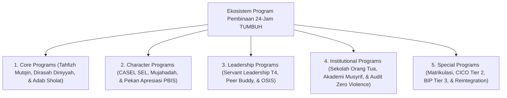

# MONOGRAF RISET AKADEMIK: KERANGKA KERJA PROGRAM PEMBINAAN 24-JAM PESANTREN
## Evaluasi Operasional: Core Programs, Character Programs, Leadership Qudwah T4, Institutional Programs, dan Special Interventions

**Dewan Riset & Keilmuan Ekosistem TUMBUH**  
*Dipublikasikan sebagai Naskah Monograf Riset Ilmiah (Jurnal Kebijakan Program Pendidikan Pesantren)*  
*Dokumen Rujukan Induk: Domain 09 Programs & Book Series Volume 04*

---

## ABSTRAK

> **Latar Belakang**: Program kegiatan santri di pesantren sering kali mengalami tumpang tindih (*programmatic clutter*), ketidakjelasan penanggung jawab operasional, atau tiadanya diferensiasi antara program pencegahan universal dan intervensi krisis khusus.
>
> **Tujuan Penelitian**: Merumuskan dan merancang taksonomi program pembinaan terpadu 24-jam yang terbagi dalam **5 Sub-Domain Program Utama** beserta SOP pelaksanaan terukurnya.
>
> **Hasil Riset**: Terstruktur 5 Sub-Domain Program Pembinaan 24-Jam: (1) **Core Programs** (Tahfizh Mutqin, Dirasah Diniyyah, & Adab Sholat); (2) **Character Programs** (CASEL SEL Kelompok Kecil, Mujahadah Regulasi Emosi, & Pekan Apresiasi PBIS); (3) **Leadership Programs** (Kaderisasi Servant Leadership T4, Peer Buddy, & Musyawarah Restoratif OSIS); (4) **Institutional Programs** (Sekolah Orang Tua, Akademi Musyrif, & Audit Zero Violence); dan (5) **Special Programs** (Matrikulasi Homesickness Care, CICO Tier 2, BIP Tier 3, & Reintegration Circle).
>
> **Kata Kunci**: *Programs Framework, Core Programs, Character Programs, Servant Leadership T4, CICO Tier 2, Reintegration Circle.*

---

## 1. PENDAHULUAN & ARSITEKTUR EKOSISTEM PROGRAM

Program pembinaan 24-jam di ekosistem TUMBUH mengoperasionalkan prinsip pengasuhan terpadu tanpa dikotomi madrasah-asrama:

---

## 2. METODOLOGI OPERASIONALISASI PROGRAM KUNCI

1. **Program Tahfizh Mutqin (Sabaq, Sabqi, Manzil)**: Mengutamakan kualitas kekokohan hafalan (*Mutqin*) dan tajwid dibanding ketergesa-gesaan kuantitas.
2. **Program Peer Buddy System T4**: Penugasan 1 santri senior T4 untuk mengayomi 2 santri junior T1/T2 tanpa feodalisme.
3. **Program Sekolah Orang Tua (Parent Engagement)**: Workshop bulanan penyelarasan pola pengasuhan positif di rumah saat liburan.
4. **Program Reintegration Circle**: Pemulihan kehangatan persaudaraan pasca insiden tanpa pelabelan buruk.

---

## 3. DAFTAR PUSTAKA
* Kouzes, J. M., & Posner, B. Z. (2017). *The Leadership Challenge*. Wiley.
* Sugai, G., & Horner, R. H. (2002). School-wide positive behavior supports. *Child & Family Behavior Therapy*, 24(1-2), 23–50.
