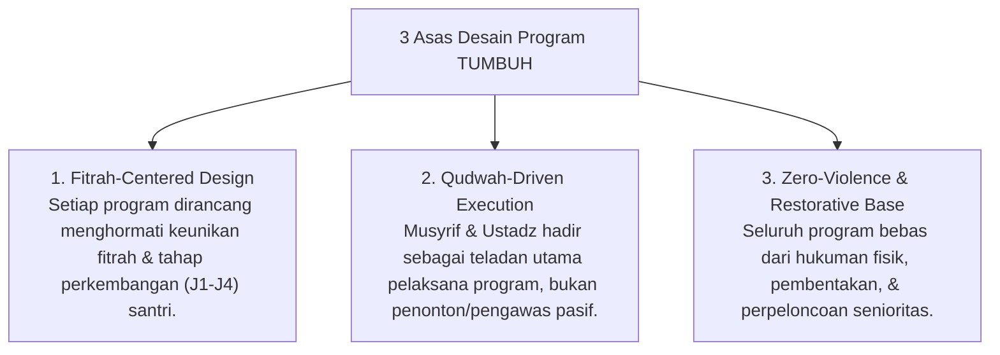
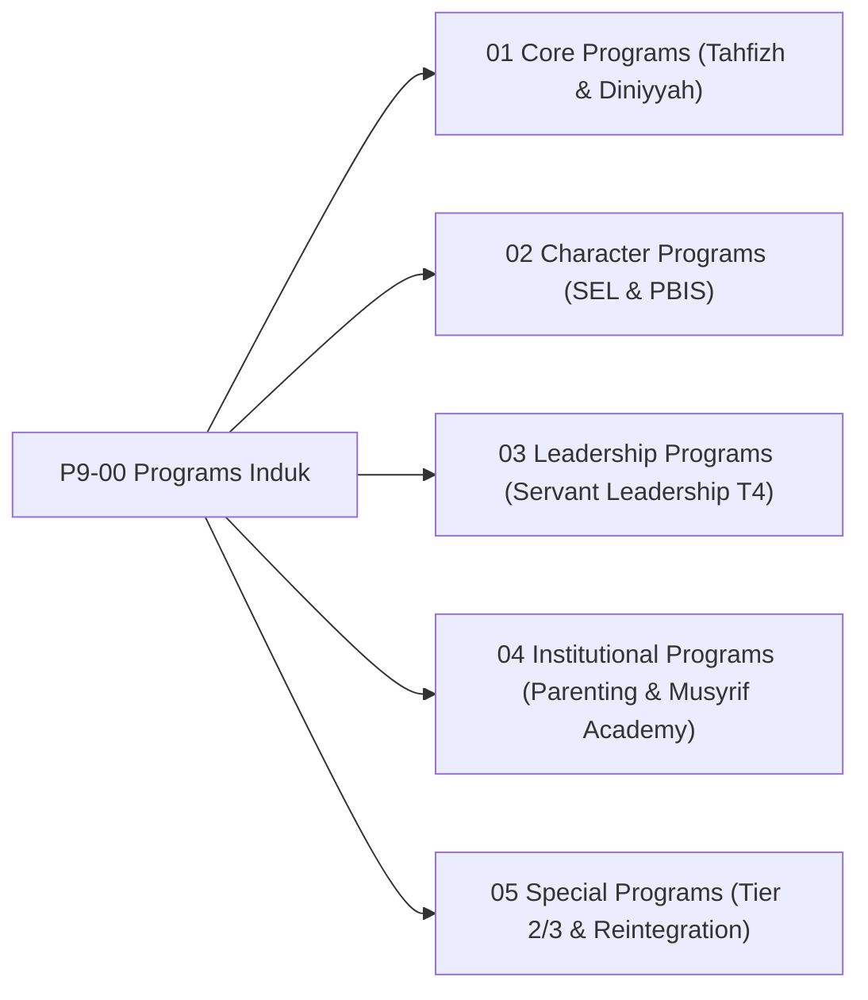

# P9-00: Programs Induk (Kerangka Kerja Program Pembinaan Pesantren TUMBUH)

## Status Dokumen
* **Status**: 🌟 **A+ (Tervalidasi & Induk Baku)**
* **Domain**: Project 9 — `09 Programs`
* **Penanggung Jawab Keilmuan**: Dewan Keilmuan TUMBUH (*Pakar Master Teacher Pedagogi, Pakar Pengasuhan Asrama, & Pakar PBIS*)

---

## 1. Pendahuluan & Prinsip Pengorganisasian Program Pembinaan

Sesuai Dokumen Induk `AGENTS.md`, seluruh program pembinaan di pesantren ekosistem **TUMBUH** dirancang terpadu 24-jam tanpa pemisahan dikotomis antara kegiatan madrasah dan asrama.

---

## 2. Model Triad Pertumbuhan Simbiotik dalam Ekosistem Program

- **Santri Tumbuh**: Memperoleh pengalaman pembinaan yang kaya, menyenangkan, terukur, dan bermakna bagi pembentukan adab & kepemimpinan.
- **Guru & Musyrif Tumbuh**: Memiliki panduan program (SOP Runbook) yang jelas, mengurangi kebingungan lapangan, & terlindungi dari *burnout*.
- **Sistem Lembaga Tumbuh**: Memiliki ekosistem program 24-jam yang terukur, akuntabel berbasis data PBIS, & berstandar mutu tinggi.

---

## 3. Peta Hubungan Sub-Domain Program

---

## 4. Rujukan Keilmuan Multidisiplin

1. **Turats Islam**: *Adab al-Alim wa al-Muta'allim* (Imam An-Nawawi), *Fiqhu ar-Ri'ayah* (Tanggung Jawab Pengasuhan Kepemimpinan), *Al-Imamah wa Qudwah* (Imam Al-Ghazali).
2. **Sains Kontemporer**: *School-Wide PBIS Implementation Blueprint* (Sugai & Horner), *Social Emotional Learning Framework* (CASEL), *Servant Leadership Theory* (Greenleaf).
