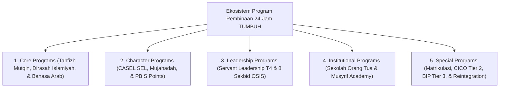

# Domain 09: Programs (Kerangka Kerja Program Pembinaan Pesantren TUMBUH)

Domain ini memuat operasionalisasi program-program pembinaan 24-jam di ekosistem **TUMBUH** yang terbagi dalam **5 Sub-Domain Utama**: Program Utama (Core), Program Karakter (SEL & PBIS), Program Kepemimpinan (Leadership Qudwah T4), Program Lembaga (Institutional), dan Program Khusus (Special & Intervensi Tier 2/3).

---

## Indeks Dokumen Induk & Jurnal Riset Monograf Utuh

* 📄 **[Jurnal-Monograf-Riset-Program-Pembinaan-24Jam-TUMBUH.md](./Jurnal-Monograf-Riset-Program-Pembinaan-24Jam-TUMBUH.md)**: **Monograf Riset Ilmiah Utuh & Terkonsolidasi** (Mencakup Handover KBM Walas 07.00-15.00 vs Asrama Musyrif 15.00-07.00, Kurikulum Pondok 24-Jam, Program 8 Sekbid OSIS, Schedule Streamlining Jam Istirahat Mutlak, & Hybrid Parent School).
* 📄 **[P9-00-Programs-Induk.md](./P9-00-Programs-Induk.md)**: Dokumen Maha-Induk Program Pembinaan 24-Jam Pesantren.

---

## Arsitektur Ekosistem Program Pembinaan 24-Jam

---

## 5 Sub-Domain Modul Program Pembinaan

1. 📂 **[01 Core Programs](./01%20Core%20Programs/)**: Program Utama (Tahfizh Al-Qur'an, Dirasah Islamiyah Subuh, Bahasa Arab Isya, & Adab Sholat).
2. 📂 **[02 Character Programs](./02%20Character%20Programs/)**: Program Karakter (CASEL SEL, Mujahadah Emosi, & Pekan Apresiasi PBIS).
3. 📂 **[03 Leadership Programs](./03%20Leadership%20Programs/)**: Program Kepemimpinan (Servant Leadership T4, Peer Buddy, & 8 Sekbid OSIS).
4. 📂 **[04 Institutional Programs](./04%20Institutional%20Programs/)**: Program Budaya & Lembaga (Sekolah Orang Tua Hybrid, Akademi Musyrif, & Audit Zero Violence).
5. 📂 **[05 Special Programs](./05%20Special%20Programs/)**: Program Khusus & Intervensi (Matrikulasi T1, CICO Tier 2, BIP Tier 3, & Reintegration Circle).
