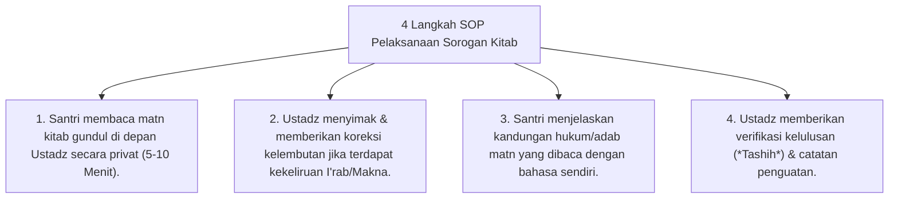

# P10-01-01: Metode Qiraah Syarah dan Sorogan Kitab Turats

## Status Dokumen
* **Status**: 🌟 **A+ (Tervalidasi & Siap Diimplementasikan)**
* **Sub-Domain**: `10 Methods / 01 Learning Methods`
* **Penanggung Jawab Keilmuan**: Dewan Keilmuan TUMBUH (*Pakar Epistemologi Turats & Pakar Master Teacher Pedagogi*)

---

## 1. Operasionalisasi Metode Sorogan Individual

Metode Sorogan melatih penguasaan mandiri santri terhadap struktur bahasa Arab (Nahwu, Sharaf) dan pemahaman teks kitab gundul:

---

## 2. Penghormatan Atas Kecepatan Belajar Santri

Sorogan menghargai perbedaan kecepatan ketuntasan santri (*Individual Pace*), memungkinkan santri yang cepat untuk maju lebih dahulu tanpa menahan yang belum tuntas.
