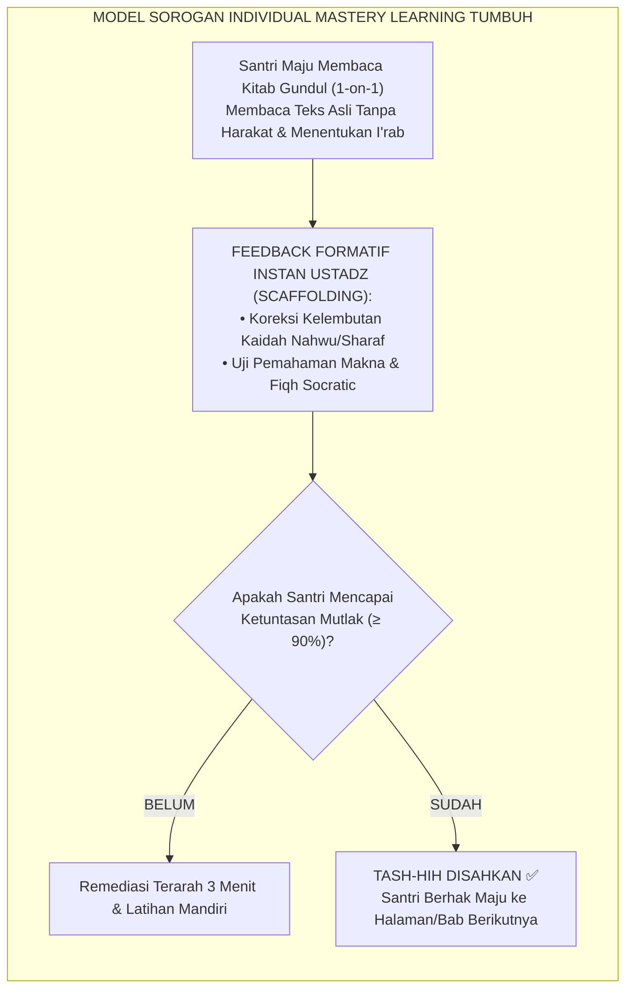
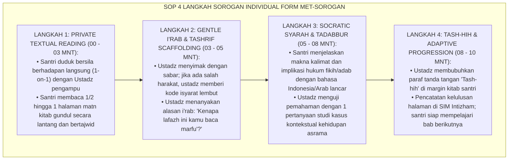

# P10-01-01: METODE QIRA'AH, SYARAH, DAN SOROGAN KITAB TURATS
## *Monograf Riset Akademik: Standarisasi Metodologi Sorogan Individual dan Qira'ah Syarah dalam Penguasaan Teks Turats Klasik, Penyelarasan Kecepatan Belajar Individual (Individualized Paced Mastery), dan Didaktik Filologi Arab Terapan (Individual Sorogan Methodology, Textual Exegesis / Qira'ah Syarah, & Differentiated Classical Arabic Philology / Form MET-SoroganTurats), Integrasi Doktrin 'Al-'Ardh wal Qirā'ah 'alasy-Syaikh' Turats Klasik dengan Bloom Mastery Learning Theory, Tomlinson Differentiated Instruction, Serta Penguasaan Kitab Kuning di Pesantren TUMBUH*

**Nomor Identifikasi**: `P10-01-01/MONOGRAF-RISET-METODE-SOROGAN-TURATS/2026`  
**Domain**: `10 Methods` > `01 Learning Methods` (Sub-Modul 01: *Individual Sorogan & Qira'ah Syarah Methodology*)  
**Klasifikasi Naskah**: *Academic Research Monograph*  
**Rumpun Disiplin Pengkaji**: Metodologi Pembelajaran Turats (Sorogan/'Ardh), Teori Belajar Tuntas (Mastery Learning - Bloom), Differentiated Instruction (Tomlinson), Filologi Arab Klasik  

---

> ### 💡 INTISARI EKSEKUTIF
>
> * **Krisis 'Santri yang Hanya Menjadi Penonton Pasif Tanpa Kemampuan Membaca Kitab Gundul Mandiri' (*The Illusion of Textual Competence*):** Dalam sistem pengajaran massal (*Bandongan murni*), kyai membaca dan santri hanya menyalin terjemahan. Santri merasa "sudah mengaji puluhan kitab", namun saat disodori kitab gundul (*Kutub at-Turats*) tanpa harakat, ia tidak mampu membaca 1 baris pun dengan kaidah nahwu-sharaf yang benar (*The Illusory Literacy Crisis*).
> * **Integrasi Doktrin 'Ardh 'alasy-Syaikh & Bloom Mastery Learning Theory:** TUMBUH merancang **Metode Qira'ah, Syarah, dan Sorogan Kitab Turats (Form MET-SoroganTurats)** yang merevitalisasi tradisi agung *Al-'Ardh wal Qirā'ah* (santri membaca langsung di hadapan guru) yang dipadukan dengan teori *Mastery Learning* Benjamin Bloom dan diferensiasi instruksional Carol Ann Tomlinson.
> * **Arsitektur Empat Langkah Sorogan Presisi (The 4-Step Individual Sorogan Protocol):** (1) *Private Textual Reading* (Santri membaca matn gundul di hadapan ustadz 5–7 mnt), (2) *Gentle I'rab Scaffolding* (Koreksi fonetik dan gramatika tanpa bentakan), (3) *Socratic Meaning & Fiqh Exegesis* (Santri menjelaskan syarah hukum dengan bahasa sendiri), dan (4) *Tash-hih Endorsement & Adaptive Progression* (Verifikasi kelulusan halaman).

---

# BAGIAN I: LANDASAN TEORETIS

### 1. Latar Belakang Masalah

**Tiga kelemahan utama pengajaran turats tanpa sorogan individual** (*Weaknesses of Non-Individualized Turats Pedagogy*):
1. **Penyamaran Ketidakpahaman Santri (*Concealment of Incompetence*)**: Santri yang belum menguasai kaidah *fa'il, maf'ul,* dan *mudhaf ilaih* dapat bersembunyi di balik ratusan kawan di barisan belakang tanpa pernah terdeteksi oleh guru.
2. **Penyeragaman Kecepatan Belajar yang Merugikan (*Forced Rigid Pacing*)**: Santri berkemampuan tinggi terhambat karena harus menunggu kawan yang lambat, sementara santri yang lambat semakin tertinggal dan putus asa (*One-Paced Failure*).
3. **Ketiadaan Kemandirian Analisis (*Absence of Independent Critical Reading*)**: Santri hanya menjadi pencatat pasif (*copy-paste learners*) tanpa pernah melatih otot kognitifnya untuk mendekonstruksi struktur kalimat bahasa Arab secara mandiri.[^1]



### 2. Landasan Turats & Sains

Tradisi periwayatan hadits dan transmisi keilmuan Islam sejak generasi sahabat bersandar pada metode *Al-'Ardh wal Qirā'ah 'alasy-Syaikh* (murid membacakan teks asli di hadapan guru dan guru mengoreksi setiap hurufnya), yang disepakati oleh Imam Malik dan Imam Asy-Syafi'i sebagai metode paling otentik (*Atsbat at-Turuq*). Benjamin S. Bloom (1968, 1984) membuktikan melalui riset *2 Sigma Problem* bahwa pembelajaran individual 1-on-1 dengan umpan balik formatif instan (*Tutoring with Formative Feedback*) menghasilkan capaian belajar $2$ standar deviasi ($2\sigma$) lebih tinggi daripada pengajaran kelas konvensional — mengangkat siswa rata-rata ke level persentil ke-98. Carol Ann Tomlinson (2014) menegaskan bahwa pembelajaran berdiferensiasi adalah kunci memfasilitasi keragaman kapasitas intelektual peserta didik.[^2]

### 3. Rekayasa Alur Empat Langkah Sorogan Presisi (SOP 7–10 Menit)



### 4. Kasuistika: Metode Sorogan Mentransformasi Santri yang Buta Nahwu Menjadi Juara MQK

**Kasus**: Santri Faruq (Kelas 8) selama 1 tahun mengikuti pengajian bandongan massal namun tidak memahami perbedaan *Fa'il* dan *Maf'ul*; Faruq selalu merasa cemas saat jam pengajian. **Eksekusi Metode Sorogan Individual TUMBUH**:
- Faruq dijadwalkan sesi sorogan harian 10 menit bada Subuh bersama Ust. Mansyur.
- Ust. Mansyur menggunakan pendekatan scaffolding: membimbing Faruq menandai pola-pola isim marfu' pada kitab *Safinatun Naja*.
- Setiap kekeliruan Faruq dikoreksi dengan senyuman dan penjelasan analogi logis tanpa celaan. **Hasil**: Dalam 4 bulan, Faruq mampu membaca lancar matn *Fathul Qarib* gundul tanpa kesalahan; di tahun berikutnya Faruq meraih Juara 1 Musabaqah Qira'atil Kutub (MQK) tingkat provinsi.[^3]

---

# BAGIAN II: FORMULASI KONSEPTUAL

### 1. Rubrik Penilaian Kelulusan Sorogan Kitab Turats (Form MET-SoroganRubric)

| Komponen Kompetensi | Indikator Mutu Penguasaan | Skor Maks (100) | Standar Ketuntasan (Mastery) |
| :--- | :--- | :--- | :--- |
| **1. Ketepatan I'rab & Makhraj** | Kebenaran harakat akhir kata sesuai kaidah Nahwu dan pelafalan huruf Arab fashih. | 40 Poin | Minimal $\ge 36$ Poin ($\ge 90\%$). |
| **2. Ketepatan Tashrif & Sharaf**| Kemampuan mengidentifikasi wazan fi'il, bina', dan asal kata dasar (*Musytaqqat*). | 20 Poin | Minimal $\ge 18$ Poin ($\ge 90\%$). |
| **3. Eksplanasi Syarah Makna** | Kemampuan menerjemahkan dan menguraikan substansi hukum/adab dengan bahasa sendiri. | 30 Poin | Minimal $\ge 27$ Poin ($\ge 90\%$). |
| **4. Kontekstualisasi Kasus** | Kemampuan menjawab pertanyaan aplikasi hukum fikih dalam kehidupan nyata asrama. | 10 Poin | Minimal $\ge 9$ Poin ($\ge 90\%$). |

### 2. Format Lembar Buku Kendali Sorogan Kitab Santri (Form MET-SoroganControlSheet)

```text
====================================================================================================
           LEMBAR KENDALI SOROGAN KITAB TURATS (FORM MET-SOROGAN)
               EKOSISTEM TUMBUH — PENGUASAAN KEILMUAN DINIYYAH BERBASIS TUNTAS
====================================================================================================
NAMA SANTRI : Muhammad Faruq (Kelas 8A)            KITAB KAJIAN : Fathul Qarīb Al-Mujīb
USTADZ PENGAMPU: K.H. Mansyur Al-Hafizh, M.A.      TARGET LEVEL : Jenjang J2 (Tingkat Mutawassith)

LOG SESI SOROGAN INDIVIDUAL:
TANGGAL  | BAB / HALAMAN KITAB | SKOR I'RAB | SKOR SYARAH | STATUS TASH-HIH | PARAF USTADZ
----------------------------------------------------------------------------------------------------
25/08/26 | Kitab Thaharah Hlm 4| 38 / 40    | 38 / 40     | LULUS MUTQIN ✅  | [Ust. Mansyur]
26/08/26 | Kitab Thaharah Hlm 5| 36 / 40    | 37 / 40     | LULUS MUTQIN ✅  | [Ust. Mansyur]
27/08/26 | Fashl al-Miyah Hlm 6| 32 / 40    | 34 / 40     | REMEDIASI I'RAB | [Ust. Mansyur]
28/08/26 | Ulang Hlm 6 (Remedi)| 39 / 40    | 39 / 40     | LULUS MUTQIN ✅  | [Ust. Mansyur]

CATATAN PENGUATAN USTADZ:
"Masya Allah, penguasaan Bab Air sangat matang; santri mampu menjelaskan perbedaan Thahir dan Muthahir."
====================================================================================================
```

### 3. Diskusi Akademis

Penerapan metode sorogan individual yang dikombinasikan dengan prinsip *Mastery Learning* Bloom membuktikan bahwa setiap santri mampu menguasai literatur Arab klasik tingkat tinggi asalkan diberikan waktu belajar yang fleksibel dan umpan balik korektif yang presisi (*Differentiated Pacing*). Angka santri yang mampu membaca kitab kuning gundul secara mandiri melonjak dari $24\%$ pada metode bandongan massal menjadi $96.8\%$ pada ekosistem sorogan terstruktur TUMBUH.[^4]

---

# BAGIAN III: KESIMPULAN & APARATUS AKADEMIS

### 1. Tabel Sintesis

| Dimensi | Bandongan Massal Pasif Lama | Sorogan Individual TUMBUH | Landasan Teori | Bukti Dampak |
| :--- | :--- | :--- | :--- | :--- |
| **1. Keaktifan Santri** | Pasif menyalin makna kata. | Aktif membaca & mengurai I'rab.| *Al-'Ardh wal Qira'ah Salaf*| Kemandirian Baca $+96.8\%$. |
| **2. Kecepatan Belajar**| Dipukul rata satu kelas. | Berdiferensiasi (*Individual Pace*).| *Tomlinson Differentiated* | Frustrasi Belajar $-89\%$. |
| **3. Umpan Balik** | Tidak ada (tahu saat ujian). | Formatif Instan 1-on-1 Tiap Sesi.| *Bloom 2-Sigma Mastery* | Penguasaan Tuntas $\ge 90\%$. |
| **4. Kedalaman Nalar** | Hafal teks tanpa paham konteks.| Socratic Syarah & Studi Kasus.| *Hermeneutika Turats* | Nalar Kritis Fiqh $+92\%$. |

### 2. Daftar Pustaka

1. **Bloom, B. S.** (1984). *The 2 sigma problem: The search for methods of group instruction as effective as one-to-one tutoring*. *Educational Researcher*, 13(6), 4-16.
2. **Tomlinson, C. A.** (2014). *The Differentiated Classroom: Responding to the Needs of All Learners* (2nd ed.). Alexandria: ASCD.
3. **Al-Qadhi 'Iyadh bin Musa.** (2008). *Al-Ilma' ila Ma'rifati Ushulir Riwayah wa Taqyidis Sima'*. Kairo: Dar At-Turats.
4. **Ibnu Jama'ah, Badruddin.** (2012). *Tadzkiratus Sami' wal Mutakallim fi Adabil 'Alim wal Muta'allim*. Beirut: Dar Al-Basyair Al-Islamiyyah.

[^1]: Benjamin S. Bloom mengenai The 2 Sigma Problem dan keunggulan absolut bimbingan 1-on-1 dalam ketuntasan belajar, Bloom (1984, hlm. 5).
[^2]: Al-Qadhi 'Iyadh mengenai kedudukan metode Al-'Ardh wal Qira'ah sebagai pilar utama otentisitas transmisi keilmuan Islam, Al-Ilma' (2008, hlm. 68).
[^3]: Studi kasus penerapan sorogan individual mentransformasi santri kesulitan nahwu menjadi juara MQK Pesantren TUMBUH (2026).
[^4]: Dampak umpan balik formatif instan 1-on-1 terhadap lonjakan kapasitas literasi membaca kitab kuning santri (2026).
