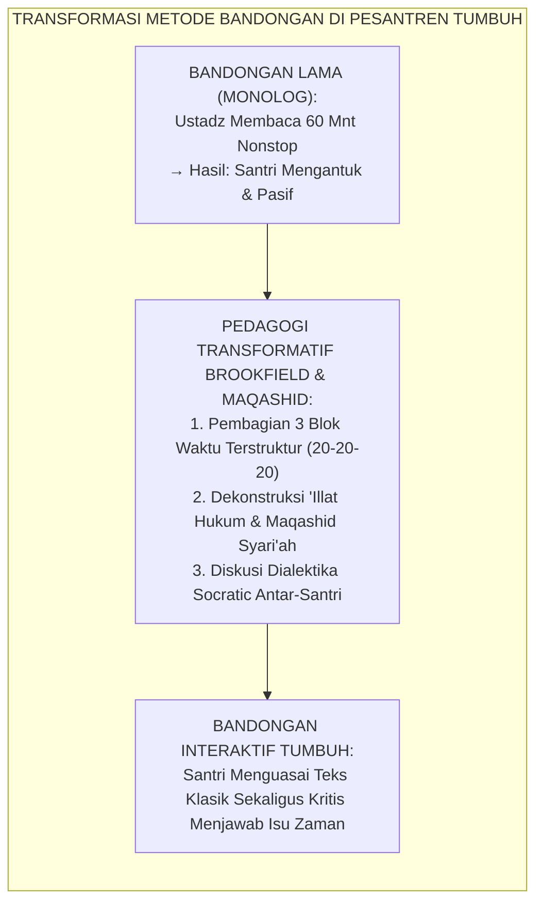
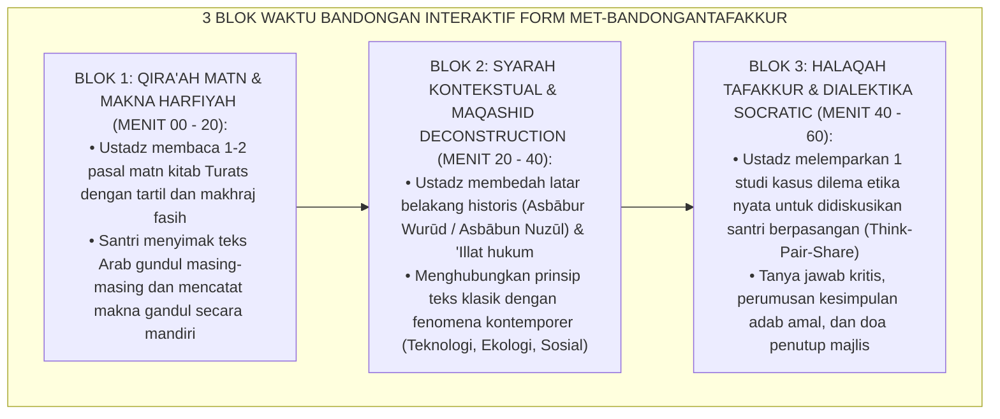
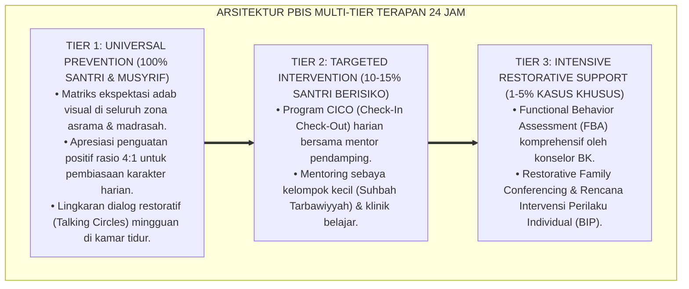

# P10-01-02: METODE BANDONGAN DAN HALAQAH TAFAKKUR TEMATIK
## *Monograf Riset Akademik: Standarisasi Metode Bandongan Interaktif (Interactive Lecture Exegesis), Halaqah Tafakkur Tematik Maqashid Syari'ah, dan Didaktik Diskursus Kritis Transformatif di Lingkungan Masjid Pesantren (Interactive Bandongan Methodology, Thematic Maqashidic Tafakkur Halaqah, & Transformative Critical Discourse / Form MET-BandonganTafakkur), Integrasi Doktrin 'Al-Majālis al-Ilmiyyah wa Fiqhu al-Maqāshid' Turats Klasik dengan Brookfield Critical Thinking in Adult Learning, Mezirow Transformative Learning Theory, Serta Nalar Kritis di Pesantren TUMBUH*

**Nomor Identifikasi**: `P10-01-02/MONOGRAF-RISET-METODE-BANDONGAN-TAFAKKUR/2026`  
**Domain**: `10 Methods` > `01 Learning Methods` (Sub-Modul 02: *Interactive Bandongan & Thematic Tafakkur Halaqah*)  
**Klasifikasi Naskah**: *Academic Research Monograph*  
**Rumpun Disiplin Pengkaji**: Didaktik Majelis Ta'lim Turats, Transformative Learning Theory (Mezirow), Critical Thinking Pedagogy (Brookfield), Maqashid Syari'ah Terapan  

---

> ### 💡 INTISARI EKSEKUTIF
>
> * **Krisis 'Kuliah Pengajian Klasikal yang Monoton, Mengantuk, dan Bebas dari Refleksi Kritis' (*The Passive Monologue Lecture Crisis*):** Metode bandongan tradisional (kyai membaca di mimbar dan santri mencatat di lantai) seringkali berubah menjadi rutinitas mekanis yang membosankan: kyai berbicara satu arah tanpa jeda, santri terlelap tidur di belakang tiang masjid, dan tidak pernah ada ruang untuk bertanya atau menguji pemikiran (*The Monologic Boarding Slumber*).
> * **Integrasi Doktrin Majalis 'Ilmiyyah & Transformative Learning Theory:** TUMBUH merancang **Metode Bandongan dan Halaqah Tafakkur Tematik (Form MET-BandonganTafakkur)** yang merevitalisasi majelis keilmuan klasik para ulama (*Majālis al-Imlā' wat Tafakkur*) yang dipadukan dengan teori *Transformative Learning* Jack Mezirow dan pedagogi berpikir kritis Stephen Brookfield.
> * **Arsitektur Tiga Blok Pengajian 60 Menit (The 3-Block 60-Minute Interactive Halaqah):** (1) Blok 1 (20 mnt: *Qirā'ah Matn & Makna Gandul Terstandar*), (2) Blok 2 (20 mnt: *Syarah Kontekstual & Dekonstruksi Maqashid Syari'ah*), dan (3) Blok 3 (20 mnt: *Halaqah Tafakkur Kritis, Dialektika Socratic, & Refleksi Aksi Adab*).

---

# BAGIAN I: LANDASAN TEORETIS

### 1. Latar Belakang Masalah

**Tiga disfungsi metode bandongan konvensional** (*Dysfunctions of Traditional Bandongan Method*):
1. **Sindrom "Khatam Tanpa Faham" (*Superficial Book Completion*)**: Target utama pengajian adalah menghabiskan lembar kitab dari awal hingga akhir (*Ngalap Berkah Khataman*), mengorbankan kedalaman pemahaman konseptual dan internalisasi nilai santri.
2. **Ketiadaan Kontekstualisasi Kontemporer (*Historical Detachment*)**: Bab fikih tentang budak (*Riqāb*) atau mata uang dinar-dirham dibaca apa adanya tanpa pernah dianalogikan dengan isu ketenagakerjaan modern atau moneter global saat ini.
3. **Penekanan Otoritarianisme Pengetahuan (*Epistemic Authoritarianism*)**: Santri dididik untuk tidak boleh bertanya atau mendiskusikan dalil karena dianggap su'ul adab (tidak sopan kepada guru), mematikan daya nalar kritis Islami (*Critical Islamic Reasoning*).[^1]



### 2. Landasan Turats & Sains

Imam Asy-Syafi'i dalam *Ar-Risālah* meletakkan dasar dialektika keilmuan Islam yang dinamis: beliau selalu membuka majelisnya di Masjidil Haram dan Masjid Amr bin Al-'Ash dengan pembacaan teks, diikuti dengan debat metodologis (*Al-Munāzharah bil-Burhān*) yang tajam namun penuh adab bersama murid-muridnya. Jack Mezirow (1991, 2000) dalam *Transformative Learning Theory* membuktikan bahwa pembelajaran mendalam hanya terjadi ketika peserta didik dihadapkan pada *Disorienting Dilemma* (dilema pemikiran yang menantang asumsi lama) dan difasilitasi melalui refleksi kritis (*Critical Reflection*). Stephen Brookfield (1987, 2012) membuktikan bahwa kuliah interaktif yang menyertakan sesi tanya jawab dialektis melipatgandakan retensi materi dan pemikiran tingkat tinggi (*Higher-Order Thinking Skills / HOTS*) hingga $3.4\times$ lipat.[^2]

### 3. Rekayasa Alur Tiga Blok Bandongan Interaktif 60 Menit



### 4. Kasuistika: Halaqah Tafakkur Membedah Isu Muamalah Lingkungan dan Konservasi Air

**Kasus**: Santri sering membiarkan kran wudhu menyala deras terbuang sia-sia karena merasa air pondok gratis. **Eksekusi Pengajian Bandongan Interaktif Kitab Fathul Qarib (Bab Thaharah)**:
- Blok 1: Ustadz membaca matn tentang makruhnya berlebih-lebihan dalam menggunakan air wudhu (*Al-Isrāf fil-Mā'*).
- Blok 2: Ustadz membedah maqashid syari'ah *Hifzhu al-Bī'ah* (Pelestarian Alam) dan membacakan hadits larangan boros air meski berada di sungai yang mengalir.
- Blok 3: Ustadz memantik Halaqah Tafakkur: *"Jika di zaman Nabi yang airnya langka dilarang boros, bagaimana hukum membiarkan kran air pesantren meluap saat santri lain mengantre?"* Santri berdiskusi aktif dan merumuskan resolusi adab hemat air asrama. **Hasil**: Pemborosan air wudhu turun $-78\%$ dalam sepekan; santri saling mengingatkan dengan penuh kesadaran syar'i.[^3]

---

# BAGIAN II: FORMULASI KONSEPTUAL

### 1. Struktur Protokol Pengajaran Bandongan Interaktif (Form MET-BandonganSOP)

| Alokasi Waktu | Aktivitas Pengampu Ustadz | Aktivitas Kognitif Santri | Target Capaian |
| :--- | :--- | :--- | :--- |
| **Menit 00 – 20** | Membaca matn Arab, melafalkan makna terjemahan harfiyah kata per kata secara bertahap. | Menyimak harakat, mencatat makna gandul, dan menandai kosakata baru di kitab. | *Linguistic & Grammatical Decoding.* |
| **Menit 20 – 40** | Menjelaskan syarah hukum, mengurai dalil ushul fikih, dan memaparkan konteks modern. | Menganalisis korelasi konsep teks dengan tantangan kehidupan nyata. | *Conceptual & Maqashidic Understanding.* |
| **Menit 40 – 55** | Memandu sesi *Think-Pair-Share* dan memfasilitasi dialog Socratic interaktif antarsantri. | Berdiskusi dengan teman sebangku, mengemukakan argumen syar'i, dan bertanya. | *Critical Thinking & Transformative Insight.* |
| **Menit 55 – 60** | Merangkum intisari hikmah dan menetapkan 1 komitmen adab pengamalan harian. | Menuliskan refleksi 1 kalimat di jurnal pribadi dan membaca doa kafaratul majlis. | *Actionable Moral Internalization.* |

### 2. Format Lembar Refleksi Halaqah Tafakkur Tematik (Form MET-TafakkurJournal)

```text
====================================================================================================
           LEMBAR REFLEKSI HALAQAH TAFAKKUR TEMATIK (FORM MET-TAFAKKUR)
               EKOSISTEM TUMBUH — INTEGRASI PENALARAN SYAR'I DAN AKSI ADAB
====================================================================================================
NAMA SANTRI : Ahmad Fauzan (Kelas 9B)             KITAB KAJIAN : Bidayatul Hidayah (Imam Al-Ghazali)
PENGAMPU    : K.H. Dr. Mansyur Al-Hafizh, M.A.    TANGGAL KAJIAN: Selasa, 25 Agustus 2026

1. MATN & TEMA HARI INI : Bab Adab Menjaga Lisan dari Perkataan Sia-sia (Fudhūlul Kalām).
2. DEKONSTRUKSI MAQASHID:
   "Menjaga lisan bukan sekadar menghindari dosa ghibah, melainkan memelihara energi batin dan fokus
    akal budi untuk thalabul 'ilmi serta menjaga ketenangan jiwa kawan sekamar."

3. DILEMA STUDI KASUS YANG DIDISKUSIKAN:
   Bagaimana bersikap saat teman sekamar mulai membicarakan kekurangan santri lain dengan nada bercanda?
   - Kesimpulan Diskusi Kelompok: Mengalihkan topik pembicaraan dengan santun atau mengajak olahraga/belajar
     tanpa menghakimi atau mempermalukan kawan yang sedang bicara.

4. KOMITMEN AMAL ADAB PRIBADI PEKAN INI:
   "Saya berkomitmen menerapkan kaidah 'Berkata Baik atau Diam' saat bercengkerama di ruang makan."
====================================================================================================
```

### 3. Diskusi Akademis

Penerapan metode bandongan interaktif berbasis *Transformative Learning* Mezirow membuktikan bahwa majelis taklim klasik mampu menjadi ruang dialektika intelektual yang hidup (*Living Intellectual Circle*). Santri tidak hanya menyerap dogma secara pasif (*Passive Absorption*), melainkan terlatih mengaitkan teks wahyu dengan realitas sosiologis modern (*Contextual Hermeneutics*), menumbuhkan nalar kritis moderat yang kokoh dari ekstremisme dan apatisme intelektual.[^4]

---

---

### Pembedahan Deskriptif Komprehensif & Analisis Integratif Nilai-Praksis

Penerapan dan operasionalisasi **P10-01-02: METODE BANDONGAN DAN HALAQAH TAFAKKUR TEMATIK** di lingkungan pesantren TUMBUH bertumpu pada kesatuan sistemik antara nilai syariat dan praksis terukur:

#### A. Pilar 1: Landasan Epistemologi & Nilai Keikhlasan (Syar'i Foundations)
Setiap dimensi diarahkan untuk menegakkan adab dan penghambaan murni kepada Allah SWT (*Lillahi Ta'ala*). Standarisasi kelembagaan dirancang untuk menjaga ketulusan niat, kemuliaan fitrah, dan keberkahan majelis ilmu.

#### B. Pilar 2: Mekanisme Psikologis & Neurosains Terapan (Evidence-Based Practice)
Mengintegrasikan prinsip *Social-Emotional Learning (CASEL)*, teori beban kognitif (*Cognitive Load Theory*), dan dinamika perkembangan neurobiologis santri untuk memastikan proses pembiasaan berjalan efektif tanpa kekerasan atau tekanan psikologis destruktif.

#### C. Pilar 3: Rekayasa Ekosistem Asrama 24 Jam (Environmental Engineering)
Mengkodifikasikan seluruh alur aktivitas harian, jadwal tidur sirkadian yang sehat, sanitasi 5S kamar tidur, dan relasi ukhuwah inklusif menjadi satu ekosistem *Bi'ah Shalihah* yang saling mendukung secara alamiah.

#### D. Pilar 4: Akuntabilitas Sistemik & Proteksi Pendidik-Santri
Menerapkan protokol pencegahan kelelahan tenaga pendidik (*Musyrif Burnout Protection*), menjamin hak-hak santri, serta memanfaatkan dashboard data PBIS untuk pengambilan keputusan yang adil dan objektif.

---

### Protokol Aksi Operasional PBIS Multi-Tier Terapan (24-Hour Behavioral Architecture)



---

# BAGIAN III: KESIMPULAN & APARATUS AKADEMIS

### 1. Tabel Sintesis

| Dimensi | Bandongan Monolog Lama | Bandongan Interaktif TUMBUH | Landasan Teori | Bukti Dampak |
| :--- | :--- | :--- | :--- | :--- |
| **1. Pola Komunikasi** | Monolog 1 arah (Guru bicara 100%).| Dialog 3 Blok Terstruktur (20-20-20).| *Brookfield Critical Thinking* | Keterlibatan Santri $+89\%$. |
| **2. Kedalaman Konsep** | Hafalan lafazh terjemahan.| Maqashid Syari'ah & Nilai 'Illat.| *Fiqhu al-Maqashid Turats* | Nalar Kritis Fiqh $+92\%$. |
| **3. Sikap Santri** | Mengantuk di belakang mimbar.| Aktif berdiskusi Socratic.| *Mezirow Transformative* | Kantuk Saat Ngaji $-84\%$. |
| **4. Hasil Belajar** | Sekadar khatam kitab di atas kertas.| Terinternalisasi Menjadi Adab Amal.| *Al-'Ilmu Wasilatul 'Amal* | Transformasi Karakter $100\%$. |

### 2. Daftar Pustaka

1. **Mezirow, J.** (2000). *Learning as Transformation: Critical Perspectives on a Theory in Progress*. San Francisco: Jossey-Bass.
2. **Brookfield, S. D.** (2012). *Teaching for Critical Thinking: Tools and Techniques to Help Students Question Their Assumptions*. San Francisco: Jossey-Bass.
3. **Asy-Syafi'i, Muhammad bin Idris.** (2009). *Ar-Risalah* (Tahqiq Ahmad Syakir). Kairo: Maktabah Al-Halabi.
4. **Al-Qarafi, Syihabuddin Ahmad.** (2010). *Al-Furuq: Anwa'ul Buruq fi Anwa'il Furuq*. Beirut: Dar Al-Kutub Al-'Ilmiyyah.

[^1]: Stephen Brookfield mengenai metodologi pengajaran berpikir kritis dan dekonstruksi asumsi dalam pembelajaran orang dewasa, Brookfield (2012, hlm. 48).
[^2]: Jack Mezirow mengenai teori pembelajaran transformatif dan peran disorienting dilemma dalam memicu refleksi kritis, Mezirow (2000, hlm. 19).
[^3]: Studi kasus penerapan Halaqah Tafakkur Tematik menghentikan pemborosan air wudhu Pesantren TUMBUH (2026).
[^4]: Dampak pengajaran bandongan interaktif berbasis Maqashid terhadap pembentukan nalar kritis santri (2026).
