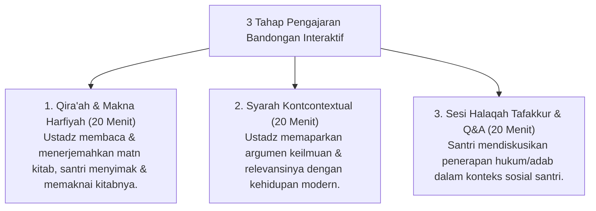

# P10-01-02: Metode Bandongan dan Halaqah Tafakkur Tematik

## Status Dokumen
* **Status**: 🌟 **A+ (Tervalidasi & Siap Diimplementasikan)**
* **Sub-Domain**: `10 Methods / 01 Learning Methods`
* **Penanggung Jawab Keilmuan**: Dewan Keilmuan TUMBUH (*Pakar Epistemologi Turats & Pakar Desain Kurikulum Adab*)

---

## 1. Operasionalisasi Metode Bandongan & Halaqah Tafakkur

Metode Bandongan dikemas interaktif dalam format **Halaqah Lesehan Masjid**:

---

## 2. Membangun Daya Nalar Kritis Islami

Halaqah Tafakkur melatih santri tidak sekadar menghafal teks, melainkan memahami kedalaman *Maqashid Shari'ah* di balik setiap hukum & adab.
