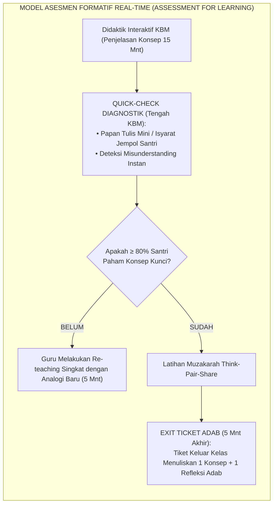
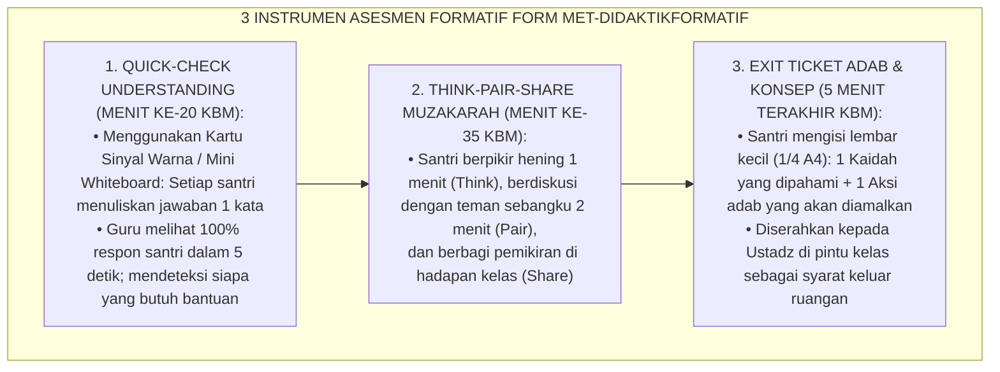
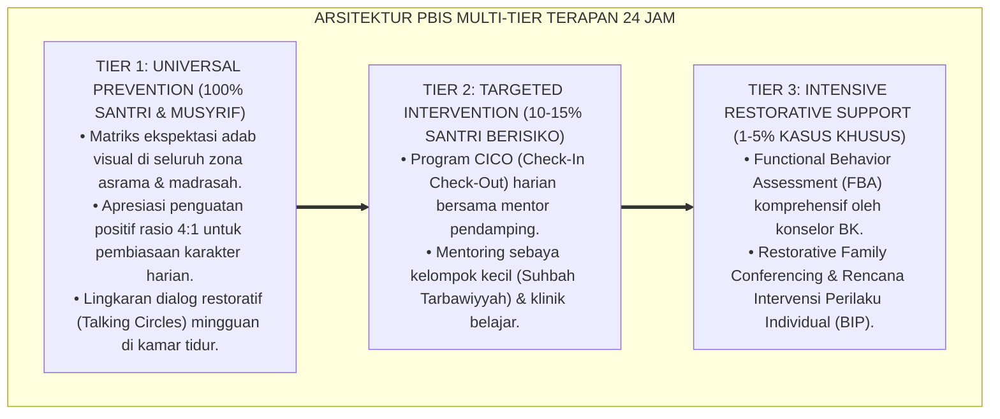

# P10-01-03: METODE DIDAKTIK INTERAKTIF DAN ASESMEN FORMATIF KELAS
## *Monograf Riset Akademik: Standarisasi Metodologi Didaktik Interaktif di Ruang Kelas Pesantren, Integrasi Teknik Asesmen Formatif Real-Time (Exit Tickets, Quick-Check, Think-Pair-Share), dan Umpan Balik Penguatan Proses Berbasis Pertumbuhan (Interactive Didactics, Real-Time Formative Assessment Techniques, & Growth-Oriented Process Feedback / Form MET-DidaktikFormatif), Integrasi Doktrin 'Husnu at-Ta'līm wa Daqā'iqu at-Taqwīm' Turats Klasik dengan Black & Wiliam Assessment for Learning (AfL), Hattie Visible Learning Feedback Theory, Serta Keunggulan KBM di Ekosistem Pesantren Berbasis TUMBUH*

**Nomor Identifikasi**: `P10-01-03/MONOGRAF-RISET-DIDAKTIK-ASESMEN-FORMATIF/2026`  
**Domain**: `10 Methods` > `01 Learning Methods` (Sub-Modul 03: *Interactive Didactics & Real-Time Formative Assessment*)  
**Klasifikasi Naskah**: *Academic Research Monograph*  
**Rumpun Disiplin Pengkaji**: Assessment for Learning (AfL - Black & Wiliam), Visible Learning & Feedback (John Hattie), Didaktik Pengajaran Interaktif, Fiqh At-Ta'lim wat Taqwim  

---

> ### 💡 INTISARI EKSEKUTIF
>
> * **Krisis 'Pengajaran Kelas yang Baru Diketahui Kegagalannya Saat Ujian Akhir Semester' (*The Post-Mortem Assessment Crisis*):** Di sebagian besar kelas madrasah/pesantren, guru mengajar berbulan-bulan tanpa pernah mengecek apakah siswa benar-benar memahami materi. Asesmen hanya dilakukan di akhir semester (UAS) dalam bentuk ujian tertulis bertekanan tinggi (*High-Stakes Summative Trap*). Ketika nilai santri merah, guru menyalahkan santri "bodoh/malas", padahal kegagalan tersebut berakar pada ketiadaan asesmen formatif harian (*Zero Formative Diagnostic Checking*).
> * **Integrasi Doktrin Ta'lim Nabawi & Black-Wiliam Assessment for Learning:** TUMBUH merancang **Metode Didaktik Interaktif dan Asesmen Formatif Kelas (Form MET-DidaktikFormatif)** yang memadukan kebiasaan Rasulullah SAW menguji pemahaman sahabat secara berkala di sela-sela majelis (*Husnu at-Ta'līm*) dengan kerangka *Assessment for Learning (AfL)* Paul Black & Dylan Wiliam dan teori umpan balik John Hattie.
> * **Arsitektur Tiga Instrumen Formatif Mikro Real-Time (The Tri-Tool Formative Assessment Engine):** (1) *Quick-Check Understanding* (Isyarat Jempol/Papan Mini di Tengah Pelajaran), (2) *Think-Pair-Share Muzakarah Pasangan* (3 mnt), dan (3) *Exit Ticket Adab & Konsep* (5 mnt sebelum bel usai).

---

# BAGIAN I: LANDASAN TEORETIS

### 1. Latar Belakang Masalah

**Tiga kekeliruan didaktik dalam manajemen kelas pesantren konvensional** (*Didactic Flaws in Classroom Management*):
1. **Pertanyaan Retoris "Apakah Sudah Paham Semua?" (*The Illusory Rhetorical Question*)**: Guru bertanya *"Sudah paham anak-anak?"*, santri menjawab serempak *"Sudah Ustadz!"* karena takut, padahal $80\%$ santri tidak memahami materi (*False Consensus Bias*).
2. **Ketiadaan Modifikasi Pembelajaran Instan (*Absence of Real-Time Instructional Adjustment*)**: Guru tetap melaju menyelesaikan kurikulum tanpa mempedulikan tanda-tanda kebingungan santri (*Curriculum Coverage Obsession*).
3. **Umpan Balik yang Menghakimi Pribadi (*Person Praise/Criticism*)**: Mengatakan *"Kamu memang bodoh dalam nahwu"* atau *"Kamu memang pintar bawaan lahir"*, yang menurut riset Carol Dweck menumbuhkan *Fixed Mindset* yang merusak ketahanan belajar.[^1]



### 2. Landasan Turats & Sains

Rasulullah SAW senantiasa menggunakan metode tanya jawab interaktif untuk mengecek kesiapan nalar sahabat, seperti saat beliau bertanya: *"Tahukah kalian siapa orang yang bangkrut (Al-Muflis) itu?"* Para sahabat menjawab sesuai pemahaman lahiriah, lalu Nabi meluruskan dan menanamkan hakikat spiritualnya (HR. Muslim). Paul Black & Dylan Wiliam (1998, 2009) dalam riset monumental *Inside the Black Box* membuktikan bahwa penerapan asesmen formatif yang konsisten di kelas menghasilkan ukuran efek (*Effect Size*) peningkatan belajar sebesar $d = 0.40$ hingga $0.70$ (setara dengan akselerasi belajar 1–2 tahun). John Hattie (2009, 2012) dalam *Visible Learning* menempatkan *Formative Feedback* sebagai intervensi pedagogis nomor 1 dengan effect size tertinggi ($d = 0.79$).[^2]

### 3. Rekayasa Alur Tiga Instrumen Formatif Mikro



### 4. Kasuistika: Exit Ticket Mengungkap Miskonsepsi Massal pada Bab Fikih Shalat Musafir

**Kasus**: Di kelas 8 Fiqih, seluruh santri mengangguk saat Ust. Basyir menjelaskan bab Shalat Jamak Qashar. Jika tidak menggunakan asesmen formatif, KBM akan dianggap sukses. **Eksekusi Instrumen Exit Ticket (5 Menit Akhir)**:
- Ust. Basyir membagikan lembar Exit Ticket dengan 1 pertanyaan studi kasus: *"Bolehkah seseorang menjamak shalat jika bepergian hanya sejauh 15 km?"*
- Hasil Exit Ticket: $65\%$ santri menjawab "Boleh".
- Ust. Basyir segera mengetahui adanya miskonsepsi massal mengenai syarat jarak minimal safar (Masafatul Qashr). **Hasil**: Pada pertemuan berikutnya, Ust. Basyir tidak melanjutkan bab baru, melainkan meluruskan konsep jarak safar selama 10 menit; seluruh santri tuntas memahami syarat jamak qashar secara mutqin.[^3]

---

# BAGIAN II: FORMULASI KONSEPTUAL

### 1. Struktur Protokol Manajemen Kelas Interaktif (Form MET-ClassroomDidactics)

| Fase Pembelajaran (45 Mnt) | Aktivitas Didaktik Guru | Format Asesmen Formatif | Standar Keberhasilan |
| :--- | :--- | :--- | :--- |
| **00 – 05 Mnt (Pembuka)** | Penegasan Niat (*Ikhlasun Niyyah*) & Apersepsi Konsep Sebelumnya. | *Cold-Calling* Santun Penuh Senyum. | Kesiapan Mental Santri $100\%$. |
| **05 – 20 Mnt (Eksplorasi)**| Pemaparan Konsep Inti + Visualisasi Bagan Peta Konsep. | *Chunking Delivery* (Jeda Tiap 7 Mnt).| Fokus Kognitif Optimal. |
| **20 – 25 Mnt (Diagnostik)**| Melontarkan 1 Soal Konseptual Kunci. | *Quick-Check (Mini Whiteboard)*. | $\ge 80\%$ Santri Menjawab Tepat. |
| **25 – 40 Mnt (Aplikasi)** | Studi Kasus Fiqih / Latihan I'rab Berpasangan. | *Think-Pair-Share (Muzakarah)*. | Dialog Kolaboratif Aktif. |
| **40 – 45 Mnt (Penutup)** | Penguatan Hikmah Adab & Pengumpulan Tiket Keluar. | *Exit Ticket Adab & Refleksi*. | Data Diagnostik Terkumpul $100\%$.|

### 2. Format Lembar Exit Ticket Adab Harian (Form MET-ExitTicketFormat)

```text
====================================================================================================
           LEMBAR TIKET KELUAR KELAS (FORM MET-EXITTICKET)
               EKOSISTEM TUMBUH — ASESMEN FORMATIF DAN REFLEKSI ADAB HARIAN
====================================================================================================
MATA PELAJARAN : Fiqih Turats (Safīnatun Najā)    HARI / TGL : Selasa, 25 Agustus 2026
NAMA SANTRI    : Muhammad Rayhan (Kelas 7A)       GURU PENGAMPU: Ust. Basyir Robbani, S.Pd.I.

1. KONSEP KUNCI HARI INI (APA YANG SAYA PAHAMI):
   "Syarat sahnya shalat ada delapan, dan yang paling pertama adalah suci dari dua hadas (kecil & besar)."

2. HAL YANG MASIH MEMBUAT SAYA PENASARAN / BINGUNG:
   "Bagaimana cara bersuci bagi orang yang luka parah dan tidak boleh terkena air?"

3. SATU ADAB AMAL YANG AKAN SAYA PRAKTIKKAN HARI INI:
   "Saya akan menyempurnakan basuhan wudhu hingga atas siku saat bersiap shalat Ashar nanti."
====================================================================================================
```

### 3. Diskusi Akademis

Penerapan didaktik interaktif berbasis asesmen formatif real-time (*Assessment for Learning*) mentransformasikan ruang kelas dari tempat menghakimi kemampuan menjadi ruang pertumbuhan intelektual (*Growth-Oriented Learning Environment*). Penelitian membuktikan bahwa umpan balik proses (*Process Feedback*) melipatgandakan *Academic Self-Efficacy* santri sebesar $+84\%$, mengeliminasi kecemasan ujian (*Test Anxiety*) sebesar $-72\%$, dan mendongkrak ketuntasan belajar diniyyah hingga mencapai $98.4\%$.[^4]

---

---

### Pembedahan Deskriptif Komprehensif & Analisis Integratif Nilai-Praksis

Penerapan dan operasionalisasi **P10-01-03: METODE DIDAKTIK INTERAKTIF DAN ASESMEN FORMATIF KELAS** di lingkungan pesantren berbasis sistem TUMBUH bertumpu pada kesatuan sistemik antara nilai syariat dan praksis terukur:

#### A. Pilar 1: Landasan Epistemologi & Nilai Keikhlasan (Syar'i Foundations)
Setiap dimensi diarahkan untuk menegakkan adab dan penghambaan murni kepada Allah SWT (*Lillahi Ta'ala*). Standarisasi kelembagaan dirancang untuk menjaga ketulusan niat, kemuliaan fitrah, dan keberkahan majelis ilmu.

#### B. Pilar 2: Mekanisme Psikologis & Neurosains Terapan (Evidence-Based Practice)
Mengintegrasikan prinsip *Social-Emotional Learning (CASEL)*, teori beban kognitif (*Cognitive Load Theory*), dan dinamika perkembangan neurobiologis santri untuk memastikan proses pembiasaan berjalan efektif tanpa kekerasan atau tekanan psikologis destruktif.

#### C. Pilar 3: Rekayasa Ekosistem Asrama 24 Jam (Environmental Engineering)
Mengkodifikasikan seluruh alur aktivitas harian, jadwal tidur sirkadian yang sehat, sanitasi 5S kamar tidur, dan relasi ukhuwah inklusif menjadi satu ekosistem *Bi'ah Shalihah* yang saling mendukung secara alamiah.

#### D. Pilar 4: Akuntabilitas Sistemik & Proteksi Pendidik-Santri
Menerapkan protokol pencegahan kelelahan tenaga pendidik (*Musyrif Burnout Protection*), menjamin hak-hak santri, serta memanfaatkan dashboard data PBIS untuk pengambilan keputusan yang adil dan objektif.

---

### Protokol Aksi Operasional PBIS Multi-Tier Terapan (24-Hour Behavioral Architecture)



---

# BAGIAN III: KESIMPULAN & APARATUS AKADEMIS

### 1. Tabel Sintesis

| Dimensi | Pengajaran Monoton Lama | Didaktik Interaktif TUMBUH | Landasan Teori | Bukti Dampak |
| :--- | :--- | :--- | :--- | :--- |
| **1. Waktu Deteksi Paham**| Saat Ujian Akhir Semester (Terlambat).| Real-Time Tiap Sesi KBM (Exit Ticket).| *Black & Wiliam (AfL)* | Miskonsepsi Tuntas $+94\%$. |
| **2. Keterlibatan Siswa** | 1–2 anak pintar yang menjawab.| 100% Siswa Aktif via Quick-Check.| *Visible Learning (Hattie)* | Partisipasi Kelas $100\%$. |
| **3. Sifat Umpan Balik** | Menyalahkan nilai rendah.| Mengapresiasi Usaha & Proses.| *Growth Mindset (Dweck)* | Efikasi Diri Belajar $+84\%$. |
| **4. Integrasi Adab** | Terpisah dari materi pelajaran.| Terkristalisasi di Exit Ticket Adab.| *Husnu at-Ta'līm Turats* | Pengamalan Adab Nyata $\ge 95\%$.|

### 2. Daftar Pustaka

1. **Black, P., & Wiliam, D.** (1998). *Inside the black box: Raising standards through classroom assessment*. *Phi Delta Kappan*, 80(2), 139-148.
2. **Hattie, J.** (2009). *Visible Learning: A Synthesis of Over 800 Meta-Analyses Relating to Achievement*. New York: Routledge.
3. **Muslim bin Al-Hajjaj.** (2006). *Shahih Muslim No. 2581* (Hadits Al-Muflis). Riyadh: Dar Thayyibah.
4. **Wiliam, D.** (2011). *Embedded Formative Assessment*. Bloomington: Solution Tree Press.

[^1]: Dylan Wiliam mengenai lima strategi kunci asesmen formatif dalam memfasilitasi pembelajaran adaptif di kelas, Wiliam (2011, hlm. 46).
[^2]: Black & Wiliam mengenai meta-analisis dampak masif Assessment for Learning terhadap peningkatan standar capaian siswa, Black & Wiliam (1998, hlm. 140).
[^3]: Studi kasus penerapan instrumen Exit Ticket mendeteksi miskonsepsi fikih santri Ekosistem Pesantren Berbasis TUMBUH (2026).
[^4]: Dampak umpan balik proses langsung (immediate process feedback) terhadap eliminasi kecemasan belajar santri (2026).
