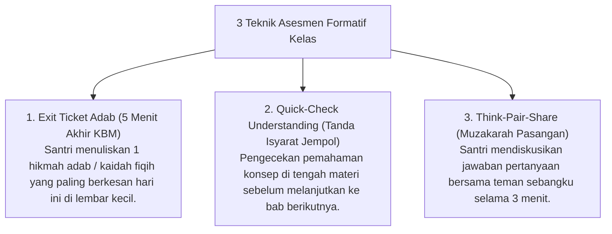

# P10-01-03: Metode Didaktik Interaktif dan Asesmen Formatif Kelas

## Status Dokumen
* **Status**: 🌟 **A+ (Tervalidasi & Siap Diimplementasikan)**
* **Sub-Domain**: `10 Methods / 01 Learning Methods`
* **Penanggung Jawab Keilmuan**: Dewan Keilmuan TUMBUH (*Pakar Master Teacher Pedagogi & Pakar Psikologi Belajar*)

---

## 1. Operasionalisasi Asesmen Formatif Kelas

Ustadz dan Guru Diniyyah menggunakan teknik **Asesmen Formatif Real-Time** untuk mengukur pemahaman santri tanpa tekanan ujian sumatif:

---

## 2. Penggunaan Umpan Balik Konstruktif

Ustadz memberikan umpan balik langsung (*Immediate Feedback*) dengan kalimat menguatkan (*Process Praise*).
