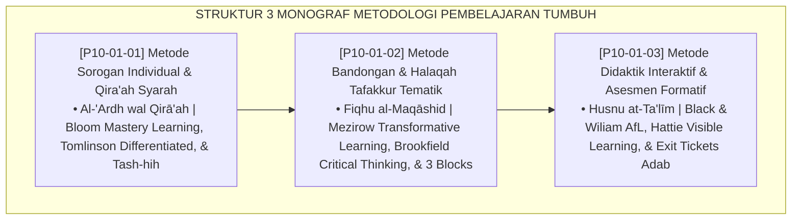

# P10-01: DOKUMEN INDUK METODOLOGI PEMBELAJARAN PESANTREN
## *Arsitektur dan Standarisasi Metode Sorogan Individual dan Qira'ah Syarah Teks Turats, Metode Bandongan Interaktif dan Halaqah Tafakkur Tematik Maqashid Syari'ah, Serta Metode Didaktik Interaktif dan Asesmen Formatif Kelas sebagai Tiga Pilar Metodologi Pengajaran (Individual Sorogan Form MET-SoroganTurats, Interactive Bandongan Form MET-BandonganTafakkur, Serta Formative Assessment Form MET-DidaktikFormatif) di Ekosistem TUMBUH Pesantren*

**Nomor Identifikasi**: `P10-01/DOKUMEN-INDUK-METODOLOGI-PEMBELAJARAN/2026`  
**Domain**: `10 Methods` > `01 Learning Methods` (Gugus Sub-Domain 01: *Instructional & Pedagogical Methods*)  
**Klasifikasi Naskah**: *Master Architecture & Navigation Monograph*  
**Rumpun Disiplin Pengkaji**: Epistemologi Didaktik Turats (Sorogan/Bandongan), Mastery Learning (Bloom), Transformative Learning (Mezirow), Assessment for Learning (Black & Wiliam)  

---

> ### 💡 INTISARI EKSEKUTIF
>
> * **Kedudukan Strategis Gugus Metodologi Pembelajaran:** Gugus ini adalah mesin didaktik keilmuan (*the instructional engine*) di ekosistem TUMBUH. Mentransformasi pengajaran turats tradisional yang pasif, monoton, dan berorientasi hafalan mekanis menjadi pembelajaran aktif yang memberdayakan nalar, memfasilitasi kecepatan belajar individual (*Differentiated Mastery Learning*), dan memadukan penguasaan teks klasik berharakat dengan pemikiran kritis kontekstual (*Contextualized Maqashidic Hermeneutics*), gugus ini menjamin lahirnya ulama dan ilmuwan muslim yang mendalam ilmunya dan tajam analisis solutifnya (*Deep Turats Mastery, Sharp Contemporary Intellect*).
> * **Triad Metodologi Pembelajaran TUMBUH:** (1) **Metode Sorogan Individual** berbasis *Mastery Learning* 1-on-1 dengan pengujian I'rab dan Syarah mandiri, (2) **Metode Bandongan Interaktif** 3 blok (20-20-20) berbasis Halaqah Tafakkur Maqashid Syari'ah, dan (3) **Didaktik Interaktif & Asesmen Formatif** real-time (Exit Tickets, Quick-Check, Think-Pair-Share) bebas stres.
> * **3 Monograf Riset Komprehensif:** Form MET-SoroganTurats, Form MET-BandonganTafakkur, dan Form MET-DidaktikFormatif.

---

## 📑 PETA NAVIGASI TIGA MONOGRAF

---

## 📚 DESKRIPSI RINGKAS 3 BERKAS MONOGRAF

1. **[P10-01-01: Metode Qiraah Syarah dan Sorogan Kitab Turats](file:///c:/xampp/htdocs/tumbuh/10%20Methods/01%20Learning%20Methods/P10-01-01-Metode-Qiraah-Syarah-dan-Sorogan-Kitab-Turats.md)**  
   *SOP 4 langkah sorogan 1-on-1 (7-10 mnt), rubrik penguasaan nahwu-sharaf-syarah, lembar kendali tash-hih halaman, dan Form MET-SoroganTurats.*
2. **[P10-01-02: Metode Bandongan dan Halaqah Tafakkur Tematik](file:///c:/xampp/htdocs/tumbuh/10%20Methods/01%20Learning%20Methods/P10-01-02-Metode-Bandongan-dan-Halaqah-Tafakkur-Tematik.md)**  
   *Struktur 3 blok 60 menit (makna gandul, syarah maqashid, dialektika socratic), lembar refleksi tafakkur tematik mingguan, dan Form MET-BandonganTafakkur.*
3. **[P10-01-03: Metode Didaktik Interaktif dan Asesmen Formatif Kelas](file:///c:/xampp/htdocs/tumbuh/10%20Methods/01%20Learning%20Methods/P10-01-03-Metode-Didaktik-Interaktif-dan-Asesmen-Formatif-Kelas.md)**  
   *Protokol kelas interaktif 45 menit, 3 instrumen asesmen formatif (Quick-Check, Think-Pair-Share, Exit Ticket Adab), umpan balik proses, dan Form MET-DidaktikFormatif.*

---

## 🎯 STANDAR PENJAMINAN MUTU PEMBELAJARAN

Penerapan gugus **Metodologi Pembelajaran** menjamin bahwa:
1. **Setiap Santri Mampu Membaca dan Memahami Kitab Gundul Secara Mandiri (*Textual Literacy Guarantee*)**: Sorogan individual memastikan kompetensi gramatika terverifikasi tuntas.
2. **Pengajian Turats Menghasilkan Pemikiran Transformatif Kontekstual (*Living Intellectual Tradition Guarantee*)**: Halaqah Tafakkur membedah maqashid syari'ah untuk menjawab isu zaman.
3. **Proses Belajar Mengajar Bebas dari Tekanan Ujian yang Menghakimi (*Formative Growth Guarantee*)**: Asesmen formatif mendeteksi kesulitan belajar seketika tanpa vonis bodoh.
