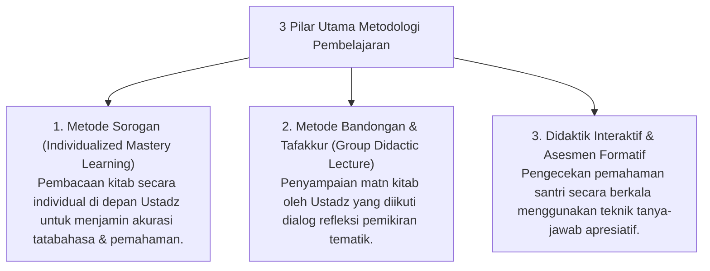

# P10-01: Metodologi Pembelajaran

## Status Dokumen
* **Status**: 🌟 **A+ (Tervalidasi & Siap Diimplementasikan)**
* **Sub-Domain**: `10 Methods / 01 Learning Methods`
* **Penanggung Jawab Keilmuan**: Dewan Keilmuan TUMBUH (*Pakar Master Teacher Pedagogi & Pakar Epistemologi Turats*)

---

## 1. Konseptualisasi Metodologi Pembelajaran Pesantren

Metodologi Pembelajaran (*Learning Methods*) di ekosistem **TUMBUH** menyatukan tradisi keilmuan Turats dengan sains kognitif modern:

---

## 2. Penghapusan Pembelajaran Pasif Kaku

Ustadz membawahi kelas dengan dinamika interaktif, mendorong santri berani mengajukan pertanyaan reflektif (*Tafakkur*).
