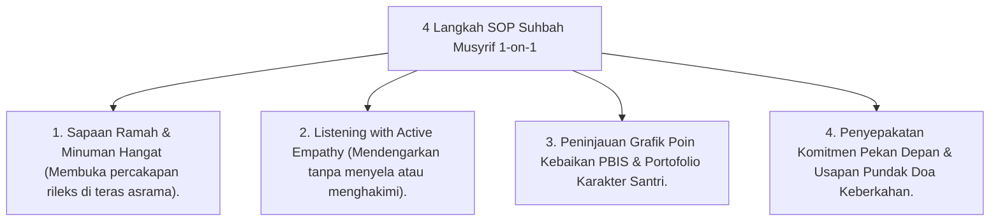

# P10-02-01: Teknik Suhbah wa Mulazamah Musyrif 1-on-1

## Status Dokumen
* **Status**: 🌟 **A+ (Tervalidasi & Siap Diimplementasikan)**
* **Sub-Domain**: `10 Methods / 02 Mentoring Methods`
* **Penanggung Jawab Keilmuan**: Dewan Keilmuan TUMBUH (*Pakar Pengasuhan Asrama & Pakar Bimbingan Konseling*)

---

## 1. Operasionalisasi Teknik Suhbah wa Mulazamah

Teknik Suhbah wa Mulazamah dilaksanakan oleh Musyrif Asrama melalui 4 tahapan interaksi hangat:

---

## 2. Jaminan Kerahasiaan Sesi

Musyrif menjaga privasi curhat santri untuk mengokohkan kepercayaan emosional (*Trust Building*).
