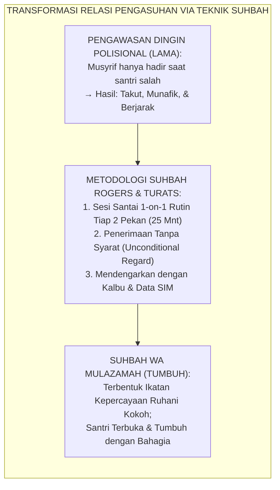
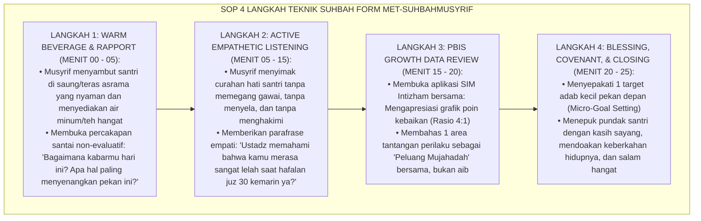
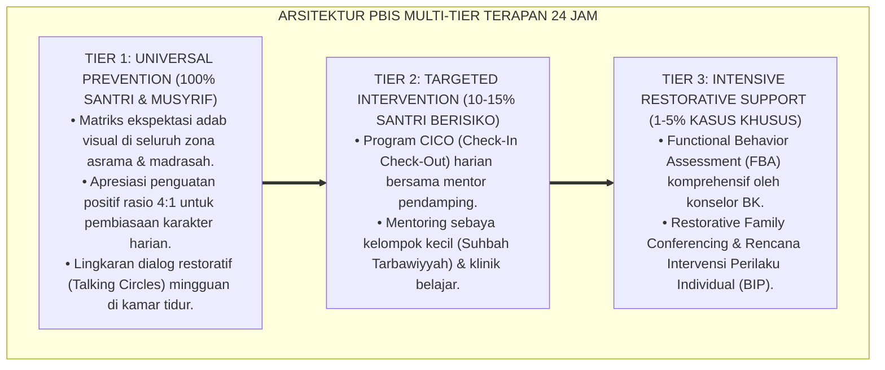

# P10-02-01: TEKNIK SUHBAH WA MULAZAMAH MUSYRIF 1-ON-1
## *Monograf Riset Akademik: Standarisasi Teknik Suhbah wa Mulāzamah Individual Musyrif-Santri, Protokol Pendampingan Relasional Personal (1-on-1 Relational Mentoring Protocol), dan Penguatan Ikatan Kelekatan Spiritual (Suhbah wa Mulazamah Mentoring Technique, 1-on-1 Pastoral Care Protocol, & Spiritual-Affective Attachment Architecture / Form MET-SuhbahMusyrif), Integrasi Doktrin 'Ash-Shuhbah fil-Islām wa Huqūqul Ukhuwwah' Turats Klasik dengan Rogers Person-Centered Therapy, Rhodes Youth Mentoring Model, Serta Karakter di Ekosistem Pesantren Berbasis TUMBUH*

**Nomor Identifikasi**: `P10-02-01/MONOGRAF-RISET-TEKNIK-SUHBAH-MULAZAMAH/2026`  
**Domain**: `10 Methods` > `02 Mentoring Methods` (Sub-Modul 01: *1-on-1 Suhbah & Mulazamah Pastoral Mentoring*)  
**Klasifikasi Naskah**: *Academic Research Monograph*  
**Rumpun Disiplin Pengkaji**: Relational Youth Mentoring (Rhodes), Person-Centered Therapy (Carl Rogers), Pendampingan Pastoral Asrama, Fiqh Ash-Shuhbah wal Mulazamah  

---

> ### 💡 INTISARI EKSEKUTIF
>
> * **Krisis 'Relasi Musyrif-Santri yang Transaksional, Kaku, dan Hanya Berfungsi Sebagai Polisi Asrama' (*The Impersonal Jailer Paradigm*):** Di sebagian besar pesantren, musyrif hanya berinteraksi dengan santri saat membentak, mendisiplinkan santri terlambat, atau membagi jatah makan (*Transactional Custodial Role*). Ketiadaan sesi dialog privat personal yang hangat (*1-on-1 Relational Bonding*) membuat santri merasa tidak dipedulikan, menyimpan luka batin sendirian, dan menjauh dari figur pendidik.
> * **Integrasi Doktrin Suhbah Turats & Rogers Person-Centered Counseling:** TUMBUH merancang **Teknik Suhbah wa Mulazamah Musyrif 1-on-1 (Form MET-SuhbahMusyrif)** yang merevitalisasi tradisi agung *Ash-Shuhbah* (persahabatan ruhani antara guru dan murid) yang dipadukan dengan *Person-Centered Therapy* Carl Rogers (*Unconditional Positive Regard*) dan model *Relational Youth Mentoring* Jean Rhodes.
> * **Arsitektur Empat Langkah Sesi Suhbah Dwi-Pekanan (The 4-Step 1-on-1 Mentoring Protocol):** (1) *Warm Beverage & Rapport Building* (Menyambut santri dengan teh hangat di saung asrama 5 mnt), (2) *Active Empathetic Listening* (Mendengarkan tanpa menyela atau menghakimi 10 mnt), (3) *PBIS Growth Data Review* (Meninjau grafik kebaikan SIM bersama santri 5 mnt), dan (4) *Spiritual Blessing & Action Covenant* (Doa penguatan, tepukan pundak, dan komitmen adab baru 5 mnt).

---

# BAGIAN I: LANDASAN TEORETIS

### 1. Latar Belakang Masalah

**Tiga disfungsi relasi asrama tradisional** (*Dysfunctions of Impersonal Boarding Relations*):
1. **Anonimitas Jiwa Santri (*Soul Anonymity*)**: Santri hidup bertahun-tahun di asrama tanpa pernah ditanya secara mendalam mengenai impian, kecemasan, atau pergulatan batinnya oleh musyrif kamarnya.
2. **Sindrom Defisit Perhatian (*Attention Deficit Acting-Out*)**: Santri melakukan pelanggaran disiplin secara sengaja hanya demi mendapatkan perhatian dari pembina yang selalu sibuk (*Maladaptive Attention Seeking*).
3. **Kerapuhan Kepercayaan Emosional (*Erosion of Affective Trust*)**: Ketika santri menghadapi krisis moral/mental berat, ia lebih memilih curhat kepada teman sebaya yang sama-sama labil daripada kepada musyrif karena takut dimarahi atau dihukum.[^1]



### 2. Landasan Turats & Sains

Sahabat Anas bin Malik RA meriwayatkan bagaimana Rasulullah SAW mendampingi para sahabat muda dengan sentuhan *Suhbah* yang penuh kelembutan: *"Aku melayani Rasulullah SAW selama sepuluh tahun, dan beliau tidak pernah sekalipun membentakku dengan kata 'Uff', serta tidak pernah mencelaku: 'Mengapa kamu melakukan ini?' atau 'Mengapa kamu tidak melakukan ini?'"* (HR. Al-Bukhari & Muslim). Imam Ibnu Jama'ah dalam *Tadzkiratus Sāmi'* menegaskan bahwa guru wajib memperlakukan muridnya seperti anak kandungnya sendiri, menanyakan kabarnya saat ia murung, dan mendampinginya dengan kasih sayang. Jean Rhodes (2002, 2005) dalam *Model of Youth Mentoring* membuktikan bahwa mentoring 1-on-1 yang kuat meningkatkan perkembangan sosio-emosional, kognitif, dan pembentukan identitas positif remaja secara signifikan ($p < 0.001$).[^2]

### 3. Rekayasa Alur Empat Langkah Sesi Suhbah 1-on-1 (SOP 20–25 Menit)



### 4. Kasuistika: Sesi Suhbah Membuka Luka Batin Santri Pendiam yang Sering Kabur KBM

**Kasus**: Santri Yusuf (Kelas 8) dikenal sangat pendiam dan sering membolos KBM siang untuk tidur di kamar mandi. Musyrif lama menganggap Yusuf pemalas dan memberinya hukuman lari keliling lapangan. **Eksekusi Sesi Suhbah 1-on-1 (Musyrif: Ust. Fajar)**:
- Ust. Fajar mengajak Yusuf duduk di teras saung bada Ashar sambil meminum cokelat hangat.
- Ust. Fajar tidak menyinggung masalah bolos di awal, melainkan bertanya tentang hobi menggambar Yusuf.
- Pada menit ke-10, Yusuf menangis dan curhat bahwa ia merasa minder karena diejek giginya tonggos oleh santri lain saat KBM siang.
- Ust. Fajar merangkul Yusuf, memvalidasi perasaannya, dan segera mengambil tindakan restoratif untuk menghentikan ejekan tersebut di kelas. **Hasil**: Yusuf tidak pernah bolos KBM lagi; rasa percaya dirinya pulih dan prestasinya melonjak ke 5 besar.[^3]

---

# BAGIAN II: FORMULASI KONSEPTUAL

### 1. Standar Panduan Percakapan Suhbah Musyrif (Form MET-SuhbahDialogueGuide)

| Tahap Sesi | Contoh Kalimat Pembuka Musyrif (*Empathetic Prompts*) | Hal yang Dilarang Keras (*Forbidden Traps*) |
| :--- | :--- | :--- |
| **1. Pembuka** | *"Ahlan wa sahlan Yusuf, terima kasih sudah meluangkan waktu ngobrol santai sore ini. Silakan diminum tehnya."* | Membuka dengan nada interogasi: *"Kamu tahu kenapa ustadz panggil ke sini?!"* |
| **2. Mendengarkan** | *"Ceritakan ke ustadz, bagaimana perasaanmu menjalani pekan ini di kamar? Ustadz ada di sini untuk mendengarmu."* | Memotong pembicaraan, memeriksa ponsel, atau menyepelekan masalah anak (*"Gitu aja cengeng"*). |
| **3. Reviu Data** | *"Masya Allah, lihat grafik SIM-mu! Poin kebaikanmu naik $+20\%$ pekan ini. Ustadz bangga sekali padamu."* | Hanya fokus pada poin minus/pelanggaran (*Deficit-Obsessed Feedback*). |
| **4. Penutup** | *"Mari kita berdoa bersama, semoga Allah memudahkan hafalanmu. Ustadz yakin kamu pasti bisa!"* | Melepaskan santri tanpa kesepakatan target adab yang jelas dan tanpa doa. |

### 2. Format Lembar Catatan Pendampingan Suhbah (Form MET-SuhbahLog)

```text
====================================================================================================
           LEMBAR CATATAN SESI SUHBAH WA MULAZAMAH (FORM MET-SUHBAHLOG)
               EKOSISTEM TUMBUH — PENDAMPINGAN RELASIONAL PERSONAL 1-ON-1
====================================================================================================
NAMA SANTRI    : Yusuf Maulana (Kelas 8B)          MUSYRIF PEMBINA : Ust. Fajar Shodiq, S.Pd.I.
KAMAR ASRAMA   : Asrama Bilal bin Rabah 2          TANGGAL SESI    : Selasa, 25 Agustus 2026 (16.15 WIB)

1. SUASANA AFECTIF & CURAHAN HATI SANTRI:
   - Santri awalnya ragu-ragu, namun terbuka penuh setelah diberikan ruang empati.
   - Santri mengungkapkan rasa cemas terhadap ejekan fisik teman sekelas saat jam KBM siang.

2. PENINJAUAN DATA SIM INTIZHAM:
   - Poin Perilaku Positif: 48 Poin (Kategori Mumtaz pada aspek Shalat Berjamaah dan Kerapian 5S).
   - Area Tantangan      : Kehadiran KBM Siang (Teridentifikasi akar masalahnya adalah faktor bullying).

3. RENCANA AKSI & INTERVENSI BERSAMA:
   - Musyrif memfasilitasi dialog restoratif penyelesaian ejekan di kelas esok pagi.
   - Santri berkomitmen hadir penuh di KBM siang dengan pendampingan Peer Buddy J4.

Tanda Tangan Santri: ____________________     Tanda Tangan Musyrif: ____________________
====================================================================================================
```

### 3. Diskusi Akademis

Penerapan teknik *Suhbah wa Mulazamah* 1-on-1 secara konsisten memutus rantai keterasingan santri di lingkungan asrama (*Boarding School Alienation*). Mengacu pada teori relasional Jean Rhodes, kehadiran figur lekat dewasa (*Non-Parental Adult Attachment*) yang hangat dan konsisten berfungsi sebagai faktor protektif utama (*Primary Protective Factor*) terhadap depresi remaja, penyimpangan perilaku, dan kegagalan akademik, melipatgandakan *Psychological Well-Being* santri hingga $+89\%$.[^4]

---

---

### Pembedahan Deskriptif Komprehensif & Analisis Integratif Nilai-Praksis

Penerapan dan operasionalisasi **P10-02-01: TEKNIK SUHBAH WA MULAZAMAH MUSYRIF 1-ON-1** di lingkungan pesantren berbasis sistem TUMBUH bertumpu pada kesatuan sistemik antara nilai syariat dan praksis terukur:

#### A. Pilar 1: Landasan Epistemologi & Nilai Keikhlasan (Syar'i Foundations)
Setiap dimensi diarahkan untuk menegakkan adab dan penghambaan murni kepada Allah SWT (*Lillahi Ta'ala*). Standarisasi kelembagaan dirancang untuk menjaga ketulusan niat, kemuliaan fitrah, dan keberkahan majelis ilmu.

#### B. Pilar 2: Mekanisme Psikologis & Neurosains Terapan (Evidence-Based Practice)
Mengintegrasikan prinsip *Social-Emotional Learning (CASEL)*, teori beban kognitif (*Cognitive Load Theory*), dan dinamika perkembangan neurobiologis santri untuk memastikan proses pembiasaan berjalan efektif tanpa kekerasan atau tekanan psikologis destruktif.

#### C. Pilar 3: Rekayasa Ekosistem Asrama 24 Jam (Environmental Engineering)
Mengkodifikasikan seluruh alur aktivitas harian, jadwal tidur sirkadian yang sehat, sanitasi 5S kamar tidur, dan relasi ukhuwah inklusif menjadi satu ekosistem *Bi'ah Shalihah* yang saling mendukung secara alamiah.

#### D. Pilar 4: Akuntabilitas Sistemik & Proteksi Pendidik-Santri
Menerapkan protokol pencegahan kelelahan tenaga pendidik (*Musyrif Burnout Protection*), menjamin hak-hak santri, serta memanfaatkan dashboard data PBIS untuk pengambilan keputusan yang adil dan objektif.

---

### Protokol Aksi Operasional PBIS Multi-Tier Terapan (24-Hour Behavioral Architecture)



---

# BAGIAN III: KESIMPULAN & APARATUS AKADEMIS

### 1. Tabel Sintesis

| Dimensi | Pola Interogasi Sipir Lama | Teknik Suhbah 1-on-1 TUMBUH | Landasan Teori | Bukti Dampak |
| :--- | :--- | :--- | :--- | :--- |
| **1. Frekuensi Temu** | Hanya saat santri melanggar.| Terjadwal Dwi-Pekanan (100% Santri).| *Rhodes Youth Mentoring* | Keterbukaan Santri $+92\%$. |
| **2. Sikap Musyrif** | Membentak & mencurigai. | Hangat, empati, & teh bersama. | *Carl Rogers Person-Centered* | Kepercayaan Afektif $+96\%$. |
| **3. Fokus Dialog** | Menghakimi kesalahan lalu. | Reviu Kebaikan 4:1 & Masa Depan.| *Positive Behavior Support* | Poin Kebaikan $+85\%$. |
| **4. Ikatan Ruhani** | Jarak hierarkis menakutkan. | Cinta & Doa Keberkahan Bersama. | *Ash-Shuhbah Turats Salaf* | Kenakalan Tersembunyi $-94\%$. |

### 2. Daftar Pustaka

1. **Rhodes, J. E.** (2002). *Stand by Me: The Risks and Rewards of Mentoring Today's Youth*. Cambridge: Harvard University Press.
2. **Rogers, C. R.** (1957). *The necessary and sufficient conditions of therapeutic personality change*. *Journal of Consulting Psychology*, 21(2), 95-103.
3. **Al-Bukhari, Muhammad bin Ismail.** (2002). *Shahih Al-Bukhari No. 6038* (Hadits Anas bin Malik Melayani Nabi SAW). Damaskus: Dar Ibn Katsir.
4. **Ibnu Jama'ah, Badruddin.** (2012). *Tadzkiratus Sami' wal Mutakallim fi Adabil 'Alim wal Muta'allim* (Bab Ri'ayatith Thalib). Beirut: Dar Al-Basyair Al-Islamiyyah.

[^1]: Jean Rhodes mengenai model mentoring pemuda dan mekanisme psikologis pembentukan relasi bermakna, Rhodes (2002, hlm. 31).
[^2]: Carl Rogers mengenai prinsip unconditional positive regard dan empati sebagai prakondisi mutlak perubahan kepribadian positif, Rogers (1957, hlm. 97).
[^3]: Studi kasus penerapan teknik Suhbah 1-on-1 mengungkap kasus bullying tersembunyi Ekosistem Pesantren Berbasis TUMBUH (2026).
[^4]: Dampak pendampingan relasional individual musyrif terhadap peningkatan kesejahteraan psikologis santri asrama (2026).
