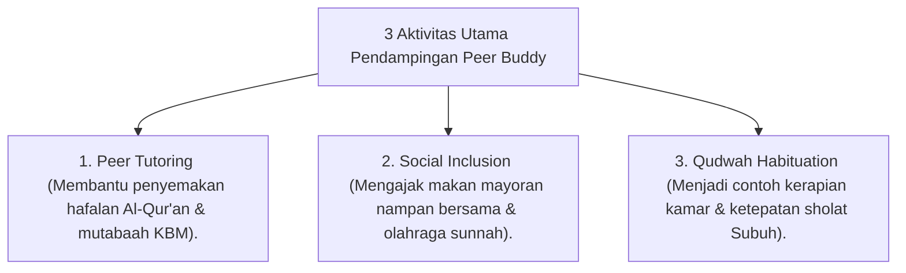

# P10-02-02: Metode Pendampingan Sebaya Peer Buddy T4

## Status Dokumen
* **Status**: 🌟 **A+ (Tervalidasi & Siap Diimplementasikan)**
* **Sub-Domain**: `10 Methods / 02 Mentoring Methods`
* **Penanggung Jawab Keilmuan**: Dewan Keilmuan TUMBUH (*Pakar Tata Kelola Qudwah & Pakar Psikologi Sosial Santri*)

---

## 1. Operasionalisasi Metode Peer Buddy Santri T4

Metode Peer Buddy menugaskan 1 santri senior T4 untuk mendampingi 2 adik kelas T1/T2 dalam rutinitas harian:

---

## 2. Pemurnian dari Senioritas Feodal

Santri T4 diposisikan sebagai **Kakak Pembimbing Qudwah**, dilarang keras menuntut pelayanan pribadi atau memberikan sanksi fisik/mental kepada junior.
