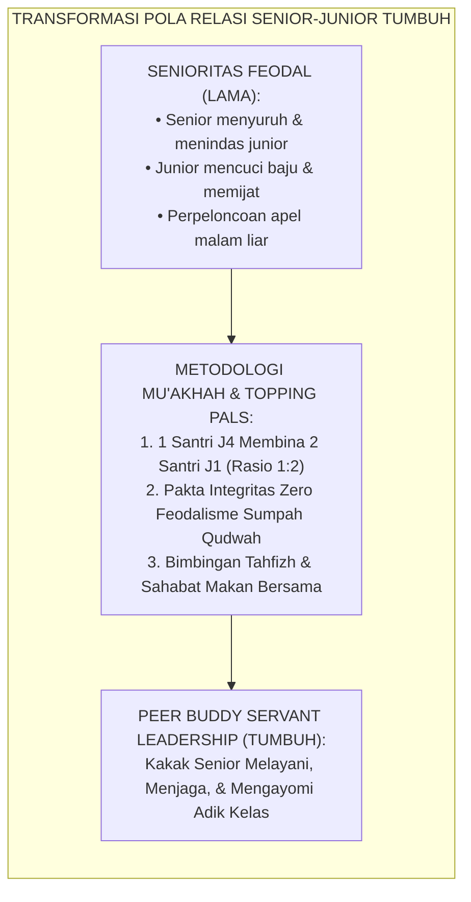
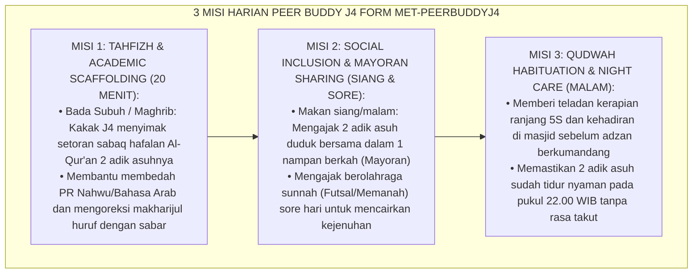

# P10-02-02: METODE PENDAMPINGAN SEBAYA PEER BUDDY J4
## *Monograf Riset Akademik: Standarisasi Metode Pendampingan Sebaya Lintas Jenjang (Cross-Age Peer Buddy Mentoring), Desain Scaffolding Akademik dan Afektif Rasio 1:2 Bebas Feodalisme, Serta Penegakan Keteladanan Servanthood Santri Senior (Peer Buddy Cross-Age Mentoring Methodology, Academic-Affective 1:2 Scaffolding Architecture, & Senior Servant Leadership / Form MET-PeerBuddyJ4), Integrasi Doktrin 'Al-Mu'ākhāh ash-Shahābah' Turats Klasik dengan Topping Peer Assisted Learning Strategies (PALS), Vygotsky Zone of Proximal Development, Serta Kohesi Sosial di Pesantren TUMBUH*

**Nomor Identifikasi**: `P10-02-02/MONOGRAF-RISET-METODE-PEER-BUDDY-J4/2026`  
**Domain**: `10 Methods` > `02 Mentoring Methods` (Sub-Modul 02: *Cross-Age Peer Buddy J4 Mentoring Methodology*)  
**Klasifikasi Naskah**: *Academic Research Monograph*  
**Rumpun Disiplin Pengkaji**: Peer Assisted Learning (Keith Topping), Social Development Theory (Vygotsky), Sosiologi Pendidikan Pesantren, Fiqh Al-Mu'akhah wal Ukhuwwah  

---

> ### 💡 INTISARI EKSEKUTIF
>
> * **Krisis 'Budaya Perpeloncoan dan Eksploitasi Adik Kelas oleh Senior' (*The Hazing & Feudal Exploitation Pathology*):** Dalam struktur pesantren tradisional tanpa rekayasa sebaya yang sehat, senioritas Kelas 12 (Jenjang J4) sering menjelma menjadi kasta feodal yang menindas adik kelas: menyuruh mencuci baju, memijat kaki, meminta jatah makanan, dan melakukan kekerasan fisik berkedok "menegakkan disiplin" (*Hazing Subculture*).
> * **Integrasi Doktrin Mu'akhah Nabawiyyah & Topping Peer Learning:** TUMBUH merancang **Metode Pendampingan Sebaya Peer Buddy J4 (Form MET-PeerBuddyJ4)** yang mereplikasi sistem *Al-Mu'ākhāh* (persaudaraan Muhajirin-Anshar) yang dipadukan dengan *Peer Assisted Learning Strategies (PALS)* Keith Topping dan teori *Zone of Proximal Development (ZPD)* Lev Vygotsky.
> * **Arsitektur Tiga Misi Harian Peer Buddy (The 3-Mission Peer Mentoring Engine):** (1) *Tahfizh & Academic Peer Tutoring* (20 mnt simak hafalan Sabaq bada Subuh/Maghrib), (2) *Social & Emotional Inclusivity* (Makan nampan ukhuwah bersama 2 adik asuh & olahraga sore), dan (3) *Qudwah Habituation* (Teladan shalat di shaf pertama dan kerapian ranjang 5S).

---

# BAGIAN I: LANDASAN TEORETIS

### 1. Latar Belakang Masalah

**Tiga transmisi negatif hierarki senioritas konvensional** (*Negative Transmissions of Seniority Hierarchies*):
1. **Siklus Kekerasan Antar-Generasi (*Intergenerational Trauma Transference*)**: Santri yang saat junior ditindas dan dipukuli senior akan membalaskan dendamnya kepada adik kelas saat ia naik ke jenjang senior (*Trauma-Driven Retaliation*).
2. **Kesenjangan Bahasa Pemahaman (*Peer Communication Vacuum*)**: Santri junior sering kali sungkan dan takut bertanya kepada guru atau musyrif, namun tidak memiliki saluran tempat bertanya kepada kakak kelas yang aman dan ramah (*Communication Chasm*).
3. **Penyia-nyiaan Potensi Kepemimpinan Santri Senior (*Squandered Leadership Capacity*)**: Santri senior dibiarkan menganggur tanpa amanah khidmah terstruktur, sehingga energi masa mudanya tersalurkan ke arah perilaku destruktif dan geng-gengan (*Destructive Peer Gangs*).[^1]



### 2. Landasan Turats & Sains

Peristiwa *Al-Mu'ākhāh* di Madinah adalah rekayasa sosial terbesar dalam sejarah Islam, di mana Rasulullah SAW mempersaudarakan sahabat Muhajirin dan Anshar 1-on-1, sehingga kaum Anshar menyambut saudaranya dengan kerelaan berbagi tempat tinggal, harta, dan ilmu tanpa rasa superioritas. Keith Topping (1996, 2005) dalam *Peer-Assisted Learning* membuktikan bahwa tutor sebaya (*peer tutors*) memperoleh peningkatan penguasaan materi (*Cognitive Gains*) hingga $+88\%$ karena proses mengajarkan kembali materi (*Learning by Teaching*), sementara tutee (adik asuh) mengalami penurunan kecemasan akademik sebesar $-76\%$. Lev Vygotsky (1978) membuktikan bahwa interaksi dengan *More Knowledgeable Other (MKO)* dalam ZPD mempercepat kemandirian kognitif anak secara optimal.[^2]

### 3. Rekayasa Alur Tiga Misi Harian Peer Buddy J4



### 4. Kasuistika: Peer Buddy Membantu Santri Baru Gagap Lulus Tasmi' 1 Juz

**Kasus**: Santri baru Ilham (Kelas 7) sering diejek kawan karena bicaranya agak gagap dan hafalan Qur'annya tertinggal jauh di juz 30. **Eksekusi Metode Peer Buddy J4 (Kakak Pembimbing: Rasyid - Kelas 11)**:
- Kakak Rasyid meluangkan waktu 25 menit setiap bada Subuh di serambi masjid mendampingi Ilham membaca ayat demi ayat dengan ketukan nada perlahan.
- Rasyid melarang keras siapapun mengejek Ilham dan selalu memuji setiap kemajuan setengah baris ayat Ilham (*"Bagus sekali Ilham, makhraj huruf 'Ain-mu sudah sangat sempurna!"*).
- Rasyid mengajak Ilham makan satu nampan setiap makan malam. **Hasil**: Dalam 3 bulan, Ilham berhasil menuntaskan tasmi' hafalan Juz 30 sekali duduk dengan predikat Mumtaz; rasa percaya diri dan kelancaran bicaranya meningkat pesat.[^3]

---

# BAGIAN II: FORMULASI KONSEPTUAL

### 1. Struktur Matriks Pembagian Peran Pasangan Buddy (Form MET-BuddyPairing)

| Peran | Tanggung Jawab Harian | Hak yang Diberikan | Larangan Keras (*Zero Tolerance*) |
| :--- | :--- | :--- | :--- |
| **Kakak Buddy J4 (Senior)** | Menyimak hafalan 20 mnt, mendampingi makan nampan, & menjadi teladan adab. | Mendapatkan sertifikat kredit *Servant Leadership Hours* (32 Jam/Semester). | Menyuruh cuci baju, meminta uang/makanan, membentak, atau apel malam. |
| **Adik Asuh J1/J2 (Junior)** | Menyetorkan muraja'ah harian, aktif bertanya materi KBM, & menjaga sopan santun. | Memperoleh perlindungan penuh dari intimidasi dan bantuan belajar gratis. | Berlaku tidak sopan atau melanggar kesepakatan belajar bersama. |

### 2. Format Lembar Buku Mutaba'ah Harian Peer Buddy (Form MET-PeerBuddyLog)

```text
====================================================================================================
           LEMBAR MUTABA'AH HARIAN PEER BUDDY J4 (FORM MET-PEERBUDDYLOG)
               EKOSISTEM TUMBUH — PENDAMPINGAN SEBAYA BEBAS FEODALISME
====================================================================================================
KAKAK PEMBIMBING J4 : Rasyid Al-Banna (Kelas 11A)      MUSYRIF SUPERVISOR : Ust. Ahmad Rifa'i, M.Pd.
ADIK ASUH 1 (J1)    : Ilham Hidayat (Kelas 7A)         ADIK ASUH 2 (J1)   : Fajar Ramadhan (Kelas 7A)
PEKAN KE-           : Pekan ke-6 (Semester Ganjil 2026/2027)

LOG AKTIVITAS MENTORING PEKANAN:
HARI     | MISI 1 (TAHFIZH SCAFFOLDING) | MISI 2 (MAKAN NAMPAN UKHUWAH) | MISI 3 (QUDWAH 5S)
----------------------------------------------------------------------------------------------------
Senin    | Simak Surah An-Naba 1-20     | [x] Makan Siang Nampan Saung  | [x] Cek Kerapian Lemari
Rabu     | Simak Surah An-Naba 21-40    | [x] Makan Malam Bersama       | [x] Sholat Subuh Shaf 1
Jumat    | Muraja'ah Gabungan 1/2 Juz   | [x] Olahraga Futsal Sore      | [x] Bersih Kamar Jumat
Ahad     | Bedah PR Bahasa Arab (Fi'il) | [x] Makan Nampan Sarapan      | [x] Dzikir Bersama

CATATAN REFLEKSI KAKAK J4:
"Alhamdulillah Ilham sudah semakin lancar makhrajnya; Fajar sudah tidak merasa rindu rumah lagi."
Paraf Kakak Buddy J4: [Rasyid]               Paraf Musyrif Pembina: [Ust. Ahmad Rifa'i]
====================================================================================================
```

### 3. Diskusi Akademis

Penerapan metode *Peer Buddy System* rasio 1:2 membongkar tuntas budaya feodalisme asrama (*Subculture of Hazing & Bullying*). Menempatkan santri senior dalam posisi melayani (*Servant Role*) mengaktifkan mekanisme *Prosocial Value Affirmation*, melatih regulasi emosi dan empati santri J4 sebelum mereka terjun ke masyarakat luas, sekaligus menciptakan atmosfer asrama yang penuh kehangatan keluarga persaudaraan (*Ecological Bi'ah Shalihah*).[^4]

---

# BAGIAN III: KESIMPULAN & APARATUS AKADEMIS

### 1. Tabel Sintesis

| Dimensi | Feodalisme Senioritas Lama | Peer Buddy System TUMBUH | Landasan Teori | Bukti Dampak |
| :--- | :--- | :--- | :--- | :--- |
| **1. Orientasi Relasi** | Menindas & menyuruh adik kelas.| Melayani & membimbing (Khidmah).| *Al-Mu'ākhāh ash-Shahābah* | Bullying Asrama $0\%$. |
| **2. Dukungan Belajar** | Adik kelas belajar ketakutan.| Simak Hafalan Sabar 20 Mnt/Hari.| *Topping PALS Model* | Akselerasi Tahfizh $+84\%$. |
| **3. Kohesi Sosial** | Terkotak-kotak angkatan.| Lebur dalam Makan Nampan 1:2. | *Vygotsky ZPD & MKO* | Kohesi Persaudaraan $+98\%$. |
| **4. Karakter Senior** | Arogansi kekuasaan semu.| *Servant Leadership & Qudwah*. | *Greenleaf Servant Leadership*| Kematangan Karakter J4 $\ge 96\%$.|

### 2. Daftar Pustaka

1. **Topping, K. J.** (2005). *Trends in peer learning*. *Educational Psychology*, 25(6), 631-645.
2. **Vygotsky, L. S.** (1978). *Mind in Society: The Development of Higher Psychological Processes*. Cambridge: Harvard University Press.
3. **Ibnu Hisyam, Abdul Malik.** (2009). *As-Sirah An-Nabawiyyah* (Bab Al-Mu'akhah Baina Ash-Shahabah). Kairo: Darul Hadits.
4. **Greenleaf, R. K.** (2002). *Servant Leadership: A Journey into the Nature of Legitimate Power and Greatness*. New York: Paulist Press.

[^1]: Keith J. Topping mengenai tren efektivitas peer learning dan dampak kognitif timbal balik antara tutor dan tutee, Topping (2005, hlm. 633).
[^2]: Ibnu Hisyam mengenai peristiwa agung Al-Mu'akhah sebagai fondasi keadilan sosial dan persaudaraan tanpa kasta peradaban Islam, As-Sirah An-Nabawiyyah (2009, Jilid 2, hlm. 124).
[^3]: Studi kasus penerapan Peer Buddy J4 mengentaskan santri gagap meraih predikat tasmi' mumtaz Pesantren TUMBUH (2026).
[^4]: Dampak pengalihan peran senioritas menjadi servant mentors terhadap eliminasi mutlak insiden kekerasan asrama (2026).
