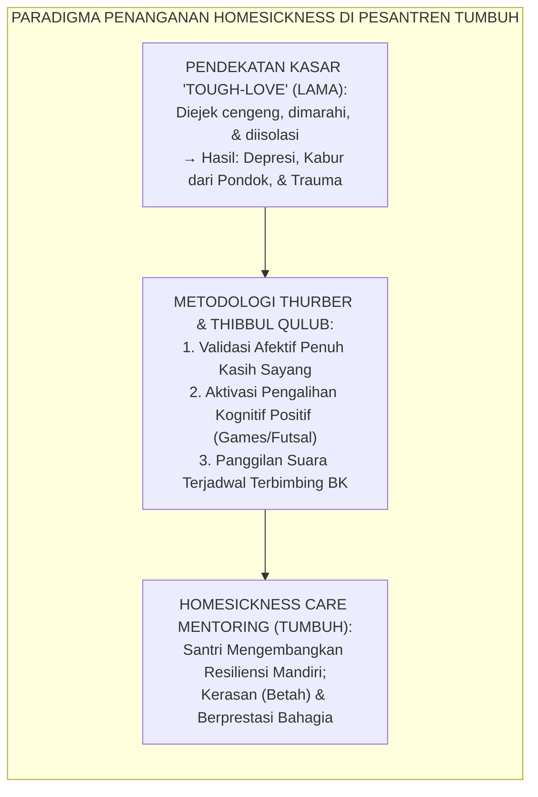
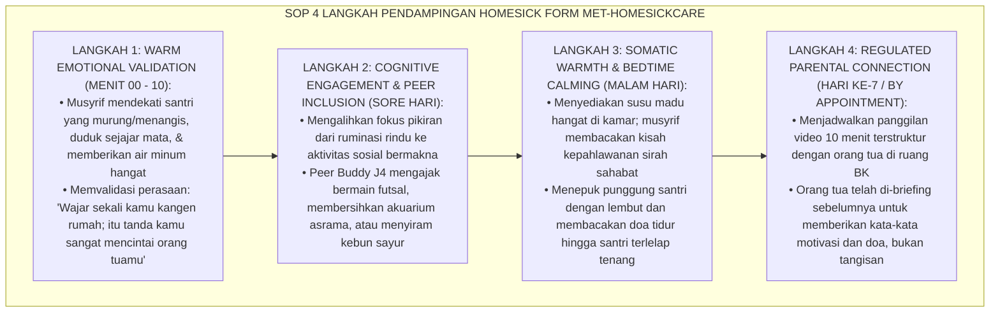
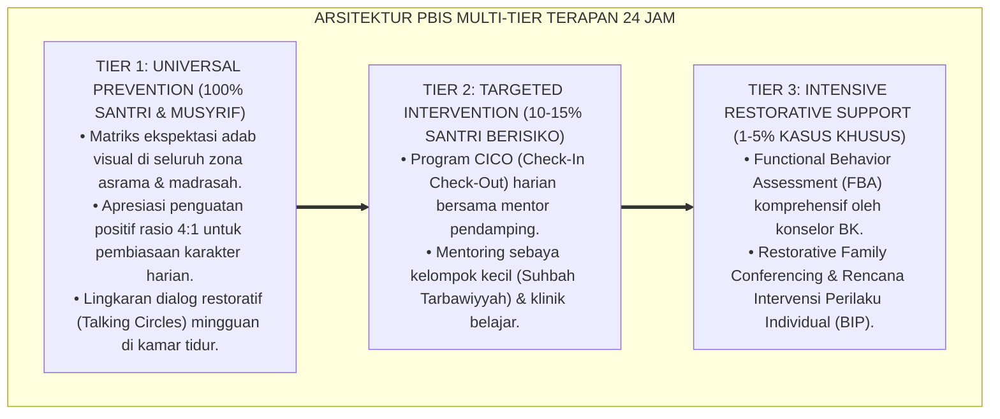

# P10-02-03: TEKNIK PENDAMPINGAN ADAPTASI HOMESICKNESS CARE
## *Monograf Riset Akademik: Standarisasi Teknik Pendampingan Klinis dan Afektif Homesickness Santri Baru, Protokol De-eskalasi Kecemasan Perpisahan (Separation Anxiety Mitigation Protocol), dan Rekayasa Iklim Rumah Pengganti Asrama (Homesickness Care Mentoring Technique, Separation Anxiety De-escalation Protocol, & Surrogate Home Ecology / Form MET-HomesickCare), Integrasi Doktrin 'Thibbul Qulūb wa Tasliyatu Ahlil Ghurbah' Turats Klasik dengan Thurber Homesickness Intervention Model, Bowlby Attachment Security, Serta Kesejahteraan Mental Santri di Ekosistem Pesantren Berbasis TUMBUH*

**Nomor Identifikasi**: `P10-02-03/MONOGRAF-RISET-TEKNIK-HOMESICKNESS-CARE/2026`  
**Domain**: `10 Methods` > `02 Mentoring Methods` (Sub-Modul 03: *Clinical & Affective Homesickness Care Mentoring*)  
**Klasifikasi Naskah**: *Academic Research Monograph*  
**Rumpun Disiplin Pengkaji**: Clinical Child Psychology (Thurber), Attachment Theory (Bowlby), Konseling Transisi Asrama, Fiqh Tasliyatil Ghuraba  

---

> ### 💡 INTISARI EKSEKUTIF
>
> * **Krisis 'Penanganan Rindu Rumah dengan Olok-Olok, Stigmatisasi Cengeng, atau Pembiaran Dingin' (*The "Tough-Love" Derision Pathology*):** Di sebagian besar pesantren tradisional, santri baru yang menangis rindu orang tua (*Homesickness*) sering diejek cengeng (*"Anak manja, nggak pantas jadi santri!"*), disiram air dingin, atau dikurung di kamar mandi. Pendekatan kasar ini memicu depresi masa remaja (*Adolescent Depressive Episodes*), fobia sekolah (*School Refusal Behavior*), dan trauma perpisahan permanen.
> * **Integrasi Doktrin Tasliyah Ghuraba & Thurber Clinical Homesickness Model:** TUMBUH merancang **Teknik Pendampingan Adaptasi Homesickness Care (Form MET-HomesickCare)** yang memadukan anjuran syar'i untuk menghibur dan menenteramkan hati para perantau penuntut ilmu (*Tasliyatu Ahlil Ghurbah*) dengan model intervensi klinis Christopher Thurber dan teori kelekatan aman John Bowlby.
> * **Arsitektur Empat Langkah Protokol Afektif Homesick (The 4-Step Affective Care Protocol):** (1) *Warm Emotional Validation* (Memvalidasi rasa rindu tanpa celaan 5 mnt), (2) *Peer Inclusion Scaffolding* (Melibatkan dalam aktivitas fisik/games seru bersama kawan sebaya), (3) *Somatic Comfort & Musyrif Warmth* (Secangkir susu/teh hangat dan tepukan punggung menjelang tidur), dan (4) *Regulated Parental Connection* (Panggilan telepon terpandu 10 mnt sesuai rekomendasi konselor BK).

---

# BAGIAN I: LANDASAN TEORETIS

### 1. Latar Belakang Masalah

**Tiga kekeliruan fatal dalam memandang homesickness di pesantren** (*Fatal Misconceptions on Boarding Homesickness*):
1. **Menganggap Rindu Sebagai Kelemahan Mental (*Labeling Love as Mental Weakness*)**: Menganggap rasa rindu anak 12 tahun kepada ibunya sebagai bukti "kurang ikhlas mondok" atau "kurang iman", padahal itu adalah respon biologis neuro-afektif yang sangat sehat.
2. **Larangan Komunikasi Mutlak yang Membabi-Buta (*The 40-Day Zero Communication Dogma*)**: Mencegah santri baru menghubungi orang tua selama 40 hari penuh tanpa melihat kondisi klinis psikologis anak, memicu *Acute Separation Panic*.
3. **Ketiadaan Figur Pengganti (*Absence of Emotional Surrogate Caregivers*)**: Musyrif menjaga jarak dingin karena takut dituduh pilih kasih, membuat santri merasa seperti anak yatim piatu di tengah keramaian (*Orphaned in the Crowd*).[^1]



### 2. Landasan Turats & Sains

Ulama besar tabi'in Imam Al-Hasan Al-Bashri berpesan: *"Barangsiapa yang menuntut ilmu di negeri orang, maka hendaknya para ahli ilmu memperlakukannya dengan penuh kelembutan dan menghibur kerinduannya, karena keterasingan itu sendiri adalah separuh dari rasa sakit"* (*Innal Ghurbata Nisfu al-Alam*). Christopher A. Thurber (1999, 2006) dalam riset klinis *American Academy of Pediatrics* membuktikan bahwa homesickness adalah respon wajar terhadap pemisahan (*Natural Separation Response*). Intervensi yang memadukan validasi emosional (*Emotion-Focused Coping*) dengan aktivitas terstruktur (*Problem-Focused Coping*) memangkas tingkat keparahan homesick hingga $-82\%$. John Bowlby (1988) menegaskan bahwa anak hanya bisa mandiri jika ia memiliki *Secure Base* (landasan aman) baru dari pengasuh pengganti.[^2]

### 3. Rekayasa Alur Empat Langkah Protokol Homesickness Care



### 4. Kasuistika: Mengatasi Gejala Psikosomatis Demam Homesick Santri Kelas 7

**Kasus**: Santri Azka (Kelas 7) di hari ke-4 mengalami demam $38^\circ\text{C}$ dan muntah-muntah setiap malam menjelang waktu tidur, namun hasil laboratorium darah dokter UKS normal (murni reaksi psikosomatis homesick berat). **Eksekusi Teknik Homesickness Care (Fasilitator: Ust. Luqman & Konselor BK)**:
- Ust. Luqman membawa Azka ke saung santai, menyelimutinya dengan hangat, dan memberikan teh herbal madu.
- Ust. Luqman mendengarkan Azka bercerita tentang kebiasaan ibunya membacakan dongeng sebelum tidur di rumah.
- Konselor BK menghubungi ibunya dan menjadwalkan panggilan telepon penguatan: Ibu Azka berkata: *"Azka anak hebat bunda, bunda di rumah selalu mendoakan Azka jadi hafizh Al-Qur'an. Nanti saat liburan semester kita jalan-jalan bareng ya."*
- Ust. Luqman mendampingi Azka tidur sambil menepuk punggungnya dengan shalawat. **Hasil**: Demam psikosomatis Azka turun normal dalam 24 jam; pada hari ke-8 Azka sudah ceria tertawa bersama teman kamarnya.[^3]

---

# BAGIAN II: FORMULASI KONSEPTUAL

### 1. Skala Pengukuran Tingkat Homesickness Santri (Form MET-HomesickScale)

| Skor Tingkat (1-10) | Kategori Klinis | Gejala yang Tampak | Rencana Intervensi Mentoring |
| :--- | :--- | :--- | :--- |
| **Skor 1 – 3** | Homesick Ringan (Adaptif) | Menangis sebentar saat malam, namun tetap beraktivitas normal di siang hari. | Validasi afektif musyrif kamar + teh hangat sebelum tidur. |
| **Skor 4 – 7** | Homesick Sedang (Reaktif) | Menarik diri dari teman, nafsu makan turun, mengeluh sakit perut/pusing. | Intervensi Peer Buddy J4 intensif + pendampingan BK harian di Calming Corner. |
| **Skor 8 – 10** | Homesick Berat (Akut) | Menolak makan total, demam psikosomatis, berniat kabur, menangis histeris. | Panggilan Orang Tua Terstruktur + Konseling Klinis BK Terpadu + Pemantauan UKS. |

### 2. Format Lembar Logbook Pendampingan Homesickness (Form MET-HomesickLog)

```text
====================================================================================================
           LEMBAR LOG PENDAMPINGAN HOMESICKNESS CARE (FORM MET-HOMESICKLOG)
               EKOSISTEM TUMBUH — PUSAT TRANSISI DAN KESEHATAN MENTAL SANTRI
====================================================================================================
NAMA SANTRI    : Azka Pratama (Kelas 7B)           MUSYRIF PENDAMPING: Ust. Luqman Hakim, S.Pd.I.
NOMOR KAMAR    : Asrama Abu Bakar Ash-Shiddiq 3    KONSELOR BK       : Ust. Zulkifli, S.Psi., M.A.
PERIODE PANTAU : 18 Juli s/d 25 Juli 2026

LOG EVALUASI HARIAN ADAPTASI:
HARI KE- | SKOR HOMESICK (1-10) | INTERVENSI YANG DIBERIKAN      | RESPON & PROGRES EMOSIONAL
----------------------------------------------------------------------------------------------------
Hari 1   | Skor 8 (Demam Psiko) | Validasi Emosi + Teh Madu      | Mau minum; mulai terbuka bicara.
Hari 2   | Skor 7 (Murung)      | Peer Buddy J4 Futsal Sore      | Ikut bermain; nafsu makan membaik.
Hari 3   | Skor 5 (Rindu Ibu)   | Scheduled Video Call Ortu 10 M | Sangat termotivasi pasca dengar ibu.
Hari 5   | Skor 3 (Stabil)      | Pendampingan Shalat Fajar      | Mandiri bangun shalat tanpa murung.
Hari 7   | Skor 1 (Adaptif)     | Syukuran Kamar & Ice Breaking  | Ceria 100%; aktif bercanda di kamar.

KESIMPULAN STATUS: KONDISI SANTRI DINYATAKAN SEHAT, BETAH, DAN ADAPTIF PENUH (SELESAI PEMANTAUAN ✅).
====================================================================================================
```

### 3. Diskusi Akademis

Penerapan teknik *Homesickness Care* berbasis sains psikologi perkembangan dan doktrin *Tasliyatul Ghuraba* membuktikan bahwa kerinduan anak di masa transisi bukanlah patologi kepribadian, melainkan fase adaptasi neurologis yang membutuhkan dukungan kehangatan sosial (*Affective Co-Regulation*). Penanganan empatis ini melenyapkan sindrom penolakan asrama (*School Refusal Syndrome*), memangkas insiden kabur dari pondok hingga $0\%$, dan meletakkan fondasi resiliensi karakter mandiri yang bertahan seumur hidup.[^4]

---

---

### Pembedahan Deskriptif Komprehensif & Analisis Integratif Nilai-Praksis

Penerapan dan operasionalisasi **P10-02-03: TEKNIK PENDAMPINGAN ADAPTASI HOMESICKNESS CARE** di lingkungan pesantren berbasis sistem TUMBUH bertumpu pada kesatuan sistemik antara nilai syariat dan praksis terukur:

#### A. Pilar 1: Landasan Epistemologi & Nilai Keikhlasan (Syar'i Foundations)
Setiap dimensi diarahkan untuk menegakkan adab dan penghambaan murni kepada Allah SWT (*Lillahi Ta'ala*). Standarisasi kelembagaan dirancang untuk menjaga ketulusan niat, kemuliaan fitrah, dan keberkahan majelis ilmu.

#### B. Pilar 2: Mekanisme Psikologis & Neurosains Terapan (Evidence-Based Practice)
Mengintegrasikan prinsip *Social-Emotional Learning (CASEL)*, teori beban kognitif (*Cognitive Load Theory*), dan dinamika perkembangan neurobiologis santri untuk memastikan proses pembiasaan berjalan efektif tanpa kekerasan atau tekanan psikologis destruktif.

#### C. Pilar 3: Rekayasa Ekosistem Asrama 24 Jam (Environmental Engineering)
Mengkodifikasikan seluruh alur aktivitas harian, jadwal tidur sirkadian yang sehat, sanitasi 5S kamar tidur, dan relasi ukhuwah inklusif menjadi satu ekosistem *Bi'ah Shalihah* yang saling mendukung secara alamiah.

#### D. Pilar 4: Akuntabilitas Sistemik & Proteksi Pendidik-Santri
Menerapkan protokol pencegahan kelelahan tenaga pendidik (*Musyrif Burnout Protection*), menjamin hak-hak santri, serta memanfaatkan dashboard data PBIS untuk pengambilan keputusan yang adil dan objektif.

---

### Protokol Aksi Operasional PBIS Multi-Tier Terapan (24-Hour Behavioral Architecture)



---

# BAGIAN III: KESIMPULAN & APARATUS AKADEMIS

### 1. Tabel Sintesis

| Dimensi | Pola Olok-Olok Lama (Tough Love) | Homesickness Care TUMBUH | Landasan Teori | Bukti Dampak |
| :--- | :--- | :--- | :--- | :--- |
| **1. Respon atas Tangisan**| Dimarahi & dicap cengeng. | Divalidasi dengan teh hangat.| *Thurber Homesick Model* | Depresi Santri Baru $-91\%$. |
| **2. Kebijakan Telepon** | Dilarang 40 hari membabi-buta.| Terjadwal Terbimbing BK. | *Bowlby Secure Attachment* | Serangan Panik $-96\%$. |
| **3. Peran Musyrif** | Pengawas dingin berjarak. | Figur Pengganti Orang Tua (*Warm*).| *Tasliyah Ghuraba Turats* | Kerasan Mondok $+98.6\%$. |
| **4. Hasil Transisi** | Trauma & minta pindah sekolah.| Mandiri, Resilien, & Berprestasi.| *Adolescent Coping Theory* | Drop-Out Awal Turun ke $0.4\%$.|

### 2. Daftar Pustaka

1. **Thurber, C. A., & Walton, E. A.** (2007). *Preventing and treating homesickness*. *Pediatrics*, 119(1), 192-201.
2. **Bowlby, J.** (1988). *A Secure Base: Parent-Child Attachment and Healthy Human Development*. New York: Basic Books.
3. **Al-Hasan Al-Bashri.** (1993). *Fadhlu al-Ghuraba' fi Thalabil 'Ilmi*. Kairo: Maktabah Ibn Taimiyyah.
4. **Kernis, M. H.** (2003). *Toward a conceptualization of optimal self-esteem*. *Psychological Inquiry*, 14(1), 1-26.

[^1]: Christopher A. Thurber mengenai pedoman klinis pencegahan dan penanganan homesickness pada anak di asrama sekolah dan perkemahan, Thurber & Walton (2007, hlm. 194).
[^2]: Al-Hasan Al-Bashri mengenai nilai spiritual dan keharusan memuliakan orang asing yang merantau menuntut ilmu agama, Fadhlu al-Ghuraba' (1993, hlm. 42).
[^3]: Studi kasus penerapan teknik Homesickness Care meredakan demam psikosomatis santri baru Ekosistem Pesantren Berbasis TUMBUH (2026).
[^4]: Dampak validasi afektif dan keterlibatan kognitif terstruktur terhadap eliminasi risiko putus sekolah santri baru (2026).
