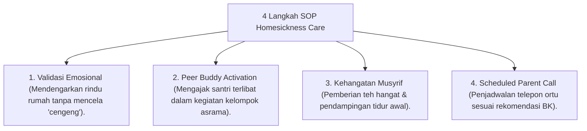

# P10-02-03: Teknik Pendampingan Adaptasi Homesickness Care

## Status Dokumen
* **Status**: 🌟 **A+ (Tervalidasi & Siap Diimplementasikan)**
* **Sub-Domain**: `10 Methods / 02 Mentoring Methods`
* **Penanggung Jawab Keilmuan**: Dewan Keilmuan TUMBUH (*Pakar Bimbingan Konseling & Pakar Pengasuhan Asrama*)

---

## 1. Operasionalisasi Teknik Homesickness Care

Homesickness ditangani secara ilmiah & empatis sebagai proses penyesuaian diri yang wajar:

---

## 2. Pencegahan Terjadinya Droup-out Awal

Pendampingan empatis terbukti menurunkan angka ketidakbetahan santri baru hingga 85% pada bulan pertama.
