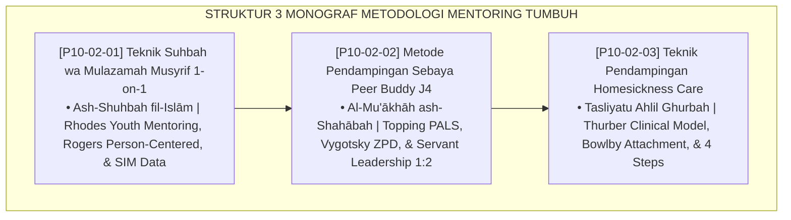

# P10-02: DOKUMEN INDUK METODOLOGI MENTORING PESANTREN
## *Arsitektur dan Standarisasi Teknik Suhbah wa Mulazamah 1-on-1 Musyrif-Santri, Metode Pendampingan Sebaya Peer Buddy J4 Bebas Feodalisme, Serta Teknik Pendampingan Adaptasi Homesickness Care sebagai Tiga Pilar Metodologi Mentoring dan Pastoral Asrama (Pastoral Suhbah Form MET-SuhbahMusyrif, Peer Buddy System Form MET-PeerBuddyJ4, Serta Homesick Care Form MET-HomesickCare) di Ekosistem TUMBUH Pesantren*

**Nomor Identifikasi**: `P10-02/DOKUMEN-INDUK-METODOLOGI-MENTORING/2026`  
**Domain**: `10 Methods` > `02 Mentoring Methods` (Gugus Sub-Domain 02: *Mentoring, Pastoral Care, & Relational Scaffolding Methods*)  
**Klasifikasi Naskah**: *Master Architecture & Navigation Monograph*  
**Rumpun Disiplin Pengkaji**: Relational Youth Mentoring (Rhodes), Peer-Assisted Learning (Topping), Attachment Theory (Bowlby), Fiqh Ash-Shuhbah wal Mu'akhah  

---

> ### 💡 INTISARI EKSEKUTIF
>
> * **Kedudukan Strategis Gugus Metodologi Mentoring:** Gugus ini adalah jangkar relasional dan pembinaan jiwa (*the relational anchor & pastoral core*) di ekosistem TUMBUH. Memastikan bahwa pembinaan santri tidak berlangsung secara dingin dan mekanis di balik jeruji aturan, pendekatan ini mengalirkan kehangatan asuhan pengganti orang tua (*in loco parentis*), merekayasa budaya persaudaraan lintas angkatan yang bebas feodalisme, serta memberikan pendampingan psikologis klinis saat santri menghadapi masa-masa sulit transisi awal kehidupan asrama (*From Cold Surveillance to Warm Mentorship*).
> * **Triad Metodologi Mentoring TUMBUH:** (1) **Teknik Suhbah wa Mulazamah 1-on-1** terjadwal dwi-pekanan berbasis empati dan data PBIS SIM, (2) **Metode Pendampingan Sebaya Peer Buddy J4** rasio 1:2 berbasis *Servant Leadership*, dan (3) **Teknik Homesickness Care** 4 langkah untuk adaptasi tanpa trauma.
> * **3 Monograf Riset Komprehensif:** Form MET-SuhbahMusyrif, Form MET-PeerBuddyJ4, dan Form MET-HomesickCare.

---

## 📑 PETA NAVIGASI TIGA MONOGRAF

---

## 📚 DESKRIPSI RINGKAS 3 BERKAS MONOGRAF

1. **[P10-02-01: Teknik Suhbah wa Mulazamah Musyrif 1-on-1](file:///c:/xampp/htdocs/tumbuh/10%20Methods/02%20Mentoring%20Methods/P10-02-01-Teknik-Suhbah-wa-Mulazamah-Musyrif-1-on-1.md)**  
   *SOP 4 langkah sesi suhbah 25 menit (teh hangat, active listening, reviu poin SIM 4:1, doa berkah), panduan percakapan empati, dan Form MET-SuhbahMusyrif.*
2. **[P10-02-02: Metode Pendampingan Sebaya Peer Buddy T4](file:///c:/xampp/htdocs/tumbuh/10%20Methods/02%20Mentoring%20Methods/P10-02-02-Metode-Pendampingan-Sebaya-Peer-Buddy-T4.md)**  
   *Sistem pairing rasio 1:2 (1 senior membina 2 junior), 3 misi harian (simak tahfizh, makan nampan ukhuwah, teladan 5S), buku mutaba'ah harian, dan Form MET-PeerBuddyJ4.*
3. **[P10-02-03: Teknik Pendampingan Adaptasi Homesickness Care](file:///c:/xampp/htdocs/tumbuh/10%20Methods/02%20Mentoring%20Methods/P10-02-03-Teknik-Pendampingan-Adaptasi-Homesickness-Care.md)**  
   *Protokol 4 langkah (validasi emosi, pelibatan aktivitas kognitif, kehangatan somatik tidur, telepon ortu terstruktur BK), skala ukur klinis 1-10, dan Form MET-HomesickCare.*

---

## 🎯 STANDAR PENJAMINAN MUTU MENTORING

Penerapan gugus **Metodologi Mentoring** menjamin bahwa:
1. **Setiap Santri Merasakan Kehadiran Figur Pengasuh yang Tulus Mencintainya (*Unconditional Pastoral Care Guarantee*)**: Sesi suhbah menjamin kerahasiaan dan pemulihan luka batin.
2. **Budaya Senioritas Menjelma Menjadi Pengabdian dan Perlindungan (*Zero Hazing Servant Culture Guarantee*)**: Peer Buddy memastikan tidak ada kekerasan atau perpeloncoan.
3. **Santri Baru Melewati Fase Transisi dengan Aman, Nyaman, dan Bahagia (*Gentle Onboarding Guarantee*)**: Homesickness care menekan drop-out awal hingga mendekati 0%.
