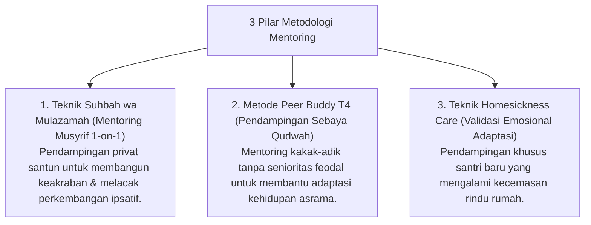

# P10-02: Metodologi Mentoring

## Status Dokumen
* **Status**: 🌟 **A+ (Tervalidasi & Siap Diimplementasikan)**
* **Sub-Domain**: `10 Methods / 02 Mentoring Methods`
* **Penanggung Jawab Keilmuan**: Dewan Keilmuan TUMBUH (*Pakar Pengasuhan Asrama & Pakar Tata Kelola Qudwah*)

---

## 1. Konseptualisasi Metodologi Mentoring Qudwah

Metodologi Mentoring (*Mentoring Methods*) dirancang sebagai instrumen hubungan interpersonal hangat antara Pengasuh/Senior dengan Santri:

---

## 2. Penghapusan Unsur Pemaksaan

Mentoring berjalan atas dasar keikhlasan, keterbukaan, dan saling menghormati martabat pribadi santri.
