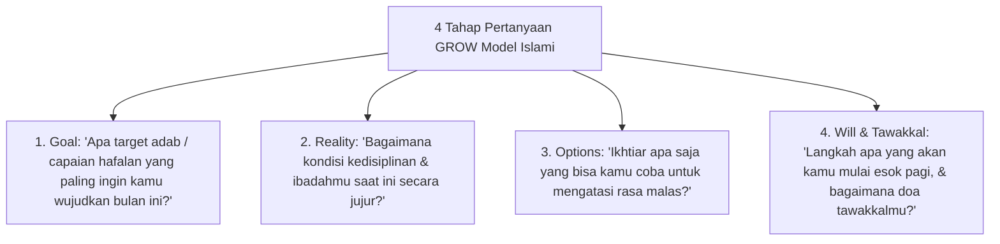

# P10-03-01: Teknik Powerful Questioning Inquiry GROW Islami

## Status Dokumen
* **Status**: 🌟 **A+ (Tervalidasi & Siap Diimplementasikan)**
* **Sub-Domain**: `10 Methods / 03 Coaching Methods`
* **Penanggung Jawab Keilmuan**: Dewan Keilmuan TUMBUH (*Pakar Pedagogi Master Guru & Pakar Tata Kelola Qudwah*)

---

## 1. Operasionalisasi Teknik Powerful Questioning GROW Model

Coach (Musyrif / Konselor) mengajukan pertanyaan berbobot terbuka (*Open-Ended Questions*) tanpa nada menggurui:

---

## 2. Kesadaran Intrinsik Santri

Pertanyaan inkuiri memicu kesadaran mandiri (*Aha Moment*) sehingga komitmen perubahan datang dari dalam diri santri sendiri.
