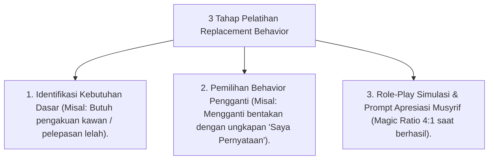

# P10-03-02: Metode Akuisisi Replacement Behavior Adaptif

## Status Dokumen
* **Status**: 🌟 **A+ (Tervalidasi & Siap Diimplementasikan)**
* **Sub-Domain**: `10 Methods / 03 Coaching Methods`
* **Penanggung Jawab Keilmuan**: Dewan Keilmuan TUMBUH (*Pakar PBIS & Pakar Bimbingan Konseling*)

---

## 1. Operasionalisasi Replacement Behavior Acquisition

Metode Replacement Behavior melatih santri mengganti kebiasaan maladaptif dengan kebiasaan adaptif baru secara sistematis:

---

## 2. Kriteria Sukses Perilaku Pengganti

Perilaku baru harus beradab, dapat diterima secara sosial oleh teman se-kamar, dan mudah dieksekusi oleh santri.
