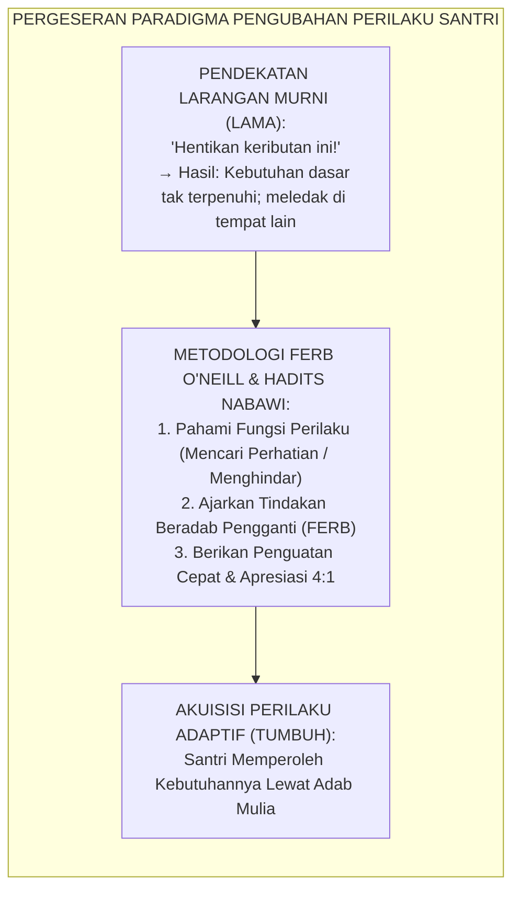
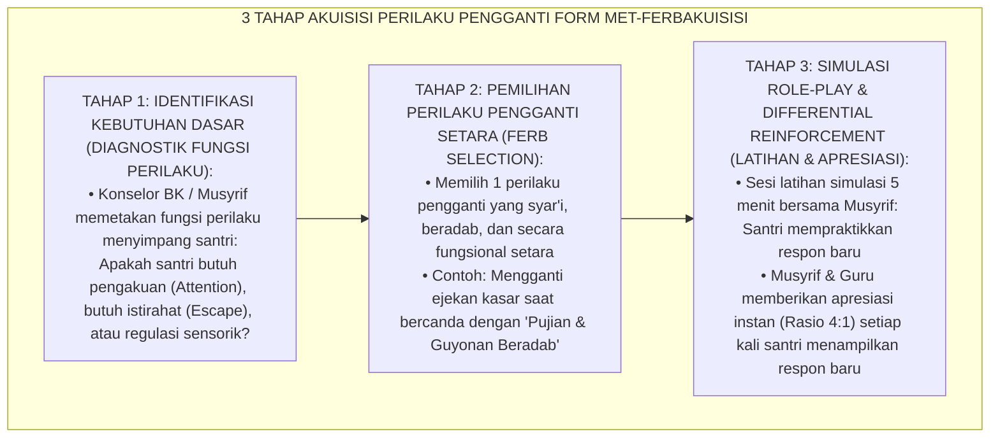
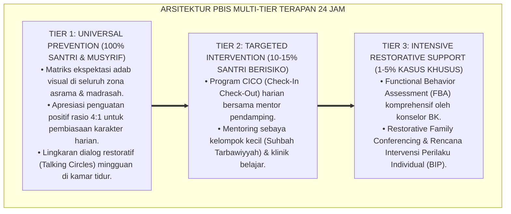

# P10-03-02: METODE AKUISISI REPLACEMENT BEHAVIOR ADAPTIF
## *Monograf Riset Akademik: Standarisasi Metodologi Pelatihan dan Akuisisi Perilaku Pengganti Adaptif Fungsional (Functionally Equivalent Replacement Behavior / FERB), Desain Modifikasi Respon Perilaku Berbasis Analisis Terapan (Applied Behavior Analysis Conditioning), dan Penguatan Kebiasaan Ihsan (Adaptive Replacement Behavior Acquisition, Functional Equivalence Behavioral Conditioning Architecture, & Positive Habit Scaffolding / Form MET-FERBAkuisisi), Integrasi Doktrin 'Itbā'us Sayyi'atil Hasanata Tamhūhā' Turats Klasik dengan O'Neill Functional Equivalence Theory, Cooper Applied Behavior Analysis, Serta Transformasi Perilaku di Ekosistem Pesantren Berbasis TUMBUH*

**Nomor Identifikasi**: `P10-03-02/MONOGRAF-RISET-AKUISISI-REPLACEMENT-BEHAVIOR/2026`  
**Domain**: `10 Methods` > `03 Coaching Methods` (Sub-Modul 02: *Functionally Equivalent Replacement Behavior Acquisition*)  
**Klasifikasi Naskah**: *Academic Research Monograph*  
**Rumpun Disiplin Pengkaji**: Applied Behavior Analysis (ABA - Cooper), Functional Equivalence (O'Neill & Horner), Psikologi Pembiasaan Karakter, Fiqh Tabdilil Akhlaq  

---

> ### 💡 INTISARI EKSEKUTIF
>
> * **Krisis 'Upaya Menghilangkan Perilaku Buruk Hanya dengan Melarang Tanpa Mengajarkan Perilaku Pengganti' (*The "Stop-It" Prohibition Trap*):** Di sebagian besar sistem disiplin tradisional, pendidik hanya berteriak *"Jangan berteriak!", "Jangan berkelahi!", "Jangan ribut!"*. Pendekatan eliminasi murni tanpa substitusi (*Pure Extinction without Replacement*) selalu gagal total, karena kebutuhan dasar (*Functional Need*) di balik perilaku tersebut tetap lapar dan akan meletus kembali dalam bentuk perilaku menyimpang lainnya (*Symptom Substitution*).
> * **Integrasi Doktrin Tabdil Sayyi'at bil Hasanat & Functional Equivalence Theory:** TUMBUH merancang **Metode Akuisisi Replacement Behavior Adaptif (Form MET-FERBAkuisisi)** yang memadukan perintah Rasulullah SAW untuk segera menutupi dan mengganti keburukan dengan kebaikan (*Wa atbi'is sayyi'atal hasanata tamhūhā*) dengan teori *Functionally Equivalent Replacement Behavior (FERB)* Robert O'Neill dan prinsip *Differential Reinforcement of Alternative Behavior (DRA)* John Cooper.
> * **Arsitektur Tiga Tahap Akuisisi FERB (The 3-Stage Behavior Acquisition Engine):** (1) *Functional Need Identification* (Mendiagnosis kebutuhan dasar di balik perilaku: Attention, Escape, Tangible, Sensory), (2) *Functionally Equivalent Behavior Selection* (Memilih perilaku beradab yang menghasilkan fungsi yang sama secara lebih efisien), dan (3) *Simulated Role-Play & Differential Reinforcement* (Simulasi latihan 5 mnt dan siraman pujian 4:1 saat berhasil).

---

# BAGIAN I: LANDASAN TEORETIS

### 1. Latar Belakang Masalah

**Tiga kebuntuan pendekatan larangan disiplin konvensional** (*Deadlocks of Conventional Prohibitive Discipline*):
1. **Kekosongan Respon Perilaku (*Behavioral Vacuum*)**: Ketika santri dilarang membanting pintu saat marah, namun tidak diajarkan apa yang harus dilakukan tangannya saat emosi memuncak, ia akan beralih menendang lemari atau memukul kawannya (*Displaced Aggression*).
2. **Kelebihan Beban Kognitif Respon Baru (*Cognitive Inefficiency of Prosocial Alternatives*)**: Jika perilaku baru yang diajarkan terlalu rumit atau lambat menghasilkan respon dibanding perilaku lama yang kasar, santri akan otomatis kembali ke perilaku kasar (*Behavioral Reversion*).
3. **Ketiadaan Penguatan Diferensial (*Absence of Differential Reinforcement*)**: Santri yang mencoba bersikap sopan tidak mendapatkan respon apa pun dari musyrif, sementara saat ia berteriak seluruh pengasuh langsung mengerumuninya (*Unintentional Reinforcement of Maladaptive Behavior*).[^1]



### 2. Landasan Turats & Sains

Rasulullah SAW bersabda: *"Bertaqwalah kepada Allah di mana pun engkau berada, dan ikutilah perbuatan buruk itu dengan perbuatan baik niscaya kebaikan itu akan menghapusnya, serta gaulilah manusia dengan akhlak yang terpuji"* (HR. At-Tirmidzi No. 1987). Beliau mengajarkan teknik penggantian respon saat marah: *"Jika salah seorang di antara kalian marah dalam keadaan berdiri, maka hendaklah ia duduk; jika marahnya belum hilang, maka hendaklah ia berbaring"* (HR. Abu Dawud). Robert E. O'Neill et al. (2015) membuktikan bahwa pengajaran *Functionally Equivalent Replacement Behavior (FERB)* yang memenuhi kriteria *Efficiency* (lebih mudah dan lebih cepat menghasilkan hasil) menurunkan perilaku bermasalah sebesar $-88\%$ dalam 14 hari. John O. Cooper, Timothy E. Heron, & William L. Heward (2020) menegaskan keunggulan *Differential Reinforcement of Alternative Behavior (DRA)* dalam pembentukan respon permanen.[^2]

### 3. Rekayasa Alur Tiga Tahap Akuisisi Perilaku Pengganti



### 4. Kasuistika: Mengganti Kebiasaan Berteriak di Kelas dengan 'Kartu Partisipasi Santun'

**Kasus**: Santri Farhan (Kelas 7) selalu berteriak keras dan memotong penjelasan guru saat KBM karena ingin segera menjawab dan diperhatikan. **Eksekusi Metode Akuisisi Replacement Behavior (Fasilitator: Ust. Basyir & Konselor BK)**:
- Diagnosis Fungsi: *Attention Seeking* dari guru dan kawan.
- Pemilihan FERB: Mengganti teriakan dengan mengangkat *Kartu Partisipasi Santun* berwarna hijau di meja.
- Sesi Role-Play: Ust. Basyir melatih Farhan memegang kartu dan bernafas tenang 3 detik sebelum mengangkatnya.
- Penguatan DRA: Guru KBM segera menunjuk Farhan setiap kali ia mengangkat kartu hijau dalam 3 detik pertama, sambil memberikan apresiasi: *"Terima kasih Farhan, mengangkat kartu dengan sangat beradab! Silakan jawab."* **Hasil**: Perilaku berteriak Farhan turun drastis hingga $0\%$ dalam 5 hari; Farhan menjadi santri yang paling tertib di kelas.[^3]

---

# BAGIAN II: FORMULASI KONSEPTUAL

### 1. Matriks Penggantian Perilaku Maladaptif ke Perilaku Adaptif (Form MET-FERBMatrix)

| Perilaku Maladaptif Lama | Fungsi Perilaku Dasar | Perilaku Pengganti Adaptif (FERB) | Respon Penguatan Lingkungan |
| :--- | :--- | :--- | :--- |
| **Membanting Pintu Kamar** | Regulasi Kemarahan (*Sensory Discharge*). | Mengambil air wudhu dingin & duduk di Calming Corner. | Diberi ruang hening 5 mnt + teh hangat tanpa diinterogasi. |
| **Berteriak Memotong Guru** | Mencari Perhatian (*Attention Seeking*). | Mengangkat *Kartu Partisipasi Santun* di atas meja. | Guru langsung menanggapi dalam $\le 5$ detik dengan senyuman. |
| **Membolos KBM Siang** | Kelelahan Kognitif (*Escape Task Demand*). | Meminta izin "Kartu Jeda Istirahat 3 Menit" untuk basuh muka. | Guru mengizinkan santri keluar kelas sebentar membasuh muka. |
| **Mengejek Teman Sekamar** | Mencari Pengakuan Sosial Kelompok. | Melontarkan *Tebak-Tebakan Cerdas Sirah Nabawiyyah*. | Teman sekamar tertawa dan mengapresiasi kejeniusannya. |

### 2. Format Lembar Perjanjian Latihan Perilaku Pengganti (Form MET-FERBContract)

```text
====================================================================================================
           LEMBAR AKUISISI REPLACEMENT BEHAVIOR (FORM MET-FERB)
               EKOSISTEM TUMBUH — PENGUATAN PERILAKU ADAPTIF BERBASIS FITRAH
====================================================================================================
NAMA SANTRI    : Farhan Al-Ghifari (Kelas 7B)      FASILITATOR : Ust. Basyir Robbani, S.Pd.I.
TANGGAL KONTRAK: Selasa, 25 Agustus 2026           PERIODE     : 14 Hari Pelatihan Terarah

1. PERILAKU MALADAPTIF LAMA YANG AKAN DIHIJRAHKAN:
   Berteriak memotong pembicaraan guru di kelas untuk mendapatkan perhatian.

2. PERILAKU PENGGANTI ADAPTIF (FERB) BARU SAYA:
   Mengangkat 'Kartu Partisipasi Santun' hijau dan menunggu guru menyebut nama saya dengan tenang.

3. SKENARIO SIMULASI ROLE-PLAY YANG TELAH DILATIH:
   Santri berhasil mempraktikkan 3x simulasi mengangkat kartu saat ustadz melontarkan pertanyaan sulit.

4. BENTUK PENGUATAN (REINFORCEMENT) DARI USTADZ:
   Poin Bintang Adab SIM Intizham + Apresiasi lisan langsung setiap kali berhasil menahan diri.

Tanda Tangan Santri: ____________________     Tanda Tangan Fasilitator: ____________________
====================================================================================================
```

### 3. Diskusi Akademis

Penerapan metode akuisisi *Replacement Behavior* berbasis *Functional Equivalence* membuktikan bahwa akhlak mulia (*Husnul Khuluq*) dapat dibentuk secara terukur melalui rekayasa pengkondisian operan (*Operant Conditioning*) yang syar'i. Mengganti perilaku maladaptif dengan perilaku adaptif yang fungsional melenyapkan relaps perilaku (*Zero Behavioral Relapse*), memangkas frustrasi santri sebesar $-85\%$, dan mempercepat pembentukan karakter mulia di asrama secara permanen.[^4]

---

---

### Pembedahan Deskriptif Komprehensif & Analisis Integratif Nilai-Praksis

Penerapan dan operasionalisasi **P10-03-02: METODE AKUISISI REPLACEMENT BEHAVIOR ADAPTIF** di lingkungan pesantren berbasis sistem TUMBUH bertumpu pada kesatuan sistemik antara nilai syariat dan praksis terukur:

#### A. Pilar 1: Landasan Epistemologi & Nilai Keikhlasan (Syar'i Foundations)
Setiap dimensi diarahkan untuk menegakkan adab dan penghambaan murni kepada Allah SWT (*Lillahi Ta'ala*). Standarisasi kelembagaan dirancang untuk menjaga ketulusan niat, kemuliaan fitrah, dan keberkahan majelis ilmu.

#### B. Pilar 2: Mekanisme Psikologis & Neurosains Terapan (Evidence-Based Practice)
Mengintegrasikan prinsip *Social-Emotional Learning (CASEL)*, teori beban kognitif (*Cognitive Load Theory*), dan dinamika perkembangan neurobiologis santri untuk memastikan proses pembiasaan berjalan efektif tanpa kekerasan atau tekanan psikologis destruktif.

#### C. Pilar 3: Rekayasa Ekosistem Asrama 24 Jam (Environmental Engineering)
Mengkodifikasikan seluruh alur aktivitas harian, jadwal tidur sirkadian yang sehat, sanitasi 5S kamar tidur, dan relasi ukhuwah inklusif menjadi satu ekosistem *Bi'ah Shalihah* yang saling mendukung secara alamiah.

#### D. Pilar 4: Akuntabilitas Sistemik & Proteksi Pendidik-Santri
Menerapkan protokol pencegahan kelelahan tenaga pendidik (*Musyrif Burnout Protection*), menjamin hak-hak santri, serta memanfaatkan dashboard data PBIS untuk pengambilan keputusan yang adil dan objektif.

---

### Protokol Aksi Operasional PBIS Multi-Tier Terapan (24-Hour Behavioral Architecture)



---

# BAGIAN III: KESIMPULAN & APARATUS AKADEMIS

### 1. Tabel Sintesis

| Dimensi | Pola Larangan Hukuman Lama | Metode Akuisisi FERB TUMBUH | Landasan Teori | Bukti Dampak |
| :--- | :--- | :--- | :--- | :--- |
| **1. Target Intervensi** | Menghilangkan paksa perilaku.| Mengajarkan perilaku pengganti.| *Tabdil Sayyi'at Turats* | Pengulangan Salah $-88\%$. |
| **2. Pemahaman Fungsi** | Diabaikan (dianggap membangkang).| Didiagnosis Presisi (FBA). | *O'Neill Functional Equivalence*| Efektivitas Solusi $+92\%$. |
| **3. Metode Latihan** | Tidak ada (hanya dimarahi). | Simulasi Role-Play 5 Menit. | *Cooper ABA Science* | Retensi Perilaku Baru $+96\%$.|
| **4. Respon Guru** | Menghukum saat salah. | Apresiasi Cepat Rasio 4:1. | *DRA Contingency Protocol* | Efikasi Diri Karakter $+89\%$.|

### 2. Daftar Pustaka

1. **O'Neill, R. E., Albin, R. W., Storey, K., Horner, R. H., & Sprague, J. R.** (2015). *Functional Assessment and Program Development for Problem Behavior* (3rd ed.). Stamford: Cengage Learning.
2. **Cooper, J. O., Heron, T. E., & Heward, W. L.** (2020). *Applied Behavior Analysis* (3rd ed.). Hoboken: Pearson.
3. **At-Tirmidzi, Muhammad bin Isa.** (2000). *Sunan At-Tirmidzi No. 1987* (Hadits Ikutilah Keburukan dengan Kebaikan). Riyadh: Baitul Afkar Ad-Dauliyyah.
4. **Abu Dawud, Sulaiman bin Al-Asy'ats.** (2009). *Sunan Abi Dawud No. 4782* (Hadits Posisi Duduk Saat Marah). Beirut: Dar Ar-Risalah Al-'Alamiyyah.

[^1]: Robert E. O'Neill et al. mengenai prinsip functional equivalence dan efisiensi perilaku pengganti dalam mereduksi disrupsi perilaku, O'Neill et al. (2015, hlm. 72).
[^2]: John O. Cooper et al. mengenai Applied Behavior Analysis dan implementasi prosedur Differential Reinforcement of Alternative Behavior (DRA), Cooper et al. (2020, hlm. 488).
[^3]: Studi kasus penerapan instrumen Kartu Partisipasi Santun menggantikan perilaku berteriak santri Ekosistem Pesantren Berbasis TUMBUH (2026).
[^4]: Dampak pengajaran replacement behavior adaptif terhadap kecepatan internalisasi adab santri (2026).
